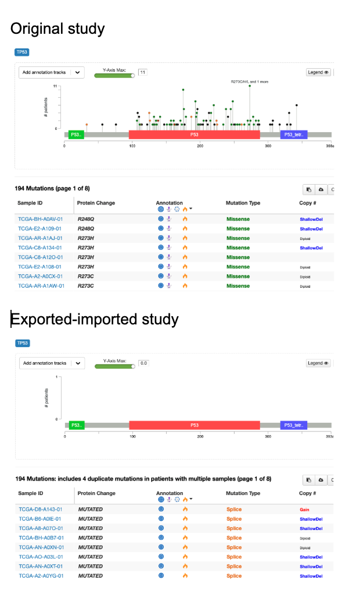

# RFC95 import-export tests

### Inlcuded studies:
- acc_2019
- all_phase2_target_2018_pub
- aml_ohsu_2022
- brca_cptac_2020
- brca_tcga_pub
- brca_tcga_pub2015
- mel_mskimpact_2020
- nsclc_tcga_broad_2016
- msk_chord_2024
- msk_met_2021
- ov_tcga_pub
- pancan_pcawg_2020
- prad_msk_stopsack_2021
- glioma_msk_2018
- kich_tcga_pan_can_atlas_2018
- sarc_mskcc

### Testing steps
1. Manually downloaded studies from datahub.
2. Manually deleted all files related to mirna data in brca_tcga_pub, ov_tcga_pub, pancan_pcawg_2020.
3. Manually uploaded studies to local cBioPortal.
4. Manually exported studies using `curl -O http://localhost:<port>/export/study/<study_id>.zip` and saved them in `downloaded_studies` folder.
5. Changed all study ids in downloaded files to add the prefix `exp_`. Within meta and case list files `cancer_study_identifier: ` was changed to `cancer_study_identifier: exp_`, and in case list files `stable_id: ` was changed to `stable_id: exp_`.
6. Manually uploaded new `exp_` studies into local cBioPortal. Import logs are located in `import_logs` directory.
7. Manually exported studies using `curl -O http://localhost:<port>/export/study/exp_<study_id>.zip` and saved them in `re-downloaded_studies` folder.
8. Ran `./diff.sh` for each study_id and saved output to `diff_outputs`.


### Encountered issues

- SOLVED ~~Unable to upload `exp_msk_chord_2024`:\
Error when validating: `ERROR: data_clinical_timeline.txt: lines [2, 3, 4, (297132 more)]: column 15: Invalid STYLE_COLOR; value encountered: ''`~~

- SOLVED <del>Unable to upload `msk_met_2021`:\
Crashes while loading `data_clinical_sample_attributes.txt`</del>

- SOLVED ~~Values of column `dbSNP_RS` in mutations data file vary between original study, downloaded and re-downloaded files.~~

- SOLVED ~~Values of column `HGVSp_Short` are dropped in downloaded mutations file, so mutations are not plotted and `Protein Change` column values are all `MUTATED` in mutations tab.\
~~

- TICKET CREATED ~~In `exp_aml_ohsu_2022` `data_clinical_sample_attributes.txt` strings appear to be truncated at a length of 254-255 characters. For example, sample id `aml_ohsu_2022_2010_BA2304` in column `SURFACE_ANTIGENS_IMMUNOHISTOCHEMICAL_STAINS` has the following values:\
    In original study:~~

    ```
    The monocytic cells (percentages shown) are  atypical in that they express partial CD56 (about 50%  positive), but otherwise demonstrate phenotypically normal  expression of CD13, bright CD33, bright CD64, CD15, HLA-DR,  and partial myeloperoxidase (Flow cytometric analysis of the bone marrow aspirate  specimen indicates that 4% of the CD45 positive leukocytes  are lymphocytes, 89% are monocytic cells, and 7% are  myeloid cells.) | CD10, CD11b, CD13,  CD16, CD33, and CD64 (Myeloid (phenotypically normal))
    ```
    ~~In downloaded study (255 characters, blank space at the end):~~

    ```
    The monocytic cells (percentages shown) are  atypical in that they express partial CD56 (about 50%  positive), but otherwise demonstrate phenotypically normal  expression of CD13, bright CD33, bright CD64, CD15, HLA-DR,  and partial myeloperoxidase (Flow 
    ```
    ~~In re-downloaded study (254 characters, blank space at the end):~~
    ```
    The monocytic cells (percentages shown) are  atypical in that they express partial CD56 (about 50%  positive), but otherwise demonstrate phenotypically normal  expression of CD13, bright CD33, bright CD64, CD15, HLA-DR,  and partial myeloperoxidase (Flow
    ```