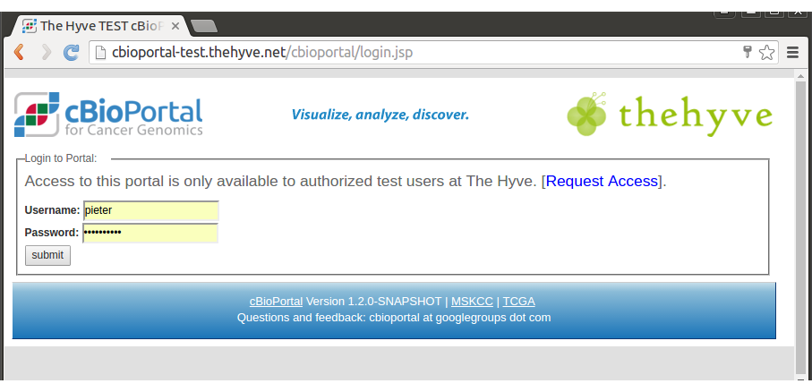

# Introduction

The cBioPortal includes support for LDAP authentication. This document explains how to configure LDAP within your own instance of cBioPortal.
Configuring your local instance to support LDAP requires a few configuration changes.

## Overview

In this setup LDAP will be used as a simple Identity Provider (IDP) for the authentication.

* **identity provider**:  in this scenario, it can be limited to a service that stores user names and passwords, and provides an authentication mechanism. 

* **service provider**:  any web site or web application that provides a service, but should only be available to authenticated and authorized users.  In the documentation below, the cBioPortal is the service provider.

* **authentication**:  a means of verifying that a user is who they purport to be.  Authentication is performed by the identify provider, by extracting the user name and password provided in a login request, and matching this with information stored in its repository. When authentication is enabled, multiple cancer studies can be stored within a single instance of cBioPortal while providing fine-grained control over which users can access which studies.  Authorization is implemented within the core cBioPortal code, and *not* the identify provider.

## Why is LDAP Relevant to cBioPortal?

The cBioPortal code has no means of storing user name and passwords and no means of directly authenticating users.  If you want to restrict access to your instance of cBioPortal, you therefore have to consider an external authentication service. LDAP is one means of doing so, and your larger institution may already provide LDAP support. This greatly simplifies user management.


# Configuring LDAP within cBioPortal


## Modifying configuration

In portal.properties, modify the section labeled `authentication`.  For
example:

    ## configuration for the LDAP access
    ldap.user_search_base=DC=example,DC=com
    ldap.url=ldap://ldap.example.com:389
    ldap.manager.dn=
    ldap.manager.password=
    ## The following attributes for are good for ActiveDirectory, for OpenLDAP use "uid" for username
    ldap.attributes.username=sAMAccountName
    #ldap.attributes.username=uid
    ldap.attributes.last_name=sn
    ldap.attributes.given_name=givenName
    ldap.attributes.email=mail    

Please note that you will have to modify all the above to match your own settings. Also note, in most cases ldap.manager.dn and ldap.manager.password should be left empty, although the properties should remain in portal.properties. 

## Authorizing Users

Please read the Wiki page on [User Authorization](User-Authorization.md), and add user rights for a single user.


## Configuring the Login.jsp Page

The login page is configurable via the `portal.properties` properties `skin.authorization_message`. 
For example in `skin.authorization_message` you can be set to something like this:

```
skin.authorization_message= Welcome to this portal. Access to this portal is available to authorized test users at YOUR ORG.  [<a href="https://thehyve.nl/">Request Access</a>].
```

You can also set a standard text in `skin.login.contact_html` that will appear in case of problems: 

```
skin.login.contact_html=If you think you have received this message in error, please contact us at <a style="color:#FF0000" href="mailto:cbioportal-access@your.org">cbioportal-access@your.org</a>
```


## Doing a Test Run

You are now ready to go.

Rebuild the WAR file and follow the [Deployment with authentication
steps](Deploying.md#required-login) using `authenticate=ldap`.

Then, go to:  [http://localhost:8080/](http://localhost:8080/).

If all goes well, the following should happen:

* You will be redirected to the Login Page.
* After authenticating, you will be redirected the home page.

Example of Login page:



If this does not happen, see the Troubleshooting Tips  below.


## Troubleshooting Tips 

### Logging

If you get stuck or get an obscure error message, you can try to turn on all DEBUG logging.  This can be done via `src/main/resources/log4j.properties`.  For example:

    # Change INFO to DEBUG, if you want to see debugging info on underlying libraries we use.
    log4j.rootLogger=DEBUG, a
    
    # Change INFO to DEBUG, if you want see debugging info on our packages only.
    log4j.category.org.mskcc=DEBUG

Then, rebuild the WAR, redeploy, and try to authenticate again.  
