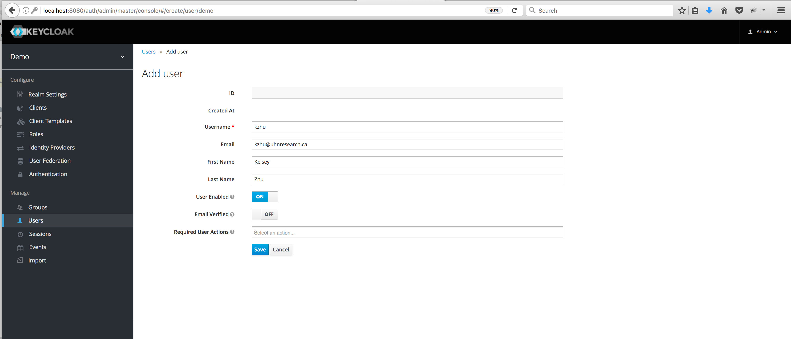

# Authenticating Users via Keycloak

## Introduction

The cBioPortal includes support for Keycloak SAML (Security Assertion Markup Language) authentication. This document explains why you might find Keycloak SAML authentication useful for storing your user login information outside 
the cBioPortal database. It also shows you how to configure Keycloak to communicate with your instance of cBioPortal.

Please note that configuring your local instance to use Keycloak SAML authentication requires a Keycloak Identity Provider to be set up. For details on how to set up a Keycloak server, please read online document at <https://keycloak.gitbooks.io/documentation/server_installation/index.html>.

This document focuses mainly on the steps to configure Keycloak for **authenticating** and **authorizing** cBioPortal users.

To skip to the authorization section see: [authorization with Keycloak](#authorization-with-keycloak). Or continue reading to learn how to integrate Keycloak with cBioPortal.

### Why Keycloak?

Keycloak is an [open source identity and access management solution](https://keycloak.gitbooks.io/documentation/server_admin/topics/overview.html). It has a built-in RDBM system to store login information. It can help build a security layer on top of the cBioPortal web application.

Keycloak boils down to three simple terms:
* **realm**: A realm secures and manages security metadata for a set of users, application, and registered auth clients.
* **client**: Clients are entities that can request authentication of a user within a realm.
* **role**: Roles identify a type or category of user. Keycloak often assigns access and permissions to specific roles rather than individual users for a fine-grained access control. 

Keycloak offers three types of roles: 
* Realm-level roles are in global namespace shared by all clients. 
* Client roles have basically a namespace dedicated to a client. 
* A composite role is a role that has one or more additional roles associated with it. 


### How does Keycloak SAML Authentication work?

Keycloak supports both OpenID-Connect and SAML authentication. When you use SAML authentication, the Keycloak server exchanges XML documents with a web application. XML signatures and encryption are then used to verify requests from the application.

## Configure Keycloak to authenticate your cbioportal instance
1. Log in to your Keycloak Identity Provider, e.g. <http://localhost:8080/auth>, as an admin user.
2. Hover over the top-left–corner drop down menu (titled ‘**Master**’) to create a new realm.

Please note if you are logged in the master realm, this drop-down menu lists all the realms created. The last entry of this drop-down menu is always **Add Realm**. Click this to add a realm. Then type '_demo_' in the name field and click the **Create** button.
3. To create a SAML client, go to the **Clients** item in the left menu. On this page, click the **Create** button on the right. This will bring you to the **Add Client** page.
Enter a **Client ID** for the client, e.g. '_cbioportal_', this will be the expected `issuer` value in SAML requests sent by the application. Select _saml_ in the **Client Protocol** drop down box.


Enter '`http://localhost:8080/auth/realms/demo/protocol/saml`' in the **Client SAML Endpoint** textbox, this is the URL that the Keycloak server will send SAML requests and responses to. Then click the **Save** button; this will take you to the client page below.


4. Choose _email_ as your **Name ID Format**.
5. Next, enter a pattern for **Valid Redirect URIs** that Keycloak can use upon a successful authentication, e.g. `http://localhost:8081/cbioportal/*`.
6. Set **Force POST Binding** and **Front Channel Logout** to _OFF_ and **Force Name ID Format** to _ON_.
7. Leave everything else as it is and click **Save**.

### Map SAML Assertion Attributes
To specify attributes included in the SAML assertion, simply click on the **Mappers** tab, and add mappers using the **Add Builtin** and **Create** buttons.
Make sure you add at least:
- the built-in User Property mapper named _X500 email_ and
- a _Role list_-type attribute using the word _roles_ as its **Role attribute name**.


Edit the email attribute to use the word _email_ as the **SAML Attribute Name**.


Finally, head to the **Scope** tab for the client and switch off
**Full Scope Allowed**, to ensure that only those roles relevant to a
particular cBioPortal instance are listed in assertions sent to the
instance, and not any other roles tracked in Keycloak.

### Export configuration for cBioPortal
1. Next, navigate to the **Installation** tab for the same client.
2. Select _SAML Metadata IDPSSODescriptor_ as the Format Option and click the **Download** button.
4. Move the downloaded XML file to `portal/src/main/resources/`


## Create a signing key for cBioPortal

Use the Java '`keytool`' command to generate keystore, as described
[here](Authenticating-Users-via-SAML.md#creating-a-keystore)
on the page about SAML in cBioPortal:

```
keytool -genkey -alias secure-key -keyalg RSA -keystore samlKeystore.jks
```

Install the generated JKS file to `portal/src/main/resources/`

In order to let Keycloak know that it can trust the holder of this
key, you'll need to import the key's certificate into Keycloak. In the
Keycloak admin screen about the `cbioportal` client, head to the
**SAML Keys** tab and click the **Import** button. Select the _JKS_
archive format, specify the key alias _secure-key_ and type the store
password _apollo1_ (not the private key password, as Keycloak only
needs to know the certificate), and select the file you just
installed. Keycloak may not give an indication of successful
completion, but when navigating to the **SAML Keys** tab again you
should now see the certificate and no private key.

## Modifying portal.properties

1. Within the portal.properties file , make sure that this line is present:
```
    app.name=cbioportal
```

2. Then, modify the properties under the comment `# authentication`. In particular, see the options listed in the example below:

```properties
    # authentication
    authorization=true
    authenticate=saml
    filter_groups_by_appname=false
    saml.sp.metadata.entityid=cbioportal
    saml.idp.metadata.location=classpath:/client-tailored-saml-idp-metadata.xml
    saml.idp.metadata.entityid=http://localhost:8080/auth/realms/demo
    saml.keystore.location=classpath:/samlKeystore.jks
    saml.keystore.password=apollo1
    saml.keystore.private-key.key=secure-key
    saml.keystore.private-key.password=apollo2
    saml.keystore.default-key=secure-key
    saml.idp.comm.binding.settings=defaultBinding
    saml.idp.comm.binding.type=
    saml.idp.metadata.attribute.email=email
    saml.idp.metadata.attribute.role=roles
    saml.custom.userservice.class=org.cbioportal.security.spring.authentication.keycloak.SAMLUserDetailsServiceImpl
    # global logout (as opposed to local logout):
    saml.logout.local=false
    saml.logout.url=/
```

## Integrate Keycloak with your company-wide authentication service

When integrating Keycloak with your company-wide authentication service, the user credentials will reside at your institute's users directory and Keycloak will work as a proxy between your LDAP (or SAML) service and cBioPortal.

Please refer to [the Keycloak documentation](https://keycloak.gitbooks.io/documentation/server_admin/topics/user-federation.html) for more information on how to integrate Keycloak with your local LDAP/SAML service.

## Authorization with Keycloak

### Create Roles for authorizing cBioPortal users
 To create a role, head to the **Roles** tab (along the top, **not** in the sidebar) and click the **Add Role** button. Enter a name (e.g `brca_tcga_pub`) and description for the role and hit the **Save** button.


To turn a regular role into a composite role, go to the role detail page and flip the Composite Role switch on.

### Local Keycloak users: create users and assign roles

1. To create a user, click on Users in the left menu bar. This menu option brings you to the user list page. On the right side of the empty user list,
 you should see an Add User button. Click that to start creating your new user.

2. Next, assign roles to each user through the Role Mappings tab for that single user.
**A composite role is a role that has one or more additional roles associated with it**. When a composite role is mapped to the user,
 the user also gains the roles associated with that composite. This inheritance is recursive so any composite of composites also gets inherited.


### Institute's IDP users: assign roles to users

When integrating Keycloak with your company-wide authentication service, the user credentials will reside at your institute's users directory and Keycloak
will work as a proxy between your LDAP (or SAML) IDP service and cBioPortal. Nevertheless, the authorization roles
should still be configured for the users. The steps below detail how to do this.

TODO

### Doing a Test Run

You are now ready to go. Rebuild the WAR file and re-deploy:

```
mvn -DskipTests clean install
cp portal/target/cbioportal.war $CATALINA_HOME/webapps/
```

Then, go to:  [http://localhost:8081/cbioportal/](http://localhost:8081/cbioportal/).

If all goes well, the following should happen:

* You will be redirected to the Keycloak Login Page.
* After authenticating, you will be redirected back to your local instance of cBioPortal.

If this does not happen, see the Troubleshooting Tips  below.

### Troubleshooting

#### Logging

Getting this to work requires many steps, and can be a bit tricky.  If you get stuck or get an obscure error message, your best bet is to turn on all DEBUG logging. 
 This can be done via `src/main/resources/log4j.properties`.  For example:

```
# Change INFO to DEBUG, if you want to see debugging info on underlying libraries we use.
log4j.rootLogger=DEBUG, a

# Change INFO to DEBUG, if you want see debugging info on our packages and spring security packages.
log4j.category.org.mskcc=DEBUG
log4j.logger.org.springframework.security=DEBUG
```
Then, rebuild the WAR, redeploy, and try to authenticate again.  Your log file will then include hundreds of SAML-specific messages, even the full XML of each SAML message, and this should help you debug the error.
