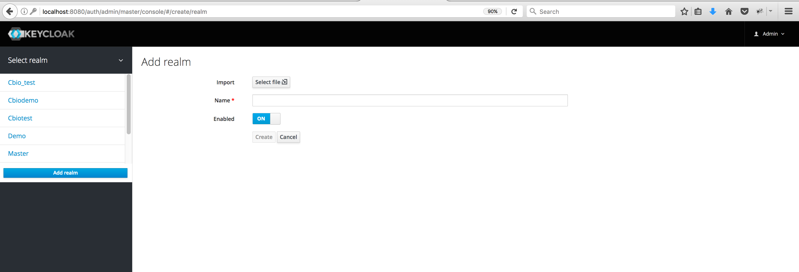

# Authenticating and Authorizing Users via Keycloak

## Introduction

The cBioPortal includes support for Keycloak authentication. Keycloak can function as an Identity Provider (IDP) for cBioPortal.
This document explains why you might find Keycloak authentication useful for storing your user login information outside
the cBioPortal database. It also shows you how to configure Keycloak to communicate with your instance of cBioPortal using
SAML (Security Assertion Markup Language).

Please note that configuring your local instance to use Keycloak authentication requires a Keycloak server to be set up. For details on how to set up a Keycloak server, please read online document at <https://www.keycloak.org/docs/latest/server_installation/index.html>.

This document focuses mainly on the steps to configure Keycloak for **authenticating** and **authorizing** cBioPortal users.

To skip to the authorization section see: [authorization with Keycloak](#authorization-with-keycloak). Or continue reading to learn how to integrate Keycloak with cBioPortal.

### Why Keycloak?

Keycloak is an [open source identity and access management solution](https://keycloak.gitbooks.io/documentation/server_admin/topics/overview.html). It has a built-in RDBM system to store login information. It can help build a security layer on top of the cBioPortal web application.

Keycloak boils down to three simple terms:
* **realm**: A realm secures and manages security metadata for a set of users, application, and registered auth clients.
* **client**: Clients are entities that can request authentication of a user within a realm.
* **role**: Roles identify a type or category of user. Keycloak often assigns access and permissions to specific roles rather than individual users for a fine-grained access control. 

Keycloak offers three types of roles: 
* Realm-level roles are in global namespace shared by all clients. 
* Client roles have basically a namespace dedicated to a client. 
* A composite role is a role that has one or more additional roles associated with it. 


### How does Keycloak SAML Authentication work?

Keycloak supports both OpenID-Connect and SAML authentication. When you use SAML authentication, the Keycloak server exchanges XML documents with a web application. XML signatures and encryption are then used to verify requests from the application.

## Configure Keycloak to authenticate your cbioportal instance
1. Log in to your Keycloak Identity Provider, e.g. <http://localhost:8080/auth>, as an admin user.
2. Hover over the top-left–corner drop down menu (titled ‘**Master**’) to create a new realm.

Please note if you are logged in the master realm, this drop-down menu lists all the realms created. The last entry of this drop-down menu is always **Add Realm**. Click this to add a realm. Then type '_demo_' in the name field and click the **Create** button.
3. To create a SAML client, go to the **Clients** item in the left menu. On this page, click the **Create** button on the right. This will bring you to the **Add Client** page.
    * Enter a **Client ID** for the client, e.g. '_cbioportal_', this will be the expected `issuer` value in SAML requests sent by the application.
    * Select _saml_ in the **Client Protocol** drop down box.
    * Enter `http://localhost:8081/cbioportal/saml` in the **Client SAML Endpoint** textbox, this is the URL that the Keycloak server will send SAML requests and responses to. Then click the **Save** button; this will take you to the client page below.


4. Choose _email_ as your **Name ID Format**.
5. Next, enter a pattern for **Valid Redirect URIs** that Keycloak can use upon a successful authentication, e.g. `http://localhost:8081/cbioportal/*`. :information_source: notice that you can add multiple URLs in this field. You could use this in some cases to support 
the URLs with and without port (e.g. if tomcat is running on port `80` and you want to allow both `http://localhost:80/cbioportal/*` and `http://localhost/cbioportal/*` as redirect URLs).
6. Set **Force POST Binding** and **Front Channel Logout** to _OFF_ and **Force Name ID Format** to _ON_.
7. Expand the subsection **Fine Grain SAML Endpoint Configuration** and set **Logout Service POST Binding URL** to `http://localhost:8081/cbioportal/saml/logout`.
8. Leave everything else as it is and click **Save**.

### Map SAML Assertion Attributes
To specify attributes included in the SAML assertion, simply click on the **Mappers** tab, and add mappers using the **Add Builtin** and **Create** buttons.
Make sure you add at least:
- the built-in User Property mapper named _X500 email_ and
- a _Role list_-type attribute using the word _roles_ as its **Role attribute name**.


Edit the email attribute to use the word _email_ as the **SAML Attribute Name**.


Finally, head to the **Scope** tab for the client and switch off
**Full Scope Allowed**, to ensure that only those roles relevant to a
particular cBioPortal instance are listed in assertions sent to the
instance, and not any other roles tracked in Keycloak.

### Export configuration for cBioPortal
1. Next, navigate to the **Installation** tab for the same client.
2. Select _SAML Metadata IDPSSODescriptor_ as the Format Option and click the **Download** button.
4. Move the downloaded XML file to `portal/src/main/resources/`


## Create a signing key for cBioPortal

Use the Java '`keytool`' command to generate keystore, as described
[here](Authenticating-Users-via-SAML.md#creating-a-keystore)
on the page about SAML in cBioPortal:

```
keytool -genkey -alias secure-key -keyalg RSA -keystore samlKeystore.jks
```

Install the generated JKS file to `portal/src/main/resources/`

In order to let Keycloak know that it can trust the holder of this
key, you'll need to import the key's certificate into Keycloak. In the
Keycloak admin screen about the `cbioportal` client, head to the
**SAML Keys** tab and click the **Import** button. Select the _JKS_
archive format, specify the key alias _secure-key_ and type the store
password _apollo1_ (not the private key password, as Keycloak only
needs to know the certificate), and select the file you just
installed. Keycloak may not give an indication of successful
completion, but when navigating to the **SAML Keys** tab again you
should now see the certificate and no private key.

## Modifying configuration

1. Within the portal.properties file , make sure that this line is present:
```
    app.name=cbioportal
```

2. Then, modify the properties under the comment `# authentication`. In particular, see the options listed in the example below:

```properties
    # authentication
    authorization=true
    filter_groups_by_appname=false
    saml.sp.metadata.entityid=cbioportal
    saml.idp.metadata.location=classpath:/client-tailored-saml-idp-metadata.xml
    saml.idp.metadata.entityid=http://localhost:8080/auth/realms/demo
    saml.keystore.location=classpath:/samlKeystore.jks
    saml.keystore.password=apollo1
    saml.keystore.private-key.key=secure-key
    saml.keystore.private-key.password=apollo2
    saml.keystore.default-key=secure-key
    saml.idp.comm.binding.settings=defaultBinding
    saml.idp.comm.binding.type=
    saml.idp.metadata.attribute.email=email
    saml.idp.metadata.attribute.role=roles
    saml.custom.userservice.class=org.cbioportal.security.spring.authentication.keycloak.SAMLUserDetailsServiceImpl
    # global logout (as opposed to local logout):
    saml.logout.local=false
    saml.logout.url=/
```

3. Finally, make Tomcat pass the authentication method as a JVM argument
   by adding this line to `$CATALINA_HOME/bin/setenv.sh`:

```sh
CATALINA_OPTS='-Dauthenticate=saml'
```

## Obtain user identities

### Optional: create users in Keycloak

To create a user, click on **Users** in the left menu bar. This menu
option brings you to the user list page. On the right side of the
empty user list, you should see an **Add User** button. Click that to
start creating your new user.


### Optional: integrate company-wide authentication services

Keycloak can read credentials from existing user databases, for
instance over LDAP. This is referred to as _user federation_. Keycloak
can also allow authentication by an external login form altogether
using a protocol such as SAML, it calls this _identity brokering_. In
either case, Keycloak acts as a proxy between your user directory and
cBioPortal, deciding which authorities to grant when telling
cBioPortal that the user has authenticated.

Please refer to the Keycloak documentation on
[user federation](https://keycloak.gitbooks.io/documentation/server_admin/topics/user-federation.html)
and
[identity brokering](https://keycloak.gitbooks.io/documentation/server_admin/topics/identity-broker.html)
for more information on how to integrate Keycloak with your local LDAP
or SAML service.

#### Federate LDAP/AD user directories

Some notes on user federation using LDAP/Active Directory:

By specifying the **Vendor** of your LDAP server, Keycloak will choose
sensible defaults for the required objectClasses and attributes of
your user entries. Apart from the Dedicated Name of the tree in which
to search for users and the DN and password that Keycloak should use
to bind to the server, make sure to specify the following **Custom
User LDAP Filter** to ensure that only user entries that have an email
address are considered:

```
(mail=*)
```

When using LDAP to load users from your institute's user directory,
you will most likely want Keycloak to refrain from trying to
synchronise changes in user details back to the central directory. You
should set **Edit Mode** to `READ_ONLY`, as the alternative `UNSYNCED`
would mean that users can be changed in the Keycloak database once
imported from LDAP, and start diverging. Also disable **Sync
Registrations** unless you want Keycloak to add new users to the LDAP
store.

Do turn on **Import Users** to make Keycloak remember users after the
first login, if you want to be able to assign non-default roles. If
the LDAP tree holding your users is large and you do not want to
import all users into Keycloak, make sure to disable **Periodic Full
Sync** and **Periodic Changed Users Sync**.

## Authorization with Keycloak

### Create roles to authorize cBioPortal users

The roles you assign to users will be used to tell cBioPortal which
studies a user is allowed to see. 

To create a role, head to the **Roles** tab that is displayed along
the top while configuring the `cbioportal` client – this tab is _not_
the link of the same name in the left sidebar.  Click the **Add
Role** button. Enter a name (e.g.  `brca_tcga_pub`) and description
for the role and hit the **Save** button.


#### Groups

Keycloak allows you to create Groups for easy mapping of multiple
studies to multiple users. One can, for example, make a Keycloak group
with name `PUBLIC_STUDIES` and add all the individual Keycloak roles
corresponding to public studies to this group. It is also possible to
configure a group to be "default" in Keycloak, meaning new users are
automatically added to this group when logging in for the first time.

Alternatively, the Keycloak roles can correspond to the **groups** specified
in the [metadata files of studies](<File-Formats.md#cancer-study>) instead
of corresponding to individual **study identifiers**. Although this will
result in less roles that need to be added and maintained in Keycloak,
it does result in group configuration being spread over both Keycloak
and meta study files.

### Assign roles to users

Next, assign roles to users. Head to **Users** in the left sidebar,
find a user (users from external providers should be known to Keycloak
after they have logged in for the first time), click the ID and
open the **Role Mappings** tab for that user. Select the
_cbioportal_ client in the dropdown under **Client Roles**, and use
the **Available Roles** selection and its **Add selected** button to
assign client roles to this user.


To automatically assign roles to all users when Keycloak first sees
them, the **Roles** pane accessed from the left sidebar has a
**Default Roles** tab. The interface for assigning roles here is much
the same as the one for assigning roles to individual users.

### Doing a Test Run

You are now ready to go. Rebuild the WAR file and re-deploy:

```
mvn -DskipTests clean install
cp portal/target/cbioportal.war $CATALINA_HOME/webapps/
```

Then, go to:  [http://localhost:8081/cbioportal/](http://localhost:8081/cbioportal/).

If all goes well, the following should happen:

* You will be redirected to the Keycloak Login Page.
* After authenticating, you will be redirected back to your local instance of cBioPortal.

If this does not happen, see the Troubleshooting Tips  below.

### Troubleshooting

#### Logging

Getting this to work requires many steps, and can be a bit tricky.  If you get stuck or get an obscure error message, your best bet is to turn on all DEBUG logging. 
 This can be done via `src/main/resources/log4j.properties`.  For example:

```
# Change INFO to DEBUG, if you want to see debugging info on underlying libraries we use.
log4j.rootLogger=DEBUG, a

# Change INFO to DEBUG, if you want see debugging info on our packages and spring security packages.
log4j.category.org.mskcc=DEBUG
log4j.logger.org.springframework.security=DEBUG
```
Then, rebuild the WAR, redeploy, and try to authenticate again.  Your log file will then include hundreds of SAML-specific messages, even the full XML of each SAML message, and this should help you debug the error.
