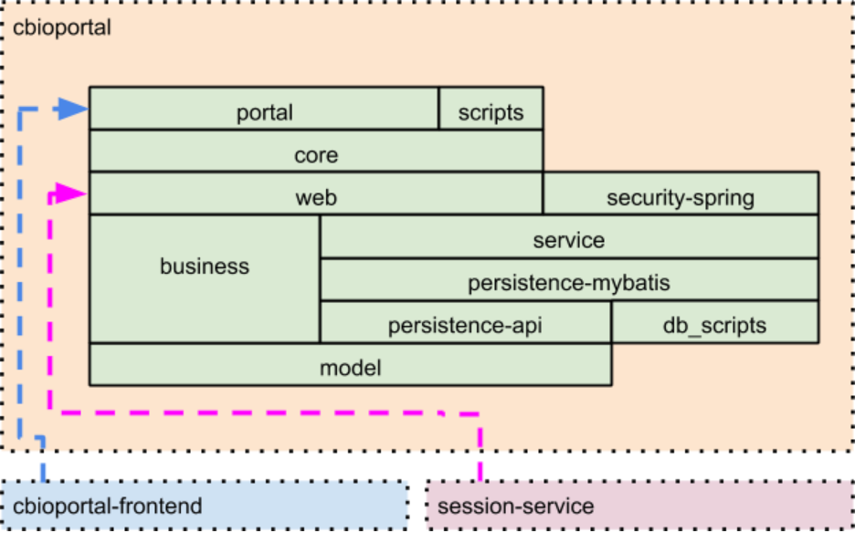

# cBioPortal Backend Code Organization

## Maven Project

The backend code is structured as a [Maven](https://maven.apache.org/index.html)
project. Included in the repository are [pom.xml files](https://maven.apache.org/pom.html#What_is_the_POM)
which define the code components and modules which make up the backend. The pom.xml
files also list dependencies on external open source libraries, and dependencies between cBioPortal Maven modules.
They also give instructions for how to build and package code components into a
deployable format.

### Refactoring

The code base is undergoing a long term refactoring effort which is nearing completion.

#### Web service refactoring

The original data distribution service (still in operation) was a custom servlet called
[webservice.do](https://github.com/cBioPortal/cbioportal/blob/v3.1.5/core/src/main/java/org/mskcc/cbio/portal/servlet/WebService.java)
This servlet takes a "cmd" argument which selects the category of data requested.
More details can be seen on the cBioPortal [webAPI](https://www.cbioportal.org/webAPI) tab.

An example request:
`curl -X GET "https://www.cbioportal.org/webservice.do?cmd=getGeneticProfiles&cancer_study_id=brca_tcga"`

The new data distribution approach follows a [RESTful](https://en.wikipedia.org/wiki/Representational_state_transfer) approach,
mapping various URL paths to data services, allowing the specification of database
entities within the path as helpful.

An example request:
`curl -X GET "https://www.cbioportal.org/api/studies/brca_tcga/molecular-profiles"`

#### Presentation / frontend refactoring

The original presentation code was written as a set of java service pages ([JSP](https://en.wikipedia.org/wiki/JavaServer_Pages)),
connected to servlets which populated needed data for page rendering into request attributes
within the backend server. You can see examples of the setting of these request attributes in
[this example servlet](https://github.com/cBioPortal/cbioportal/blob/master/core/src/main/java/org/mskcc/cbio/portal/servlet/QueryBuilder.java)

This has largely been superceded and expanded on by a new [React](https://reactjs.org/)
javascript application located in a separate
[GitHub repository](https://github.com/cBioPortal/cbioportal-frontend), which maintains a
browser data store populated from the new RESTful Web API. Although the new frontend
project is not dependent on the original custom servlets for data delivery, we may continue
to use the servlet / JSP delivery path to embed configuration data in the initial HTML page
in order to allow us to optimize loading times. Some of this logic has already been
migrated out of the core module and moved to the portal module.

### Current Maven Modules

#### The core module

The [core](https://github.com/cBioPortal/cbioportal/blob/master/core) module contains the oldest code in the code base. Much of
the backend web data services logic has been re-implemented and expanded in
other backend maven modules, such as [model](https://github.com/cBioPortal/cbioportal/blob/master/model),
[persistence-mybatis](https://github.com/cBioPortal/cbioportal/blob/master/persistence/persistence-mybatis),
[service](https://github.com/cBioPortal/cbioportal/blob/master/service), and [web](https://github.com/cBioPortal/cbioportal/blob/master/web). We plan to discontinue the legacy
webservice.do data servlet and fully transition to the new data services API in
the near future. The core module will then be purged of much of the legacy
code. Any surviving functionality (such as the handling of global configuration
properties) may be relocated into new modules. It is therefore important that
no new code features be introduced which are dependent on the core module
functionality.

#### The central stack modules : web, service, persistence

Three maven modules make up the central stack of the new web API implementation.

* [web](https://github.com/cBioPortal/cbioportal/blob/master/web) : define Web API request handlers, map endpoints, select services
* [service](https://github.com/cBioPortal/cbioportal/blob/master/service) : call persistence module or utils, apply business logic
* [persistence](https://github.com/cBioPortal/cbioportal/blob/master/persistence) : retrieve data from database. Two submodules:
  * [persistence-api](https://github.com/cBioPortal/cbioportal/blob/master/persistence/persistence-api) : declaration of repository classes / functions, caching markup
  * [persistence-mybatis](https://github.com/cBioPortal/cbioportal/blob/master/persistence/persistence-mybatis) : implementation of persistence-api using [MyBatis](https://mybatis.org/mybatis-3/) mappers

#### Other modules

* [model](https://github.com/cBioPortal/cbioportal/blob/master/model) : data model POJO classes (used throughout the stack)
* [security](https://github.com/cBioPortal/cbioportal/blob/master/security) : user authentication methods and authorization, request filters 
* [business](https://github.com/cBioPortal/cbioportal/blob/master/business) : a legacy refactor of webservice.do, has active dataSource definition
* [portal](https://github.com/cBioPortal/cbioportal/blob/master/portal) : web application packaging and launch
* [scripts](https://github.com/cBioPortal/cbioportal/blob/master/scripts) : data import tool packaging (from core module scripts package)
* [db_scripts](https://github.com/cBioPortal/cbioportal/blob/master/db_scripts) : installation and migration scripts for the database

#### External code modules

* [cbioportal-frontend](https://github.com/cBioPortal/cbioportal-frontend) : a React application using MobX and TypeScript
* [session-service](https://github.com/cBioPortal/session-service) : an external session key/query specifier storage system

**cbioportal-frontend** is packaged in the web application as a default frontend
implementation, but the source of the frontend code can also be directed to an external
source host and be deployed independently of the backend web application. See
[details](Deployment-Procedure.md)

**session-service** is imported into the web module in order to set up a proxy service
which receives and forwards requests for saved cBioPortal sessions to a separate system
providing this storage (using a document based database) The code is needed for handling
modeled types such as VirtualStudy and Session

### cBioPortal Module Dependencies

_A module is directly dependent on all modules which touch it from below (touching only at a corner
does not count). Dependencies are transitive : web is dependent on service, service
is dependent on persistence-mybatis, therefore web is also dependent on
persistence-mybatis. During packaging, all dependencies are made available to the
dependent package for use. Avoid creating new dependencies between modules.
**cyclical dependencies will cause errors during build**_

Module | Dependencies
------ | ------------
portal | core, _cbioportal-frontend_
scripts | core
core | web 
web | business, service, _session-service_
security-spring | service
service | persistence-mybatis
persistence-mybatis | persistence-api, db-scripts
persistence-api | model
business | model
db-scripts |
model |
