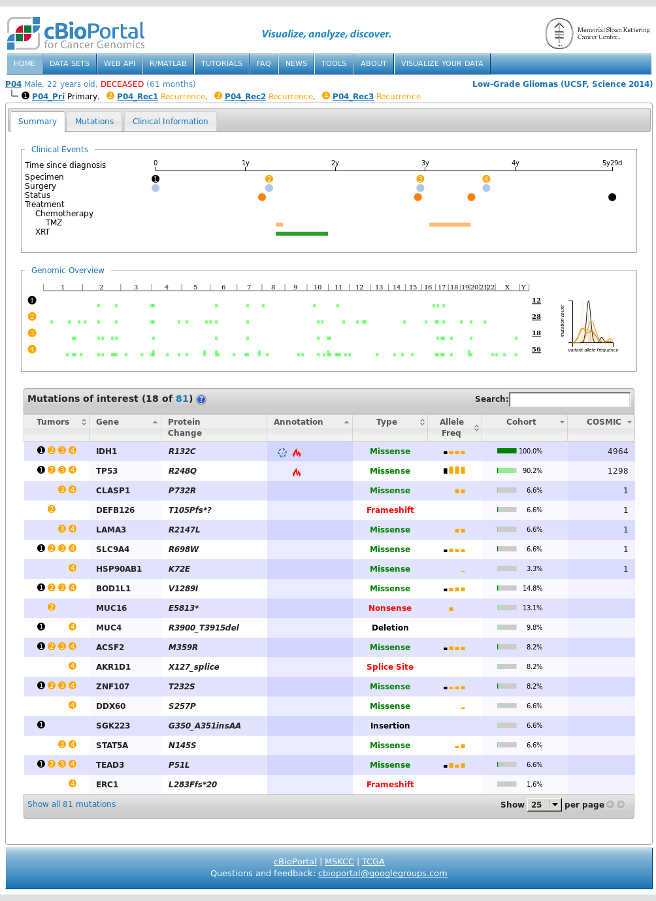

# Customizing your instance of cBioPortal

cBioPortal contains a number of properties that allow you to customize your cBioPortal instance. 

This page focuses on the skin properties, which allow you to
customize the web page cosmetics, such as custom images,
texts, which tabs are visible, etc.
Nearly all the skins properties have defaults, which can be overwritten by
changing the `portal.properties` file located in `$PORTAL_HOME`--see
[the deployment manual](Deploying.md). If your cBioPortal instance
does not yet contain a `portal.properties` file, you can copy
`src/main/resources/portal.properties.EXAMPLE` and edit it.

Below you can find the complete list of all the available skin properties.

# cBioSkins Properties

**Please note!**  If you are reading this on the GitHub web site, you may need to scroll right to see all the columns in the table below.

<table>
   <tbody>
		<tr>
         <th>Name</th>
         <th>Description</th>
         <th>Default</th>
         <th>Type Allowed</th>
		</tr>
		<tr>
			<td>skin.authorization_message</td>
			<td>sets the authorization message that appears after an unsuccessful login</td>
			<td>Access to this portal is only available to authorized users at Memorial Sloan Kettering Cancer Center...</td>
			<td>Any HTML text</td>
		</tr>
		<tr>
			<td>skin.blurb</td>
			<td>sets the main text on the index page</td>
			<td>Text for public cBioPortal.org.</td>
			<td>Any HTML text</td>
		</tr>
		<tr>
			<td>skin.example_study_queries</td>
			<td>\n-separated list of study query suggestions displayed when clicking the ‘select a cancer study' search box</td>
			<td>tcga\ntcga -provisional\ntcga -moratorium\ntcga OR icgc\n-"cell line"\nprostate mskcc\nesophageal OR stomach\nserous\nbreast</td>
			<td>text separated by the escape sequence \n</td>
		</tr>
		<tr>
			<td>skin.data_sets_footer</td>
			<td>sets the text that is shown below the number of samples, after clicking on the "DATA SETS" tab in the header.</td>
			<td>The portal currently contains data from the following cancer genomics studies.  The table below lists the number of available samples per data type and tumor.</td>
			<td>Any HTML text</td>
		</tr>
		<tr>
			<td>skin.data_sets_header</td>
			<td>sets the text that is shown below the Data Sets title, after clicking on the "DATA SETS" tab in the header. By adding &lt;NUM_CANCER_STUDIES&gt; to the text, the number of cancer studies is inserted</td>
			<td>Data sets of TCGA studies were downloaded from Broad Firehose (http://gdac.broadinstitute.org) and updated monthly. In some studies, data sets were from the TCGA working groups directly.</td>
			<td>Any HTML text</td>
		</tr>
      <tr>
         <td>skin.documentation.about</td>
         <td>set the about page which can be accessed via ABOUT in the header. Please see the cBioportal Documentation section for details on how to properly configure the documentation pages.</td>
         <td>About-Us.md</td>
         <td>text</td>
      </tr>
      <tr>
         <td>skin.documentation.baseurl</td>
         <td>set the base url for the documentation. Please see the cBioPortal Documentation section for details on how to properly configure the documentation pages.</td>
         <td>https://github.com/cBioPortal/cbioportal/wiki/</td>
         <td>text</td>
      </tr>
      <tr>
         <td>skin.documentation.faq</td>
         <td>set the faq page which can be accessed via FAQ in the header. Please see the cBioPortal Documentation section for details on how to properly configure the documentation pages.</td>
         <td>FAQ.md</td>
         <td>text</td>
      </tr>
      <tr>
         <td>skin.documentation.markdown</td>
         <td>set whether the documentation files are in markdown. Please see the cBioPortal Documentation section for details on how to properly configure the documentation pages.</td>
         <td>true</td>
         <td>text</td>
      </tr>
      <tr>
         <td>skin.documentation.news</td>
         <td>set the news page which can be accessed via NEWS in the header. Please see the cBioPortal Documentation section for details on how to properly configure the documentation pages.</td>
         <td>News.md</td>
         <td>text</td>
      </tr>
		<tr>
			<td>skin.email_contact</td>
			<td>sets the contact email address for Questions and feedback, located in the footer.</td>
			<td>cbioportal at googlegroups dot com</td>
			<td>Specify as name at somewhere dot extension or as name@somewhere.extension</td>
		</tr>
      <tr>
         <td>skin.examples_right_column_html</td>
         <td>set the Examples Queries section in the right navigation bar</td>
         <td>&lt;ul&gt;&lt;li&gt;&lt;a href="patient?studyId=ucec_tcga_pub&caseId=TCGA-BK-A0CC"&gt;Patient view of an endometrial cancer case&lt;/a&gt;&lt;/li&gt;&lt;/ul&gt;</td>
         <td>Any HTML text</td>
      </tr>
		<tr>
			<td>skin.footer</td>
			<td>sets the footer text. The text will be appended to the already existing cBioPortal link</td>
			<td>cBioPortal public instance footer.</td>
			<td>Any HTML text</td>
		</tr>
		<tr>
			<td>skin.login.contact_html</td>
			<td>sets the feedback message which appears after a failed login attempt</td>
			<td>If you think you have received this message in error, please contact us at...</td>
			<td>Any HTML text</td>
		</tr>
		<tr>
			<td>skin.login.saml.registration_html</td>
			<td>sets the button text for saml login</td>
			<td>Sign in with MSK</td>
			<td>Any HTML text</td>
		</tr>
		<tr>
			<td>skin.right_logo</td>
			<td>sets the right logo in the header. Logo should be placed in the images directory or in a subdirectory of the images directory. If placed in a subfolder, the skin.right_logo value has to contain the folder, e.g. skin.right_logo = myFolder/myImage.jpg</td>
			<td>MSKCC Logo</td>
			<td>text</td>
		</tr>
		<tr>
			<td>skin.right_nav.show_data_sets</td>
			<td>show the "Data Sets" section in the right navigation bar</td>
			<td>true</td>
			<td>true / false</td>
		</tr>
		<tr>
			<td>skin.right_nav.show_examples</td>
			<td>show the "Example Queries" section in the right navigation bar</td>
			<td>true</td>
			<td>true / false</td>
		</tr>
		<tr>
			<td>skin.right_nav.show_testimonials</td>
			<td>show the "What People are Saying" section in the right navigation bar</td>
			<td>true</td>
			<td>true / false</td>
		</tr>
		<tr>
			<td>skin.right_nav.whats_new_blurb</td>
			<td>set the content of the "What’s New" section in the right navigation bar</td>
			<td>Text for public cBioPortal.org.</td>
			<td>Any HTML text</td>
		</tr>
		<tr>
			<td>skin.show_about_tab</td>
			<td>show the "ABOUT" tab in the header</td>
			<td>true</td>
			<td>true / false</td>
		</tr>
		<tr>
			<td>skin.show_data_tab</td>
			<td>show the "DATA SETS" tab in the header</td>
			<td>true</td>
			<td>true / false</td>
		</tr>
		<tr>
			<td>skin.show_faqs_tab</td>
			<td>show the "FAQ" tab in the header</td>
			<td>true</td>
			<td>true / false</td>
		</tr>
		<tr>
			<td>skin.show_news_tab</td>
			<td>show the "NEWS" tab in the header</td>
			<td>true</td>
			<td>true / false</td>
		</tr>
		<tr>
			<td>skin.show_r_matlab_tab</td>
			<td>show the "R/MATLAB" tab in the header</td>
			<td>true</td>
			<td>true / false</td>
		</tr>
		<tr>
			<td>skin.show_tools_tab</td>
			<td>show the "TOOLS" tab in the header</td>
			<td>true</td>
			<td>true / false</td>
		</tr>
		<tr>
			<td>skin.show_tutorials_tab</td>
			<td>show the "TUTORIALS" tab in the header</td>
			<td>true</td>
			<td>true / false</td>
		</tr>
		<tr>
			<td>skin.show_web_api_tab</td>
			<td>show the "WEB API" tab in the header</td>
			<td>true</td>
			<td>true / false</td>
		</tr>
		<tr>
			<td>skin.tag_line_image</td>
			<td>sets the tag line image in the header. The image should be placed in the images directory or in a subdirectory of the images directory. If placed in a subdirectory, the skin.tag_line_image value has to contain the folder, e.g. skin.tag_line_image = myFolder/myImage.jpg</td>
			<td>tag_line.png</td>
			<td>text</td>
		</tr>
		<tr>
			<td>skin.title</td>
			<td>sets the title of the site / name of the browser tab. E.g. when navigating to About Us with the default setting, the title becomes "cBioPortal for Cancer Genomics::About Us"</td>
			<td>cBioPortal for Cancer Genomics</td>
			<td>text</td>
		</tr>
		<tr>
            <td>skin.query.max_tree_depth</td>
            <td>sets the maximum number of subcategories shown in the query component hierarchy before each study. E.g. when set to 0, the hierarchy is flat, meaning only the study elements show in the component, without any tissue or cancer type sorting.</td>
            <td>3</td>
            <td>integer</td>
        </tr>
		<tr>
            <td>skin.patientview.filter_genes_profiled_all_samples</td>
            <td>sets default setting for the genes filter in patient view to only show mutations for genes that were profiled for mutations or CNA's in all samples of that patient. If unset, patient view will show mutations/CNA's for genes that were profiled in any sample.</td>
            <td>false</td>
            <td>true / false</td>
        </tr>
      <tr>
            <td>google_analytics_profile_id</td>
            <td>enables google analaytics tracking on your site</td>
            <td>disabled</td>
            <td>string</td>
        </tr>
                
           
        

        
       
        
   </tbody>
</table>

# Customization when using Docker
To add images or other files to the Docker image one can mount them inside the `cbioportal-webapp` folder. For example to use a custom logo for `skin.right_logo`. Mount the image inside the`cbioportal-webapp` folder with `-v /path/to/custom_logo.png:/cbioportal-webapp/images/custom_logo.png` and set `skin.right_logo=custom_logo.png` in your properties file.

# Creating your own local news/about or FAQ page

Creating you own local news/about or FAQ page involves three steps. For example, to create your own news page:

1. Copy `<cbioportal_source_folder>/portal/src/main/webapp/content/news.html` to `news_XXXX.html`
2. Modify `news_XXXX.html` as needed.
3. Edit the `portal.properties` file and change the `skin.documentation.news` property, giving it the name of your news HTML component.

You may need to modify additional settings depending on whether you're e.g. using markdown pages. Please refer to the [cBioPortal Documentation](#cbioportal-documentation-settings) for more information.

# cBioPortal Documentation Settings
cBioPortal supports internal as well as external pages and supports html and markdown pages. 

## Using External Pages
cBioPortal can retrieve external pages and use them as news/faq/about page. For example, if your news page is stored on github wiki and reachable via https://github.com/cBioPortal/cbioportal/wiki/News.md use

```
skin.documentation.baseurl=https://github.com/cBioPortal/cbioportal/wiki/
skin.documentation.news=News.md
```

## Using Internal Pages
cBioPortal can use pages stored in (a subdirectory of) your content directory as news/faq/about page. For example, if your news page is called myNews.md and stored in content/myFolder, use 

```
skin.documentation.baseurl=/
skin.documentation.news=myFolder/myNews.md
```

## Markdown
By default, cBioPortal assumes all documentation is in markdown. If your documentation is not in markdown, please use

```
skin.documentation.markdown=false
```

If your documentation contains a relative link, cBioPortal will assume it uses the same format and, when clicked, will try to interpret the page as such. If your documentation contains an absolute link, cBioPortal will open it in a new window when clicked.
Please be aware that the links may be case-sensitive! E.g. https://github.com/cBioPortal/cbioportal/wiki/News.md is not the same as https://github.com/cBioPortal/cbioportal/wiki/news.md

# Custom styling of the patient view's clinical data
The [Patient View](https://www.cbioportal.org/patient?studyId=lgg_ucsf_2014&caseId=P04) shows several [clinical attributes](File-Formats.md#clinical-data) at the top of the page, e.g. `AGE`, `SEX`:

The order, styling and visibility of those [attributes](File-Formats.md#clinical-data) at the top can be changed by editing the [patient view's clinical attributes CSS file](../portal/src/main/webapp/css/patient-view/clinical-attributes.css).
