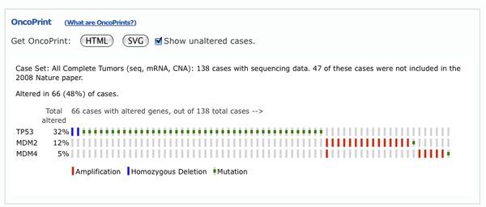

# Frequently Asked Questions

## General Questions

### What is the cBioPortal for Cancer Genomics?

The cBioPortal for Cancer Genomics is an open-access, open-source resource for interactive exploration of multidimensional cancer genomics data sets. The cBioPortal significantly lowers the barriers between complex genomic data and cancer researchers who want rapid, intuitive, and high-quality access to molecular profiles and clinical attributes from large-scale cancer genomics projects and empowers researchers to translate these rich data sets into biologic insights and clinical applications.

### How do I get started?

Check out our [tutorial paper](http://www.ncbi.nlm.nih.gov/pubmed/23550210) to get started.

### What data types are in the portal?

The portal currently stores DNA copy-number data (putative, discrete values per gene, e.g. "deeply deleted" or "amplified", as well as log2 levels), mRNA and microRNA expression data, non-synonymous mutations, protein-level and phosphoprotein level (RPPA) data, DNA methylation data, and limited de-identified clinical data. For a complete breakdown of available data types per cancer study go to the [Data Sets Page](http://www.cbioportal.org/data_sets.jsp).

### What is the process of data curation?

The TCGA provisional datasets are directly from [TCGA data center](https://tcga-data.nci.nih.gov/tcga/) partly via [Broad Firehose](http://gdac.broadinstitute.org/) which are updated regularly.

We are also actively curating datasets from literature. Studies from literature were curated from the data published with the papers. We sometimes reach out to the investigators to additional data such as clinical attributes. All the mutation data (VCF or MAF) were processed through an internal pipeline to annotate the variant effects in a consistent way across studies.

Please [contact us](mailto:cbioportal@googlegroups.com) to suggest public datasets to curate. 

### How do I get updates on new portal developments and new data sets?

Please subscribe to our low-traffic [news mailing list](http://groups.google.com/group/cbioportal-news) or follow us on [Twitter](https://twitter.com/cbioportal).

### Does the portal work on all browsers and operating systems?

We support and test on the following web browsers: Internet Explorer 11.0 and above, Firefox 3.0 and above, Safari and Google Chrome. If you notice any other incompatibilities, please let us know.

### How do I cite the cBioPortal?

You can cite the following portal papers:

*   Cerami et al. The cBio Cancer Genomics Portal: An Open Platform for Exploring Multidimensional Cancer Genomics Data. _Cancer Discovery_. May 2012 2; 401. [Abstract](http://cancerdiscovery.aacrjournals.org/content/2/5/401.abstract).
*   Gao et al. Integrative analysis of complex cancer genomics and clinical profiles using the cBioPortal. _Sci. Signal._ 6, pl1 (2013). [Reprint](http://www.ncbi.nlm.nih.gov/pubmed/23550210).

### Can I use figures from the cBioPortal in my publications or presentations?

Yes, you are free to use any of the figures from the portal in your publications or presentations (many are available as PDFs for easier scaling and editing). When you do, please cite Cerami et al., Cancer Discov. 2012 and Gao et al. Sci. Signal. 2013.

When using TCGA data in your publications, please adhere to the [TCGA publication guidelines](http://cancergenome.nih.gov/publications/publicationguidelines).

### How is the cBioPortal for Cancer Genomics different from the TCGA Data Portal?

The cBio portal is an exploratory analysis tool for exploring large-scale cancer genomic data sets. You can quickly view genomic alterations across a set of patients, across a set of cancer types, perform survival analysis and perform network analysis. By contrast, the [TCGA Data Portal](http://tcga-data.nci.nih.gov/tcga/tcgaHome2.jsp) aims to be the definitive place for full-download and access to all data generated by TCGA. If you want to explore a pathway of interest in one or more cancer types, the cBio portal is probably where you want to start. However, if you want to download raw mRNA expression files or full segmented copy number files, the TCGA Data Portal is probably where you want to start.

### Does the cBioPortal provide a Web Service API?  R interface?  MATLAB interface?

Yes, the cBioPortal provides a [Web API](http://www.cbioportal.org/web_api.jsp), and [R/MATLAB interfaces](http://www.cbioportal.org/cgds_r.jsp).

### Can I create a local instance of cBioPortal to host my own data?

Yes, the cBioPortal is open-source, and available on [GitHub](https://github.com/cBioPortal/cbioportal).  Our [Wiki pages](https://github.com/cBioPortal/cbioportal/wiki) provide complete download and installation instructions.

### I'd like to contribute code to the cBioPortal.  How do I get started?

Great!  We would love to have your contributions.  To get started, head over to our GitHub repository and check out our page on [how to contribute](https://github.com/cBioPortal/cbioportal/blob/master/CONTRIBUTING.md).

## Data-Specific Questions

### Does the cBioPortal contain synonymous mutation data?

No, the cBioPortal does not currently support synonymous mutations.  This may change in the future, but we have no plans yet to add this feature.

### Why do some cancer studies have mutation data and others do not?

We store mutation data for published cancer studies. We do not, however store mutation data for provisional cancer data sets generated by TCGA. This is because provisional studies contain preliminary somatic mutations, which per NCI guidelines cannot be redistributed until they have been validated. As each cancer study is published and finalized by the TCGA, we will import the corresponding mutation data.

### Does the portal contain cancer study X?

Check out the [Data Sets Page](http://www.cbioportal.org/data_sets.jsp) for the complete set of cancer studies currently stored in the portal. If you do not see your specific cancer study of interest, please contact us directly, and we will let you know if it's in the queue.

### What kind of clinical data is stored in the portal?

The portal currently stores overall and disease-free survival data, plus limited de-identified clinical data, such as gender, age, stage and tumor grade, when available.

### Does the portal store raw or probe-level data?

No, the portal only contains gene-level data. Data for different isoforms of a given gene are merged. Raw and probe-level data for all date sets is available via NCBI GEO or through the TCGA Data Portal. See the cancer type description on the main query page for links to the raw data.

### Which methylation probe is used for genes with multiple probes?

For genes with multiple probes, we only include methylation data from the probe with the strongest negative correlation between the methylation signal and the gene's expression.

### How can I query phosphoprotein levels in the portal?

You need to input special IDs for each phosphoprotein/phopshosite such as _AKT_pS473_ (which means AKT protein phosphorylated at serine residue at position 473). You could also input aliases such as _phosphoAKT1_ or _phosphoprotein_, and the portal will ask you to select the phosphoprotein/phosphosite of your interest.

### How can I query microRNAs in the portal?

You can input either precusor or mature miRNA IDs. Since one precusor ID may correspond to multiple mature IDs and vise versa, the portal creates one internal ID for each pair of precursor ID and mature ID mapping. For example, an internal ID of MIR-29B-1/29B stands for precursor microRNA hsa-mir-29b-1 and mature microRNA hsa-miR-29b. After entering a precusor or mature ID, you will be asked to select one internal ID for query and that internal ID will also be displayed in the Oncoprint.

### What are mRNA and microRNA Z-Scores?

For mRNA and microRNA expression data, we typically compute the relative expression of an individual gene and tumor to the gene's expression distribution in a reference population. That reference population is all samples that are diploid for the gene in question (by default for mRNA), or normal samples (when specified), or all profiled samples . The returned value indicates the number of standard deviations away from the mean of expression in the reference population (Z-score). This measure is useful to determine whether a gene is up- or down-regulated relative to the normal samples or all other tumor samples.

### Are there any normal samples available through cBioPortal?

No, we currently do not store any normal data in our system.

### What is GISTIC? What is RAE?

Copy number data sets within the portal are generated by [GISTIC](http://www.ncbi.nlm.nih.gov/sites/entrez?term=18077431) or [RAE](http://www.ncbi.nlm.nih.gov/sites/entrez?term=18784837) algorithms. Both algorithms attempt to identify significantly altered regions of amplification or deletion across sets of patients. Both algorithms also generate putative gene/patient copy number specific calls, which are then input into the portal.

For TCGA studies, the table in all_thresholded.by_genes.txt (which is the part of the GISTIC output that is used to determine the copy-number status of each gene in each sample in cBioPortal) is obtained by applying both low- and high-level thresholds to to the gene copy levels of all the samples. The entries with value +/- 2 exceed the high-level thresholds for amps/dels, and those with +/- 1 exceed the low-level thresholds but not the high-level thresholds. The low-level thresholds are just the 'amp_thresh' and 'del_thresh' noise threshold input values to GISTIC (typically 0.1 or 0.3) and are the same for every thresholds.

By contrast, the high-level thresholds are calculated on a sample-by-sample basis and are based on the maximum (or minimum) median arm-level amplification (or deletion) copy number found in the sample. The idea, for deletions anyway, is that this level is a good approximation for hemizygous given the purity and ploidy of the sample. The actual cutoffs used for each sample can be found in a table in the output file sample_cutoffs.txt. All GISTIC output files for TCGA are available at: gdac.broadinstitute.org.

### What do "-2", "-1", "0", "1", and "2" mean in the copy-number data?

These levels are derived from the copy-number analysis algorithms GISTIC or RAE, and indicate the copy-number level per gene. "-2" is a deep loss, possibly a homozygous deletion, "-1" is a shallow loss (possibly heterozygous deletion), "0" is diploid, "1" indicates a low-level gain, and "2" is a high-level amplification. Note that these calls are putative.

### What are the sources of biological network data?

The biological network data were retrieved from [Pathway Commons](http://www.pathwaycommons.org/).

### How does cBioPortal handle duplicate samples or sample IDs across different studies?

The cBioPortal assumes that samples or patients that have the same ID are actually the same. This is important for cross-cancer queries, where each sample should only be counted once. If a sample is part of multiple cancer cohorts, its alterations are only counted once in cross-cancer summaries: while it is listed multiple times in cross-cancer mutation tables, it is only counted once in summary statistics (e.g., alteration frequencies) and in mutation diagrams. To avoid any confusion and miscounts, all sample IDs in cBioPortal of samples that are different should be unique, and identical samples in different cohorts should use the same ID.

## OncoPrint-Specific Questons

### What are OncoPrints?

OncoPrints are compact means of visualizing distinct genomic alterations, including somatic mutations, copy number alterations, and mRNA expression changes across a set of cases. They are extremely useful for visualizing gene set and pathway alterations across a set of cases, and for visually identifying trends, such as trends in mutual exclusivity or co-occurence between gene pairs within a gene set. Individual genes are represented as rows, and individual cases or patients are represented as columns.

### Can I change the order of genes in the OncoPrint?

The order of genes in the OncoPrint is determined by the order entered into the initial query field. Simply change the initial gene order, resubmit your query, and the change will be reflected in the OncoPrint.

### Can I visualize my own data within an OncoPrint?

Yes, check out the OncoPrinter tool on our [tools page](http://www.cbioportal.org/tools.jsp).

## What if I have other questions or comments?

Please contact us at [cbioportal@googlegroups.com](mailto:cbioportal@googlegroups.com). Previous discussions about cBioPortal are available on the [user discussion mailing list](http://groups.google.com/group/cbioportal).

