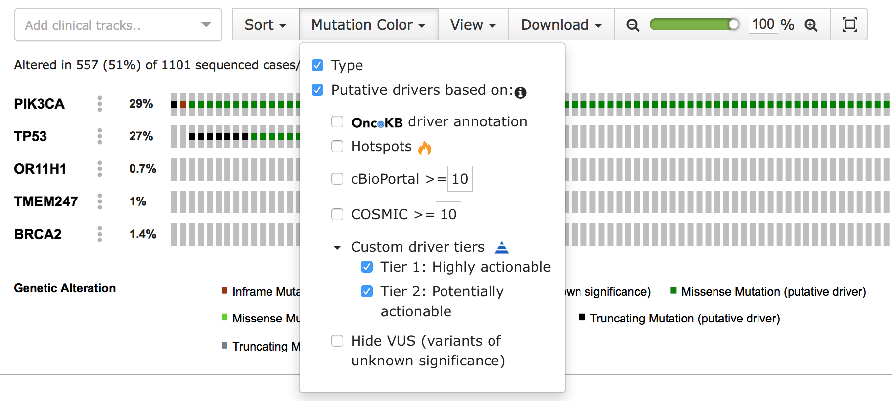

* [Introduction](#introduction)
* [Formats](#formats)
    * [Cancer Study](#cancer-study)
    * [Cancer Type](#cancer-type)
    * [Clinical Data](#clinical-data)
    * [Discrete Copy Number Data](#discrete-copy-number-data)
    * [Continuous Copy Number Data](#continuous-copy-number-data)
    * [Segmented Data](#segmented-data)
    * [Expression Data](#expression-data)
    * [Mutation Data](#mutation-data)
    * [Fusion Data](#fusion-data)
    * [Methylation Data](#methylation-data)
    * [Protein level Data](#protein-level-data)
    * [Case Lists](#case-lists)
    * [Timeline Data](#timeline-data)
    * [GISTIC 2.0 Data](#gistic-20-data)
    * [Mutsig Data](#mutsig-data)
    * [Gene Panel Data](#gene-panel-data)
    * [Gene Set Data](#gene-set-data)
    * [Study Tags file](#study-tags-file)
    * [Generic Assay](#generic-assay)
    * [Resource Data](#resource-data)

# Introduction

This page describes the file formats that cancer study data should assume in order to be successfully imported into the database.  Unless otherwise noted, all data files are in tabular-TSV (tab separated value) format and have an associated metadata file which is in a multiline record format.  The metadata and data files should follow a [few rules documented at the Data Loading page](Data-Loading.md#preparing-study-data).

# Formats

## Cancer Study

As described in the [Data Loading tool](Data-Loading.md) page, the following file is needed to describe the cancer study:

### Meta file
This file contains metadata about the cancer study. The file contains the following fields:

1. **type_of_cancer**: The cancer type abbreviation, e.g., "brca".  This should be the same cancer type as specified in the `meta_cancer_type.txt` file, if available. The type can be "mixed" for studies with multiple cancer types.
2. **cancer_study_identifier**: A string used to uniquely identify this cancer study within the database, e.g., "brca_joneslab_2013".  
3. **name**: The name of the cancer study, e.g., "Breast Cancer (Jones Lab 2013)".
4. **description**: A description of the cancer study, e.g., "Comprehensive profiling of 103 breast cancer samples. Generated by the Jones Lab 2013". This description may contain one or more URLs to relevant information.
5. **citation (Optional)**: A relevant citation, e.g., "TCGA, Nature 2012".
6. **pmid (Optional)**: One or more relevant pubmed ids (comma separated without whitespace). If used, the field citation has to be filled, too.
7. **short_name**:  A short name used for display used on various web pages within the cBioPortal, e.g., "BRCA (Jones)".
8. **groups (Optional)**: When using an authenticating cBioPortal, lists the user-groups that are allowed access to this study. Multiple groups are separated with a semicolon ";". The study will be invisible to users not in _at least one_ of the listed groups, as if it wasn't loaded at all. e.g., "PUBLIC;GDAC;SU2C-PI3K". see [User-Authorization](User-Authorization.md) for more information on groups
9. **add_global_case_list (Optional)**: set to 'true' if you would like the "All samples" case list to be generated automatically for you. See also [Case lists](#case-lists).
10. **tags_file (Optional)**: the file name containing custom study tags for the [study tags](#study-tags-file).
11. **reference_genome (Optional)**: the study reference genome (e.g. `hg19`, `hg38`). Without specifying this property, the study will be assigned to the reference genome specified in `portal.properties` (property `ucsc.build`).

### Example  
An example meta_study.txt file would be:
```
type_of_cancer: brca
cancer_study_identifier: brca_joneslab_2013
name: Breast Cancer (Jones Lab 2013)
short_name: BRCA (Jones)
description: Comprehensive profiling of 103 breast cancer samples. Generated by the Jones Lab 2013.
add_global_case_list: true
```

## Cancer Type
If the type_of_cancer specified in the meta_study.txt does not yet exist in the `type_of_cancer` database table, a `meta_cancer_type.txt` file is also mandatory.

### Meta file
The file is comprised of the following fields:

1. **genetic_alteration_type**: CANCER_TYPE
2. **datatype**: CANCER_TYPE
3. **data_filename**: your datafile

### Example
An example meta_cancer_type.txt file would be:
```
genetic_alteration_type: CANCER_TYPE
datatype: CANCER_TYPE
data_filename: cancer_type.txt
```

### Data file
The file is comprised of the following columns in the order specified:

1. **type_of_cancer**: The cancer type abbreviation, e.g., "brca".
2. **name**: The name of the cancer type, e.g., "Breast Invasive Carcinoma".
3. **clinical_trial_keywords**: A comma separated list of keywords used to identify this study, e.g., "breast,breast invasive".
4. **dedicated_color**: CSS color name of the color associated with this cancer study, e.g., "HotPink". See [this list](https://www.w3.org/TR/css3-color/#svg-color) for supported names, and follow the [awareness ribbons](https://en.wikipedia.org/wiki/List_of_awareness_ribbons) color schema. This color is associated with the cancer study on various web pages within the cBioPortal.
5. **parent_type_of_cancer**:  The `type_of_cancer` field of the cancer type of which this is a subtype, e.g., "Breast". :information_source: : you can set parent to `tissue`, which is the reserved word to place the given cancer type at "root" level in the "studies oncotree" that will be generated in the homepage (aka query page) of the portal. 

### Example
An example record would be:
```
brca<TAB>Breast Invasive Carcinoma<TAB>breast,breast invasive<TAB>HotPink<TAB>Breast
```

## Clinical Data

The clinical data is used to capture both clinical attributes and the mapping between patient and sample ids. The software supports multiple samples per patient.  

As of March 2016, the clinical file is split into a patient clinical file and a sample clinical file. The *sample* file is required, whereas the *patient* file is optional. cBioPortal has specific functionality for a core set of patient and sample columns, but can also display custom columns (see section ["Custom columns in clinical data"](#custom-columns-in-clinical-data)).

### Meta files
The two clinical metadata files (or just one metadata file if you choose to leave the *patient* file out) have to contain the following fields:

1. **cancer_study_identifier**: same value specified in meta_study.txt
2. **genetic_alteration_type**: CLINICAL
3. **datatype**: PATIENT_ATTRIBUTES or SAMPLE_ATTRIBUTES
4. **data_filename**: your datafile

### Examples
An example metadata file, e.g. named meta_clinical_sample.txt, would be:
```
cancer_study_identifier: brca_tcga_pub
genetic_alteration_type: CLINICAL
datatype: SAMPLE_ATTRIBUTES
data_filename: data_clinical_sample.txt
```

An example metadata file, e.g. named meta_clinical_patient.txt, would be:
```
cancer_study_identifier: brca_tcga_pub
genetic_alteration_type: CLINICAL
datatype: PATIENT_ATTRIBUTES
data_filename: data_clinical_patient.txt
```

### Data files
For both patients and samples, the clinical data file is a two dimensional matrix with multiple clinical attributes. When the attributes are defined in the *patient* file they are considered to be patient attributes; when they are defined in the *sample* file they are considered to be sample attributes. 

The first four rows of the clinical data file contain tab-delimited metadata about the clinical attributes. These rows **have to start with a '#' symbol**. Each of these four rows contain different type of information regarding each of the attributes that are defined in the fifth row:

- Row 1: **The attribute Display Names**: The display name for each clinical attribute
- Row 2: **The attribute Descriptions**: Long(er) description of each clinical attribute
- Row 3: **The attribute Datatype**: The datatype of each clinical attribute (must be one of:  STRING, NUMBER, BOOLEAN)
- Row 4: **The attribute Priority**: A number which indicates the importance of each attribute.  In the future, higher priority attributes will appear in more prominent places than lower priority ones on relevant pages (such as the [Study View](https://www.cbioportal.org/study?id=brca_tcga)). A higher number indicates a higher priority.
    ```
    To promote certain chart in study view, please increase priority to a certain number. The higher the score, the higher priority it will be displayed in the study view.
    If you want to hide chart, please set the priority to 0. For combination chart, as long as one of the clinical attribute has been set to 0, it will be hidden.
    
    Currently, we preassigned priority to few charts, but as long as you assign a priority except than 1, these preassigned priorities will be overwritten.
    
    CANCER_TYPE: 3000, CANCER_TYPE_DETAILED: 2000,
    Overall survival plot: 400 (This is combination of OS_MONTH and OS_STATUS) 
    Disease Free Survival Plot: 300 (This is combination of DFS_MONTH and DFS_STATUS) 
    Mutation Count vs. CNA Scatter Plot: 200,
    Mutated Genes Table: 90, CNA Genes Table: 80, study_id: 70, # of Samples Per Patient: 40,
    With Mutation Data Pie Chart: 60, With CNA Data Pie Chart: 50, 
    Mutation Count Bar Chart: 30, CNA Bar Chart: 20,
    GENDER: 9, SEX: 9, AGE: 8
    ```
    
    Please note: 
    Priority is not the sole factor determining which chart will be displayed first.
    A layout algorithm in study view also makes a minor adjustment on the layout.
    The algorithm tries to fit all charts into a 2 by 2 matrix (Mutated Genes Table occupies 2 by 2 space).
    When a chart can not be fitted in the first matrix, the second matrixed will be generated. 
    And the second matrix will have lower priority than the first one. 
    If later chart can fit into the first matrix, then its priority will be promoted.
    
    Please see [here](Study-View.md) for more detailed information about how study view utilize priority and how the layout is calculated based on priority.
- Row 5: **The attribute name for the database**: This name should be in upper case.
- Row 6: This is the first row that contains actual data.


### Example clinical header
Below is an example of the first 4 rows with the respective metadata for the attributes defined in the 5th row. 
```
#Patient Identifier<TAB>Overall Survival Status<TAB>Overall Survival (Months)<TAB>Disease Free Status<TAB>Disease Free (Months)<TAB>...
#Patient identifier<TAB>Overall survival status<TAB>Overall survival in months since diagnosis<TAB>Disease free status<TAB>Disease free in months since treatment<TAB>...
#STRING<TAB>STRING<TAB>NUMBER<TAB>STRING<TAB>NUMBER<TAB>...
#1<TAB>1<TAB>1<TAB>1<TAB>1<TAB>
PATIENT_ID<TAB>OS_STATUS<TAB>OS_MONTHS<TAB>DFS_STATUS<TAB>DFS_MONTHS<TAB>...
....
data - see examples below
....
```

### Clinical patient columns
The file containing the patient attributes has one **required** column:
- **PATIENT_ID (required)**: a unique patient ID. This field allows only numbers, letters, points, underscores and hyphens.

The following columns are used by the study view as well as the patient view. In the [study view](https://www.cbioportal.org/study?id=brca_tcga) they are used to create the survival plots. In the patient view they are used to add information to the [header](https://www.cbioportal.org/patient?studyId=lgg_ucsf_2014&caseId=P05). 
- **OS_STATUS**:  Overall patient survival status
    - Possible values: 1:DECEASED, 0:LIVING
    - In the patient view, 0:LIVING creates a green label, 1:DECEASED a red label.
    - In visualisation of [Timeline data](#timeline-data), 1:DECEASED will result in a new event of type STATUS
- **OS_MONTHS**:  Overall survival in months since initial diagnosis
- **DFS_STATUS**: Disease free status since initial treatment
    - Possible values: 0:DiseaseFree, 1:Recurred/Progressed
    - In the patient view, 0:DiseaseFree creates a green label, 1:Recurred/Progressed a red label.
- **DFS_MONTHS**: Disease free (months) since initial treatment

These columns, when provided, add additional information to the patient description in the header:
- **PATIENT_DISPLAY_NAME**: Patient display name (string)
- **GENDER** or **SEX**: Gender or sex of the patient (string)
- **AGE**: Age at which the condition or disease was first diagnosed, in years (number)
- **TUMOR_SITE**

Custom attributes:
- **Custom Clinical Attribute Headers**: Any other custom attribute can be added as well. See section ["Custom columns in clinical data"](#custom-columns-in-clinical-data).

### Example *patient* data file
```
#Patient Identifier<TAB>Overall Survival Status<TAB>Overall Survival (Months)<TAB>Disease Free Status<TAB>Disease Free (Months)<TAB>...
#Patient identifier<TAB>Overall survival status<TAB>Overall survival in months since diagnosis<TAB>Disease free status<TAB>Disease free in months since treatment<TAB>...
#STRING<TAB>STRING<TAB>NUMBER<TAB>STRING<TAB>NUMBER<TAB>...
#1<TAB>1<TAB>1<TAB>1<TAB>1<TAB>
PATIENT_ID<TAB>OS_STATUS<TAB>OS_MONTHS<TAB>DFS_STATUS<TAB>DFS_MONTHS<TAB>...
PATIENT_ID_1<TAB>1:DECEASED<TAB>17.97<TAB>1:Recurred/Progressed<TAB>30.98<TAB>...
PATIENT_ID_2<TAB>0:LIVING<TAB>63.01<TAB>0:DiseaseFree<TAB>63.01<TAB>...
...
```

### Clinical sample columns
The file containing the sample attributes has two **required** columns:
- **PATIENT_ID (required)**: A patient ID. This field can only contain numbers, letters, points, underscores and hyphens.
- **SAMPLE_ID (required)**: A sample ID. This field can only contain numbers, letters, points, underscores and hyphens.

By adding `PATIENT_ID` here, cBioPortal will map the given sample to this patient. This enables one to associate multiple samples to one patient. For example, a single patient may have had multiple biopsies, each of which has been genomically profiled. See [this example for a patient with multiple samples](https://www.cbioportal.org/patient?studyId=lgg_ucsf_2014&caseId=P04).

The following columns are required for the pan-cancer summary statistics tab ([example](https://www.cbioportal.org/index.do?cancer_study_id=msk_impact_2017&Z_SCORE_THRESHOLD=2&RPPA_SCORE_THRESHOLD=2&data_priority=0&case_set_id=msk_impact_2017_cnaseq&gene_list=BRAF&geneset_list=+&tab_index=tab_visualize&Action=Submit&genetic_profile_ids_PROFILE_MUTATION_EXTENDED=msk_impact_2017_mutations&genetic_profile_ids_PROFILE_COPY_NUMBER_ALTERATION=msk_impact_2017_cna)).
- **CANCER_TYPE**: Cancer Type
- **CANCER_TYPE_DETAILED**: Cancer Type Detailed, a sub-type of the specified CANCER_TYPE

The following columns affect the header of the patient view by adding text to the samples in the header:
- **SAMPLE_DISPLAY_NAME**: displayed in addition to the ID
- **SAMPLE_CLASS**
- **METASTATIC_SITE** or **PRIMARY_SITE**: Override TUMOR_SITE (patient level attribute) depending on sample type

The following columns additionally affect the [Timeline data](#timeline-data) visualization:
- **OTHER_SAMPLE_ID**: sometimes the timeline data (see the [timeline data section](#timeline-data)) will not have the SAMPLE_ID but instead an alias to the sample (in the field `SPECIMEN_REFERENCE_NUMBER`). To ensure that the timeline data field `SPECIMEN_REFERENCE_NUMBER` is correctly linked to this sample, be sure to add this column `OTHER_SAMPLE_ID` as an attribute to your sample attributes file.  
- **SAMPLE_TYPE**, **TUMOR_TISSUE_SITE** or **TUMOR_TYPE**: gives sample icon in the timeline a color.
    - If set to `recurrence`, `recurred`, `progression` or `progressed`: orange
    - If set to `metastatic` or `metastasis`: red
    - If set to `primary` or otherwise: black

Custom attributes:
- **Custom Clinical Attribute Headers**: Any other custom attribute can be added as well. See section ["Custom columns in clinical data"](#custom-columns-in-clinical-data).

### Example sample data file
```
#Patient Identifier<TAB>Sample Identifier<TAB>Subtype<TAB>...
#Patient identifier<TAB>Sample Identifier<TAB>Subtype description<TAB>...
#STRING<TAB>STRING<TAB>STRING<TAB>...
#1<TAB>1<TAB>1<TAB>...
PATIENT_ID<TAB>SAMPLE_ID<TAB>SUBTYPE<TAB>...
PATIENT_ID_1<TAB>SAMPLE_ID_1<TAB>basal-like<TAB>...
PATIENT_ID_2<TAB>SAMPLE_ID_2<TAB>Her2 enriched<TAB>...
...
```

### Columns with specific functionality
These columns can be in either the patient or sample file.
- **CANCER_TYPE**: Overrides study wide cancer type
- **CANCER_TYPE_DETAILED**
- **KNOWN_MOLECULAR_CLASSIFIER**
- **GLEASON_SCORE**: Radical prostatectomy Gleason score for prostate cancer
- **HISTOLOGY**
- **TUMOR_STAGE_2009**
- **TUMOR_GRADE**
- **ETS_RAF_SPINK1_STATUS**
- **TMPRSS2_ERG_FUSION_STATUS**
- **ERG_FUSION_ACGH**
- **SERUM_PSA**
- **DRIVER_MUTATIONS**

### Custom columns in clinical data
cBioPortal supports custom columns with clinical data in either the patient or sample file. They should follow the previously described 5-row header format. Be sure to provide the correct `Datatype`, for optimal search, sorting, filtering (in [clinical data tab](https://www.cbioportal.org/study?id=brca_tcga#clinical)) and visualization.

The Clinical Data Dictionary from MSKCC is used to normalize clinical data, and should be followed to make the clinical data comparable between studies. This dictionary provides a definition whether an attribute should be defined on the patient or sample level, as well as provides a name, description and datatype. The data curator can choose to ignore these proposed definitions, but not following this dictionary might make comparing data between studies more difficult. It should however not break any cBioPortal functionality. See GET /api/ at [https://oncotree.mskcc.org/cdd/swagger-ui.html#/](https://oncotree.mskcc.org/cdd/swagger-ui.html#/) for the data dictionary of all known clinical attributes.

### Banned column names
`MUTATION_COUNT` and `FRACTION_GENOME_ALTERED` are auto populated clinical attributes, and should therefore not be present in clinical data files.

## Discrete Copy Number Data
The discrete copy number data file contain values that would be derived from copy-number analysis algorithms like [GISTIC 2.0](https://www.ncbi.nlm.nih.gov/sites/entrez?term=18077431) or [RAE](https://www.ncbi.nlm.nih.gov/sites/entrez?term=18784837). GISTIC 2.0 can be [installed](https://www.broadinstitute.org/cgi-bin/cancer/publications/pub_paper.cgi?mode=view&paper_id=216&p=t) or run online using the GISTIC 2.0 module on [GenePattern](https://cloud.genepattern.org). For some help on using GISTIC 2.0, check the [Data Loading: Tips and Best Practices](Data-Loading-Tips-and-Best-Practices.md) page. When loading case list data, the `_cna` case list is required. See the [case list section](#case-lists).

### Meta file 
The meta file is comprised of the following fields:

1. **cancer_study_identifier**: same value as specified in [study meta file](#cancer-study)
2. **genetic_alteration_type**: COPY_NUMBER_ALTERATION
3. **datatype**: DISCRETE
4. **stable_id**: gistic, cna, cna_rae or cna_consensus
5. **show_profile_in_analysis_tab**: true
6. **profile_name**: A name for the discrete copy number data, e.g., "Putative copy-number alterations from GISTIC"
7. **profile_description**: A description of the copy number data, e.g., "Putative copy-number from GISTIC 2.0. Values: -2 = homozygous deletion; -1 = hemizygous deletion; 0 = neutral / no change; 1 = gain; 2 = high level amplification."
8. **data_filename**: your datafile
9. **gene_panel (Optional)**:  gene panel stable id

### Example
An example metadata file could be named meta_CNA.txt and its contents could be:
```
cancer_study_identifier: brca_tcga_pub
genetic_alteration_type: COPY_NUMBER_ALTERATION
datatype: DISCRETE
stable_id: gistic
show_profile_in_analysis_tab: true
profile_name: Putative copy-number alterations from GISTIC
profile_description: Putative copy-number from GISTIC 2.0. Values: -2 = homozygous deletion; -1 = hemizygous deletion; 0 = neutral / no change; 1 = gain; 2 = high level amplification.
data_filename: data_CNA.txt
```

### Data file

For each gene (row) in the data file, the following columns are required in the order specified:

One or both of:
- ***Hugo_Symbol***: A [HUGO](https://www.genenames.org/) gene symbol.
- ***Entrez_Gene_Id***: A [Entrez Gene](https://www.ncbi.nlm.nih.gov/gene) identifier.

And:
- An additional column for each sample in the dataset using the sample id as the column header.

For each gene-sample combination, a copy number level is specified:
- "-2" is a deep loss, possibly a homozygous deletion
- "-1" is a single-copy loss (heterozygous deletion)
- "0" is diploid
- "1" indicates a low-level gain
- "2" is a high-level amplification.

### Example
An example data file which includes the required column header would look like:
```
Hugo_Symbol<TAB>Entrez_Gene_Id<TAB>SAMPLE_ID_1<TAB>SAMPLE_ID_2<TAB>...
ACAP3<TAB>116983<TAB>0<TAB>-1<TAB>...
AGRN<TAB>375790<TAB>2<TAB>0<TAB>...
...
...
```

### GISTIC 2.0 Format
GISTIC 2.0 outputs a tabular file similarly formatted to the cBioPortal format, called `<prefix>_all_thresholded.by_genes.txt`.
In this file the gene symbol is found in the `Gene Symbol` column, while Entrez gene IDs are in the `Gene ID` or 
`Locus ID` column. Please rename `Gene Symbol` to `Hugo_Symbol` and `Gene ID` or `Locus ID` to `Entrez_Gene_Id`. The 
`Cytoband` column can be kept in the table, but note that these values are ignored in cBioPortal. cBioPortal uses 
cytoband annotations from the `map_location` column in NCBI's `Homo_sapiens.gene_info.gz` when loading genes into 
the seed database.

## Continuous Copy Number Data

### Meta file
The continuous copy number metadata file should contain the following fields:

1. **cancer_study_identifier**: same value as specified in [study meta file](#cancer-study)
2. **genetic_alteration_type**: COPY_NUMBER_ALTERATION.
3. **datatype**: CONTINUOUS
4. **stable_id**: linear_CNA 
5. **show_profile_in_analysis_tab**: false.
6. **profile_name**: A name for the copy number data, e.g., "copy-number values".
7. **profile_description**: A description of the copy number data, e.g., "copy-number values for each gene (from Affymetrix SNP6).".
8. **data_filename**: your datafile
9. **gene_panel (Optional)**:  gene panel stable id

cBioPortal also supports log2 copy number data. If your data is in log2, change the following fields:

3. **datatype**: LOG2-VALUE
4. **stable_id**: log2CNA 

### Example
An example metadata file, e.g. meta_CNA_log2.txt, would be:
```
cancer_study_identifier: brca_tcga_pub
genetic_alteration_type: COPY_NUMBER_ALTERATION
datatype: LOG2-VALUE
stable_id: log2CNA
show_profile_in_analysis_tab: false
profile_description: Log2 copy-number values for each gene (from Affymetrix SNP6).
profile_name: Log2 copy-number values
data_filename: data_log2CNA.txt
```

### Data file

The log2 copy number data file follows the same format as expression data files.  See [Expression Data](#expression-data) for a description of the expression data file format.

### GISTIC 2.0 Format
GISTIC 2.0 outputs a tabular file similarly formatted to the cBioPortal format, called `<prefix>_all_data_by_genes.txt`. 
In this file the gene symbol is found in the `Gene Symbol` column, while Entrez gene IDs are in the `Gene ID` or 
`Locus ID` column. Please rename `Gene Symbol` to `Hugo_Symbol` and `Gene ID` or `Locus ID` to `Entrez_Gene_Id`. The 
`Cytoband` column can be kept in the table, but note that these values are ignored in cBioPortal. cBioPortal uses 
cytoband annotations from the `map_location` column in NCBI's `Homo_sapiens.gene_info.gz` when loading genes into 
the seed database.


## Segmented Data

A SEG file (segmented data; .seg or .cbs) is a tab-delimited text file that lists loci and associated numeric values. The segmented data file format is the output of the Circular Binary Segmentation algorithm (Olshen et al., 2004).  **Segment data for import into the cBioPortal should be based on build 37 (hg19)**. This Segment data enables the 'CNA' lane in the Genomic overview of the Patient view (as [can be seen in this example](https://www.cbioportal.org/patient?sampleId=TCGA-BH-A0E6-01&studyId=brca_tcga)). 

### Meta file
The segmented metadata file should contain the following fields:

1. **cancer_study_identifier**: same value as specified in [study meta file](#cancer-study)
2. **genetic_alteration_type**: COPY_NUMBER_ALTERATION
3. **datatype**: SEG
4. **reference_genome_id**: Reference genome version. Supported values: "hg19"
5. **description**: A description of the segmented data, e.g., "Segment data for the XYZ cancer study.".
6. **data_filename**: your datafile

### Example:
An example metadata file, e.g. meta_cna_seg.txt, would be:
```
cancer_study_identifier: brca_tcga_pub
genetic_alteration_type: COPY_NUMBER_ALTERATION
datatype: SEG
reference_genome_id: hg19
description: Somatic CNA data (copy number ratio from tumor samples minus ratio from matched normals) from TCGA.
data_filename: brca_tcga_data_cna_hg19.seg
```

### Data file

The first row contains column headings and each subsequent row contains a locus and an associated numeric value. See also the [Broad IGV page on this format](https://www.broadinstitute.org/software/igv/SEG).

### Example:

An example data file which includes the required column header would look like:
```
ID<TAB>chrom<TAB>loc.start<TAB>loc.end<TAB>num.mark<TAB>seg.mean
SAMPLE_ID_1<TAB>1<TAB>3208470<TAB>245880329<TAB>128923<TAB>0.0025
SAMPLE_ID_2<TAB>2<TAB>474222<TAB>5505492<TAB>2639<TAB>-0.0112
SAMPLE_ID_2<TAB>2<TAB>5506070<TAB>5506204<TAB>2<TAB>-1.5012
SAMPLE_ID_2<TAB>2<TAB>5512374<TAB>159004775<TAB>80678<TAB>-0.0013
...
...
```

## Expression Data

An expression data file is a two dimensional matrix with a gene per row and a sample per column.  For each gene-sample pair, a real number represents the gene expression in that sample.  

### Meta file

The expression metadata file should contain the following fields:

1. **cancer_study_identifier**: same value as specified in [study meta file](#cancer-study)
2. **genetic_alteration_type**: MRNA_EXPRESSION
3. **datatype**: CONTINUOUS, DISCRETE or Z-SCORE
4. **stable_id**: see table below.
5. **source_stable_id**: Required when both conditions are true: (1) `datatype` = `Z-SCORE` and (2) this study contains [GSVA data](#gene-set-data). Should contain `stable_id` of the expression file for which this [Z-SCORE file is the statistic](#z-score-instructions).
5. **show_profile_in_analysis_tab**: false (you can set to **true** if Z-SCORE to enable it in the oncoprint, for example).
6. **profile_name**: A name for the expression data, e.g., "mRNA expression (microarray)".
7. **profile_description**: A description of the expression data, e.g., "Expression levels (Agilent microarray).".
8. **data_filename**: your datafile
9. **gene_panel (Optional)**:  gene panel stable id

### Supported stable_id values for MRNA_EXPRESSION
For historical reasons, cBioPortal expects the `stable_id` to be one of those listed in the following static set.
The stable_id for continuous RNA-seq data has two options: `rna_seq_mrna` or `rna_seq_v2_mrna`. These options were added to distinguish between two different TCGA pipelines, which perform different types of normalization (RPKM and RSEM). However, for custom datasets either one of these `stable_id` can be chosen.

<table>
<thead>
<tr><th>datatype</th><th>stable_id</th><th>description</th></tr>
</thead>
<tr><td>CONTINUOUS</td><td>mrna_U133</td><td>Affymetrix U133 Array</td></tr>
<tr><td>Z-SCORE</td><td>mrna_U133_Zscores</td><td>Affymetrix U133 Array</td></tr>
<tr><td>Z-SCORE</td><td>rna_seq_mrna_median_Zscores</td><td>RNA-seq data</td></tr>
<tr><td>Z-SCORE</td><td>mrna_median_Zscores</td><td>mRNA data</td></tr>
<tr><td>CONTINUOUS</td><td>rna_seq_mrna</td><td>RNA-seq data</td></tr>
<tr><td>CONTINUOUS</td><td>rna_seq_v2_mrna</td><td>RNA-seq data</td></tr>
<tr><td>Z-SCORE</td><td>rna_seq_v2_mrna_median_Zscores</td><td>RNA-seq data</td></tr>
<tr><td>CONTINUOUS</td><td>mirna</td><td>MicroRNA data</td></tr>
<tr><td>Z-SCORE</td><td>mirna_median_Zscores</td><td>MicroRNA data</td></tr>
<tr><td>Z-SCORE</td><td>mrna_merged_median_Zscores</td><td>?</td></tr>
<tr><td>CONTINUOUS</td><td>mrna</td><td>mRNA data</td></tr>
<tr><td>DISCRETE</td><td>mrna_outliers</td><td>mRNA data of outliers</td></tr>
<tr><td>Z-SCORE</td><td>mrna_zbynorm</td><td>?</td></tr>
<tr><td>CONTINUOUS</td><td>rna_seq_mrna_capture</td><td>data from Roche mRNA Capture Kit</td></tr>
<tr><td>Z-SCORE</td><td>rna_seq_mrna_capture_Zscores</td><td>data from Roche mRNA Capture Kit</td></tr>
</table>


### Example

An example metadata, e.g. meta_expression_file.txt file would be:
```
cancer_study_identifier: brca_tcga_pub
genetic_alteration_type: MRNA_EXPRESSION
datatype: CONTINUOUS
stable_id: rna_seq_mrna
show_profile_in_analysis_tab: false
profile_name: mRNA expression 
profile_description: Expression levels 
data_filename: data_expression_file.txt
```

### Data file

For each gene (row) in the data file, the following columns are required in the order specified:

One or both of:
- ***Hugo_Symbol***: A [HUGO](https://www.genenames.org/) gene symbol.
- ***Entrez_Gene_Id***: A [Entrez Gene](https://www.ncbi.nlm.nih.gov/gene) identifier.

And:
- An additional column for each sample in the dataset using the sample id as the column header.

For each gene-sample combination, a value is specified:
- A real number for each sample id (column) in the dataset, representing the expression value for the gene in the respective sample.
- or `NA` for when the expression value for the gene in the respective sample could not (or was not) be measured (or detected).

### z-score instructions

For mRNA expression data, we typically expect the relative expression of an individual gene and tumor to the gene's expression distribution in a reference population. That reference population is either all tumors that are diploid for the gene in question, or, when available, normal adjacent tissue. The returned value indicates the number of standard deviations away from the mean of expression in the reference population (Z-score). This measure is useful to determine whether a gene is up- or down-regulated relative to the normal samples or all other tumor samples.  **Note, the importer tool can create normalized (z-score) expression data on your behalf.  Please visit the [Z-Score normalization script](Z-Score-normalization-script.md) wiki page for more information.
A corresponding z-score metadata file would be something like**:
```
cancer_study_identifier: brca_tcga_pub
genetic_alteration_type: MRNA_EXPRESSION
datatype: Z-SCORE
stable_id: rna_seq_mrna_median_Zscores
show_profile_in_analysis_tab: true
profile_name: mRNA expression z-scores
profile_description: Expression levels z-scores
data_filename: data_expression_zscores_file.txt
```

### Examples of data files: 

An example data file which includes the required column header and *leaves out Hugo_Symbol* (recommended) would look like:

```
Entrez_Gene_Id<TAB>SAMPLE_ID_1<TAB>SAMPLE_ID_2<TAB>...
116983<TAB>-0.005<TAB>-0.550<TAB>...
375790<TAB>0.142<TAB>0.091<TAB>...
...
...
```

An example data file which includes both Hugo_Symbo and Entrez_Gene_Id would look like (supported, but not recommended as it increases the chances of errors regarding ambiguous gene symbols):
```
Hugo_Symbol<TAB>Entrez_Gene_Id<TAB>SAMPLE_ID_1<TAB>SAMPLE_ID_2<TAB>...
ACAP3<TAB>116983<TAB>-0.005<TAB>-0.550<TAB>...
AGRN<TAB>375790<TAB>0.142<TAB>0.091<TAB>...
...
...
```

An example data file with only Hugo_Symbol column (supported, but not recommended as it increases the chances of errors regarding ambiguous gene symbols):
```
Hugo_Symbol<TAB>SAMPLE_ID_1<TAB>SAMPLE_ID_2<TAB>...
ACAP3<TAB>-0.005<TAB>-0.550<TAB>...
AGRN<TAB>0.142<TAB>0.091<TAB>...
...
...
```


## Mutation Data
When loading mutation data, the `_sequenced` case list is required. See the [case list section](#case-lists).

### Meta file
The mutation metadata file should contain the following fields:

1. **cancer_study_identifier**: same value as specified in [study meta file](#cancer-study)
2. **genetic_alteration_type**: MUTATION_EXTENDED
3. **datatype**: MAF
4. **stable_id**: mutations
5. **show_profile_in_analysis_tab**: true
6. **profile_name**: A name for the mutation data, e.g., "Mutations".
7. **profile_description**: A description of the mutation data, e.g., "Mutation data from whole exome sequencing.".
8. **data_filename**: your data file
9. **gene_panel (optional)**: gene panel stable id. See [Gene panels for mutation data](#gene-panels-for-mutation-data).
10. **swissprot_identifier (optional)**: `accession` or `name`, indicating the type of identifier in the `SWISSPROT` column
11. **variant_classification_filter (optional)**: List of `Variant_Classifications` values to be filtered out.
12. **namespaces (optional)**: Comma-delimited list of `namespaces` to import. 

### Gene panels for mutation data
Using the `gene_panel` property it is possible to annotate **all samples in the MAF file** as being profiled on the **same** specified gene panel. 

Please use the [Gene Panel Matrix file](#gene-panel-matrix-file) when:
- Data contains samples that are profiled but no mutations are called. Also please add these to the `_sequenced` case list. 
- Multiple gene panels are used to profile the samples in the MAF file.

### Variant classification filter
The `variant_classification_filter` field can be used to filter out specific mutations. This field should contain a comma separated list of `Variant_Classification` values. By default, cBioPortal filters out `Silent, Intron, IGR, 3'UTR, 5'UTR, 3'Flank and 5'Flank`, except for the promoter mutations of the TERT gene. For no filtering, include this field in the metadata file, but leave it empty. For cBioPortal default filtering, do not include this field in the metadata file.
Allowed values to filter out (mainly from [Mutation Annotation Format page](https://docs.gdc.cancer.gov/Data/File_Formats/MAF_Format/)): `Frame_Shift_Del, Frame_Shift_Ins, In_Frame_Del, In_Frame_Ins, Missense_Mutation, Nonsense_Mutation, Silent, Splice_Site, Translation_Start_Site, Nonstop_Mutation, 3'UTR, 3'Flank, 5'UTR, 5'Flank, IGR, Intron, RNA, Targeted_Region, De_novo_Start_InFrame, De_novo_Start_OutOfFrame, Splice_Region and Unknown`

### Tumor seq allele ambiguity
Bugs may exist in MAF data that make it ambiguous as to whether `Tumor_Seq_Allele1` or `Tumor_Seq_Allele2` should be seen as the variant allele to be used when a new mutation record is created and imported in cBioPortal. In such cases, preference is given to the tumor seq allele value that matches a valid nucleotide pattern `^[ATGC]*$` versus a null or empty value, or "-".
For example, given `Reference_Allele` = "G", `Tumor_Seq_Allele` = "-", and `Tumor_Seq_Allele2` = "A", preference will be given to `Tumor_Seq_Allele2`. Using this same example with `Tumor_Seq_Allele1` = "T", preference will be given to `Tumor_Seq_Allele1` if it does not match `Reference_Allele`, which in this case it does not.

When curating MAF data, it is best practice to leave `Tumor_Seq_Allele1` empty if this information is not provided in your data source to avoid this ambiguity.

### Namespaces
The `namespaces` field can be used to specify additional MAF columns for import. This field should contain a comma separated list of namespaces. Namespaces can be identified as prefixes to an arbitrary set of additional MAF columns (separated with a period e.g `ASCN.total_copy_number`, `ASCN.minor_copy_number`). All columns with a prefix matching a namespace specified in the metafile will be imported; columns with an unspecified namespace will be ignored. If no additional columns beyond the required set need to be imported, the field should be left blank. 

### Example
An example metadata file would be:
```
cancer_study_identifier: brca_tcga_pub
genetic_alteration_type: MUTATION_EXTENDED
datatype: MAF
stable_id: mutations
show_profile_in_analysis_tab: true
profile_description: Mutation data from whole exome sequencing.
profile_name: Mutations
data_filename: brca_tcga_pub.maf
namespaces: ASCN
```

### Data file
The mutation data file extends the [Mutation Annotation Format](https://docs.gdc.cancer.gov/Data/File_Formats/MAF_Format/) (MAF) created as part of The Cancer Genome Atlas (TCGA) project, by adding *extra annotations* to each mutation record. This section describes two types of MAF files:
1. A minimal MAF file with only the columns required for cBioPortal.
2. An extended MAF file created with [vcf2maf or maf2maf](https://github.com/mskcc/vcf2maf).

### Minimal MAF format
A minimal mutation annotations file can contain just three of the MAF columns plus one annotation column. From this minimal MAF, it is possible to create an extended MAF by running maf2maf.
1. **Hugo_Symbol (Required)**: (MAF column) A [HUGO](https://www.genenames.org/) gene symbol.
2. **Tumor_Sample_Barcode (Required)**: (MAF column) This is the sample ID as listed in the clinical data file.
3. **Variant_Classification (Required)**: (MAF column) Translational effect of variant allele. Allowed values (from [Mutation Annotation Format page](https://docs.gdc.cancer.gov/Data/File_Formats/MAF_Format/)): `Frame_Shift_Del, Frame_Shift_Ins, In_Frame_Del, In_Frame_Ins, Missense_Mutation, Nonsense_Mutation, Silent, Splice_Site, Translation_Start_Site, Nonstop_Mutation, 3'UTR, 3'Flank, 5'UTR, 5'Flank, IGR, Intron, RNA, Targeted_Region, De_novo_Start_InFrame, De_novo_Start_OutOfFrame`. cBioPortal skips the following types during the import: `Silent, Intron, 3'UTR, 3'Flank, 5'UTR, 5'Flank, IGR and RNA`. Two extra values are allowed by cBioPortal here as well: `Splice_Region, Unknown`. :warning: the values should be in the correct case. E.g. `missense_mutation` is not allowed, while `Missense_Mutation` is.
4. **HGVSp_Short (Required)**: (annotation column) Amino Acid Change, e.g. p.V600E.

Next to Hugo_Symbol, it is recommended to have the Entrez gene ID:

5. **Entrez_Gene_Id (Optional, but recommended)** : An [Entrez Gene](https://www.ncbi.nlm.nih.gov/gene) identifier.
 
The following extra annotation columns are important for making sure mutation specific UI functionality works well in the portal:

6. **Protein_position (Optional)**: (annotation column) Required to initialize the 3D viewer in [mutations view](https://www.cbioportal.org/index.do?cancer_study_list=brca_tcga_pub&cancer_study_id=brca_tcga_pub&genetic_profile_ids_PROFILE_MUTATION_EXTENDED=brca_tcga_pub_mutations&genetic_profile_ids_PROFILE_COPY_NUMBER_ALTERATION=brca_tcga_pub_gistic&genetic_profile_ids_PROFILE_MRNA_EXPRESSION=brca_tcga_pub_mrna_median_Zscores&Z_SCORE_THRESHOLD=2.0&RPPA_SCORE_THRESHOLD=2.0&data_priority=0&case_set_id=brca_tcga_pub_complete&case_ids=&patient_case_select=sample&gene_set_choice=prostate-cancer%3A-ar-signaling-%2810-genes%29&gene_list=TP53&clinical_param_selection=null&tab_index=tab_visualize&Action=Submit#mutation_details)
7. **SWISSPROT (Optional)**: (annotation column) UniProtKB/SWISS-PROT name (formerly called ID) or accession code depending on the value of the `swissprot_identifier` metadatum, e.g. O11H1_HUMAN or Q8NG94. Is not required, but not having it may result in inconsistent PDB structure matching in [mutations view](https://www.cbioportal.org/index.do?cancer_study_list=brca_tcga_pub&cancer_study_id=brca_tcga_pub&genetic_profile_ids_PROFILE_MUTATION_EXTENDED=brca_tcga_pub_mutations&genetic_profile_ids_PROFILE_COPY_NUMBER_ALTERATION=brca_tcga_pub_gistic&genetic_profile_ids_PROFILE_MRNA_EXPRESSION=brca_tcga_pub_mrna_median_Zscores&Z_SCORE_THRESHOLD=2.0&RPPA_SCORE_THRESHOLD=2.0&data_priority=0&case_set_id=brca_tcga_pub_complete&case_ids=&patient_case_select=sample&gene_set_choice=prostate-cancer%3A-ar-signaling-%2810-genes%29&gene_list=TP53&clinical_param_selection=null&tab_index=tab_visualize&Action=Submit#mutation_details).

### Creating an extended MAF file with vcf2maf or maf2maf
If your mutation data is already in [VCF](https://www.1000genomes.org/wiki/Analysis/Variant%20Call%20Format/vcf-variant-call-format-version-41) format (which most variant callers produce by default) you can use the [vcf2maf](https://github.com/mskcc/vcf2maf) converter. This tool parses VCF and MAF files, runs Ensembl Variant Effect Predictor (VEP) and selects a single effect per variant. Protein identifiers should be mapped to UniProt canonical isoforms by adding the `--custom-enst` flag and [this mapping file](https://github.com/mskcc/vcf2maf/blob/master/data/isoform_overrides_uniprot). This will override the Ensembl canonical isoforms with UniProt canonical isoforms, which ensures the SWISSPROT column can be used correctly by cBioPortal.

### Extended MAF format
The extended MAF format recognized by the portal has:
* 32 columns from the [TCGA MAF format](https://docs.gdc.cancer.gov/Data/File_Formats/MAF_Format/).
* 1 column with the amino acid change.
* 4 columns with information on reference and variant allele counts in tumor and normal samples. 

1. **Hugo_Symbol (Required)**: A [HUGO](https://www.genenames.org/) gene symbol.
2. **Entrez_Gene_Id (Optional, but recommended)**: A [Entrez Gene](https://www.ncbi.nlm.nih.gov/gene) identifier.
3. **Center (Optional)**: The sequencing center.
4. **NCBI_Build (Required)<sup>1</sup>**: The Genome Reference Consortium Build is used by a variant calling software. It must be "GRCh37" or "GRCh38" for a human, and "GRCm38" for a mouse.
5. **Chromosome (Optional)**: A chromosome number, e.g., "7".
6. **Start_Position (Optional)**: Start position of event.
7. **End_Position (Optional)**: End position of event.
8. **Strand (Optional)**: We assume that the mutation is reported for the + strand.
9. **Variant_Classification (Required)**: Translational effect of variant allele, e.g. Missense_Mutation, Silent, etc.
10. **Variant_Type <sup>1</sup>(Optional)**: Variant Type, e.g. SNP, DNP, etc.
11. **Reference_Allele (Optional)**: The plus strand reference allele at this position.
12. **Tumor_Seq_Allele1 (Optional)**: Primary data genotype.
13. **Tumor_Seq_Allele2 (Optional)**: Primary data genotype.
14. **dbSNP_RS<sup>1</sup> (Optional)**: Latest dbSNP rs ID.
15. **dbSNP_Val_Status<sup>1</sup> (Optional)**: dbSNP validation status.
16. **Tumor_Sample_Barcode (Required)**: This is the sample ID. Either a TCGA barcode (patient identifier will be extracted), or for non-TCGA data, a literal SAMPLE_ID as listed in the clinical data file.
17. **Matched_Norm_Sample_Barcode<sup>1</sup> (Optional)**: The sample ID for the matched normal sample.
18. **Match_Norm_Seq_Allele1 (Optional)**: Primary data.
19. **Match_Norm_Seq_Allele2 (Optional)**: Primary data.
20. **Tumor_Validation_Allele1 (Optional)**: Secondary data from orthogonal technology.
21. **Tumor_Validation_Allele2 (Optional)**: Secondary data from orthogonal technology.
22. **Match_Norm_Validation_Allele1<sup>1</sup> (Optional)**: Secondary data from orthogonal technology.
23. **Match_Norm_Validation_Allele2<sup>1</sup> (Optional)**: Secondary data from orthogonal technology.
24. **Verification_Status<sup>1</sup> (Optional)**: Second pass results from independent attempt using same methods as primary data source. "Verified", "Unknown" or "NA".
25. **Validation_Status (Optional)**: Second pass results from orthogonal technology. "Valid", "Invalid", "Untested", "Inconclusive", "Redacted", "Unknown" or "NA".
26. **Mutation_Status (Optional)**: "Somatic" or "Germline" are supported by the UI in Mutations tab. "None", "LOH" and "Wildtype" will not be loaded. Other values will be displayed as text.
27. **Sequencing_Phase<sup>1</sup> (Optional)**: Indicates current sequencing phase.
28. **Sequence_Source<sup>1</sup> (Optional)**: Molecular assay type used to produce the analytes used for sequencing.
29. **Validation_Method<sup>1</sup> (Optional)**: The assay platforms used for the validation call.
30. **Score<sup>1</sup> (Optional)**: Not used.
31. **BAM_File<sup>1</sup> (Optional)**: Not used.
32. **Sequencer<sup>1</sup> (Optional)**: Instrument used to produce primary data.
33. **HGVSp_Short (Required)**: Amino Acid Change, e.g. p.V600E.
34. **t_alt_count (Optional)**: Variant allele count (tumor). 
35. **t_ref_count (Optional)**: Reference allele count (tumor).
36. **n_alt_count (Optional)**: Variant allele count (normal).
37. **n_ref_count (Optional)**: Reference allele count (normal).

<sup>**1**</sup> These columns are currently not shown in the Mutation tab and Patient view.

### Custom driver annotations
It is possible to manually add columns for defining custom driver annotations. These annotations can be used to complement or replace default driver annotation resources OncoKB and HotSpots.

38. **cbp_driver (Optional)**: "Putative_Driver", "Putative_Passenger", "Unknown", "NA" or "" (empty value).
39. **cbp_driver_annotation (Optional)**: Description field for the cbp_driver value (limited to 80 characters). This field can only be present if the cbp_driver is also present in the MAF file. This field is free text. Example values for this field are: "Pathogenic" or "VUS".
40. **cbp_driver_tiers (Optional)**: Free label/category that marks the mutation as a putative driver such as "Driver", "Highly actionable", "Potential drug target". In the OncoPrint view's Mutation Color dropdown menu, these tiers are ordered alphabetically. This field is free text and limited to 20 characters. For mutations without a custom annotation, leave the field blank or type "NA".
41. **cbp_driver_tiers_annotation (Optional)**: Description field for the cbp_driver_tiers value (limited to 80 characters). This field can only be present if the cbp_driver_tiers is also present in the MAF file.

The `cbp_driver` column flags the mutation as either driver or passenger. In cBioPortal, passenger mutations are also known as variants of unknown significance (VUS). The `cbp_driver_tiers` column assigns an annotation tier to the mutation, such as "Driver", "Highly actionable" or "Potential drug target". When a tier is selected, mutations with that annotation are highlighted as driver. Both types of custom annotations contain a second column with the suffix `_annotation`, to add a description. This is displayed in the tooltip that appears when hovering over the sample's custom annotation icon in the OncoPrint view.

You can learn more about configuring these annotations in the [portal.properties documentation](portal.properties-Reference.md#custom-annotation). When properly configured, the customized annotations appear in the "Mutation Color" menu of the OncoPrint view: \
 

### Adding your own mutation annotation columns
Adding additional mutation annotation columns to the extended MAF rows can also be done. In this way, the portal will parse and store your own MAF fields in the database. For example, mutation data that you find on cBioPortal.org comes from MAF files that have been further enriched with information from [mutationassessor.org](https://mutationassessor.org/), which leads to a "Mutation Assessor" column in the [mutation table](https://www.cbioportal.org/index.do?cancer_study_list=acc_tcga&cancer_study_id=acc_tcga&genetic_profile_ids_PROFILE_MUTATION_EXTENDED=acc_tcga_mutations&Z_SCORE_THRESHOLD=2.0&RPPA_SCORE_THRESHOLD=2.0&data_priority=0&case_set_id=acc_tcga_sequenced&case_ids=&patient_case_select=sample&gene_set_choice=user-defined-list&gene_list=ZFPM1&clinical_param_selection=null&tab_index=tab_visualize&Action=Submit).

### Adding mutation annotation columns through namespaces
Additional columns may also be added into the MAF and imported through the namespace mechanism. Any columns starting with a prefix specified in the `namespaces` field in the metafile will be imported into the database. Namespace columns should be formatted as the namespace and namespace attribute seperated with a period (e.g ASCN.total_copy_number where ASCN is the namespace and total_copy_number is the attribute). 

An example MAF with the following **additional** columns:
```
ASCN.total_copy_number    ASCN.clonal     MUTATION.name    MUTATION.type
```
imported with the following `namepsaces` field in the metafile:
```
namespaces: ascn
```
will import the `ASCN.total_copy_number` and `ASCN.clonal` column into the database. `MUTATION.name` and `MUTATION.type` will be ignored because `mutation` is not specified in the `namespaces` field. 

### Allele specific copy number (ASCN) annotations
Allele specific copy number (ASCN) annotation is also supported and may be added using namespaces, described [here](#adding-mutation-annotation-columns-through-namespaces). If ASCN data is present in the MAF, the deployed cBioPortal instance will display additional columns in the mutation table showing ASCN data.

**The ASCN columns below are optional by default. If `ascn` is a defined namespace in `meta_mutations_extended.txt`, then these columns are ALL required.**

42. **ASCN.ASCN_METHOD (Optional)**: Method used to obtain ASCN data e.g "FACETS".
43. **ASCN.CCF_EXPECTED_COPIES (Optional)**: Cancer-cell fraction if mutation exists on major allele. 
44. **ASCN.CCF_EXPECTED_COPIES_UPPER (Optional)**: Upper error for CCF estimate.
45. **ASCN.EXPECTED_ALT_COPIES (Optional)**: Estimated number of copies harboring mutant allele.
46. **ASCN.CLONAL (Optional)**: "Clonal", "Subclonal", or "Indeterminate". 
47. **ASCN.TOTAL_COPY_NUMBER (Optional)**: Total copy number of the gene.
48. **ASCN.MINOR_COPY_NUMBER (Optional)**: Copy number of the minor allele.
49. **ASCN.ASCN_INTEGER_COPY_NUMER (Optional)**: Absolute integer copy-number estimate.

### Example MAF
An example MAF can be found in the cBioPortal test study [study_es_0](https://github.com/cBioPortal/cbioportal/blob/master/core/src/test/scripts/test_data/study_es_0/data_mutations_extended.maf).

### Filtered mutations
A special case for **Entrez_Gene_Id=0** and **Hugo_Symbol=Unknown**: when this combination is given, the record is parsed in the same way as **Variant_Classification=IGR** and therefore filtered out.


## Methylation Data
The Portal expects a single value for each gene in each sample, usually a beta-value from the Infinium methylation array platform.

### Meta file

The methylation metadata file should contain the following fields:

1. **cancer_study_identifier**: same value as specified in [study meta file](#cancer-study)
2. **genetic_alteration_type**: METHYLATION
3. **datatype**: CONTINUOUS
4. **stable_id**: "methylation_hm27" or "methylation_hm450" (depending on platform).
5. **show_profile_in_analysis_tab**: false
6. **profile_name**: A name for the methylation data, e.g., "Methlytation (HM27)".
7. **profile_description**: A description of the methlytation data, e.g., "Methylation beta-values (HM27 platform). For genes with multiple methylation probes, the probe least correlated with expression is selected.".
8. **data_filename**: your datafile
9. **gene_panel (Optional)**:  gene panel stable id


### Example

An example metadata file would be:
```
cancer_study_identifier: brca_tcga_pub
genetic_alteration_type: METHYLATION
datatype: CONTINUOUS
stable_id: methylation_hm27
show_profile_in_analysis_tab: false
profile_name: Methylation (HM27)
profile_description: Methylation beta-values (HM27 platform). For genes with multiple methylation probes, the probe least correlated with expression is selected.
data_filename: data_methylation_hm27.txt
```

### Data file

The methylation data file follows the same format as expression data files. See [Expression Data](#expression-data) for a description of the expression data file format. The Portal expects a single value for each gene in each sample, usually a beta-value from the Infinium methylation array platform.


## Protein level Data

Protein expression measured by reverse-phase protein array or mass spectrometry. Antibody-sample pairs, with a real number representing the protein level for that sample.

### Meta file

The protein level metadata file should contain the following fields:

1. **cancer_study_identifier**: same value as specified in [study meta file](#cancer-study)
2. **genetic_alteration_type**: PROTEIN_LEVEL
3. **datatype**: LOG2-VALUE or Z-SCORE
4. **stable_id**: rppa, rppa_Zscores, protein_quantification or protein_quantification_zscores 
5. **show_profile_in_analysis_tab**: false (**true** for Z-SCORE datatype)
6. **profile_name**: A name for the RPPA data, e.g., "RPPA data".
7. **profile_description**: A description of the RPPA data, e.g., "RPPA levels.".
8. **data_filename**: your datafile
9. **gene_panel (Optional)**:  gene panel stable id

An example metadata file would be:
```
cancer_study_identifier: brca_tcga
genetic_alteration_type: PROTEIN_LEVEL
datatype: LOG2-VALUE
stable_id: rppa
show_profile_in_analysis_tab: false
profile_description: Protein expression measured by reverse-phase protein array
profile_name: Protein expression (RPPA)
data_filename: data_rppa.txt
```

**NB:** You also need a Z-SCORE file if you want protein levels to be available in query UI and in [Oncoprint visualization](https://www.cbioportal.org/index.do?cancer_study_list=brca_tcga_pub&cancer_study_id=brca_tcga_pub&genetic_profile_ids_PROFILE_MUTATION_EXTENDED=brca_tcga_pub_mutations&genetic_profile_ids_PROFILE_COPY_NUMBER_ALTERATION=brca_tcga_pub_gistic&genetic_profile_ids_PROFILE_MRNA_EXPRESSION=brca_tcga_pub_mrna_median_Zscores&Z_SCORE_THRESHOLD=2.0&genetic_profile_ids_PROFILE_PROTEIN_EXPRESSION=brca_tcga_pub_rppa_Zscores&RPPA_SCORE_THRESHOLD=2.0&data_priority=0&case_set_id=brca_tcga_pub_complete&case_ids=&patient_case_select=sample&gene_set_choice=prostate-cancer%3A-ar-signaling-%2810-genes%29&gene_list=TP53+SOX9+RAN+TNK2+EP300+PXN+NCOA2+AR+NRIP1+NCOR1+NCOR2&clinical_param_selection=null&tab_index=tab_visualize&Action=Submit). E.g.:

```
cancer_study_identifier: brca_tcga
genetic_alteration_type: PROTEIN_LEVEL
datatype: Z-SCORE
data_filename: data_rppa.txt
stable_id: rppa_Zscores
show_profile_in_analysis_tab: true
profile_description: Protein expression Z-scores (RPPA)
profile_name: Protein expression Z-scores (RPPA)
```

### Data file

A protein level data file is a two dimensional matrix with a RPPA antibody per row and a sample per column. For each antibody-sample pair, a real number represents the protein level for that sample.  The antibody information can contain one or more HUGO gene symbols and/or entrez gene identifiers, separated by a space, and an antibody ID pair separated by the "|" symbol.

### Example 

An example data file which includes the required column header would look like:

```
Composite.Element.REF<TAB>SAMPLE_ID_1<TAB>SAMPLE_ID_2<TAB>...
BRAF|B-Raf-M-NA<TAB>1.09506676325<TAB>0.5843256495...
MAPK1 MAPK3|MAPK_PT202_Y204<TAB>1.70444582025<TAB>1.0982864685...
AKT1 AKT2 10000|AKT<TAB>0.17071492725<TAB>0.264067254391
...
```


## Fusion Data  

### Meta file
The fusion metadata file should contain the following fields:

1. **cancer_study_identifier**: same value as specified in [study meta file](#cancer-study)
2. **genetic_alteration_type**: FUSION
3. **datatype**: FUSION
4. **stable_id**: fusion
5. **show_profile_in_analysis_tab**: true.
6. **profile_name**: A name for the fusion data, e.g., "Fusions".
7. **profile_description**: A description of the fusion data.
8. **data_filename**: your datafile
9. **gene_panel (Optional)**:  gene panel stable id

### Example
An example metadata file would be:
```
cancer_study_identifier: brca_tcga_pub
genetic_alteration_type: FUSION
datatype: FUSION
stable_id: fusion
show_profile_in_analysis_tab: true
profile_name: Fusions
profile_description: Fusion data.
data_filename: data_fusions.txt
```

### Data file
A fusion data file is a two dimensional matrix with one gene per row.  For each gene (row) in the data file, the following tab-delimited values are required in the order specified:

1. **Hugo_Symbol**: A [HUGO](https://www.genenames.org/) gene symbol.
2. **Entrez_Gene_Id**: A [Entrez Gene](https://www.ncbi.nlm.nih.gov/gene) identifier.
3. **Center**: The sequencing center.
4. **Tumor_Sample_Barcode**: This is the sample ID.
5. **Fusion**: A description of the fusion, e.g., "TMPRSS2-ERG fusion".
6. **DNA_support**: Fusion detected from DNA sequence data, "yes" or "no".
7. **RNA_support**: Fusion detected from RNA sequence data, "yes" or "no".
8. **Method**: Fusion detected algorithm/tool.
9. **Frame**: "in-frame" or "frameshift".
10. **Fusion_Status (OPTIONAL)**: An assessment of the mutation type (i.e., "SOMATIC", "GERMLINE", "UNKNOWN", or empty)

**Note:** If a fusion event includes a gene, e.g., Hugo_Symbol or Entrez_Gene_Id, that is not profiled, the event will be filter out during import into the database.

An example data file which includes the required column header would look like:
```
Hugo_Symbol<TAB>Entrez_Gene_Id<TAB>Center<TAB>Tumor_Sample_Barcode<TAB>Fusion<TAB>DNA_support<TAB>RNA_support<TAB>Method<TAB>Frame>
ALK<TAB>238<TAB>center.edu<TAB>SAMPLE_ID_1<TAB>Fusion<TAB>unknown<TAB>yes<TAB>unknown<TAB>in-frame
ALK<TAB>238<TAB>center.edu<TAB>SAMPLE_ID_2<TAB>Fusion<TAB>unknown<TAB>yes<TAB>unknown<TAB>in-frame
RET<TAB>5979<TAB>center.edu<TAB>SAMPLE_ID_3<TAB>Fusion<TAB>unknown<TAB>yes<TAB>unknown<TAB>in-frame
...
...
```

## Case Lists

Case lists are used to define sample lists that can be selected on the query page. Some case lists have specific functionality, but it's also possible to add custom case lists. The case list files should be placed in a sub-directory called `case_lists` which exists alongside all the other cancer study data. 
The case list file should contain the following fields:

1. **cancer_study_identifier**: same value as specified in [study meta file](#cancer-study)
2. **stable_id**: it must contain the cancer_study_identifier followed by an underscore. Typically, after this a relevant suffix, e.g., `_custom`, is added. There are some naming rules to follow if you want the case list to be selected automatically in the query UI base on the selected sample profiles. See subsection below.
3. **case_list_name**: A name for the patient list, e.g., "All Tumors".
4. **case_list_description**: A description of the patient list, e.g., "All tumor samples (825 samples).".
5. **case_list_ids**: A tab-delimited list of sample ids from the dataset.
6. **case_list_category**: Optional *alternative* way of linking your case list to a specific molecular profile. E.g. setting this to `all_cases_with_cna_data` will signal to the portal that this is the list of samples to be associated with CNA data in *some* of the analysis. 

### Example
An example case list file would be:
```
cancer_study_identifier: brca_tcga_pub
stable_id: brca_tcga_pub_custom
case_list_name: Custom subset of samples
case_list_description: Custom subset of samples (825 samples)
case_list_ids: SAMPLE_ID_1<TAB>SAMPLE_ID_2<TAB>SAMPLE_ID_3<TAB>...
```

### Case list stable id suffixes
In order for sample counts to propagate to the data sets widget on the home page and the table on the [Data Sets](https://www.cbioportal.org/data_sets.jsp) page, the following case list suffixes need to be used in the stable_id property (e.g. `brca_tcga_pub_sequenced`). This is also needed for correct statistics in the Study view page when calculating the frequency of CNA and of mutations per gene in the respective summary tables.

* **Sequenced**: `_sequenced` . When only a mutation profile is selected on the query page, this is the default case list. Also used in the Study Summary to calculate the proportion of samples with mutations.
* **CNA**: `_cna`. When only a CNA profile is selected on the query page, this is the default case list. Also used in the Study Summary to calculate the proportion of samples with CNA.
* **Sequenced and CNA**: `_cnaseq`. When a mutation and CNA genetic profile are selected on the query page, this is the default case list.
* **mRNA (microarray)**: `_mrna`. When only a mRNA (microarray) profile is selected on the query page, this is the default case list.
* **mRNA (RNA-Seq)**: `_rna_seq_mrna`. When only a mRNA (RNA-Seq) profile is selected on the query page, this is the default case list.
* **mRNA (RNA-SeqV2)**: `_rna_seq_v2_mrna`. When only a mRNA (RNA-SeqV2) profile is selected on the query page, this is the default case list.
* **mRNA normal**: `_normal_mrna`. Used for the datasets page to calculate the number of normal samples.
* **mRNA normal**: `_microrna`. Used for the datasets page to calculate the number of microRNA samples.
* **Methylation (HM27)**: `_methylation_hm27`.
* **RPPA**: `_rppa`. When only a RPPA profile is selected on the query page, this is the default case list.
* **Sequenced, CNA and mRNA**: `_3way_complete` When a mutation, CNA and mRNA profile are selected on the query page, this is the default case list.
* **SV**: `_sv` . When a structural variant profile is selected on the query page, this is the default case list. Also used in the Study Summary to calculate the proportion of samples with fusions.
* **All**: `_all`. If you are not using *add_global_case_list* attribute in [Study metadata](#cancer-study), you need to add this case list.

### Required case lists
Some case lists are required:

- `_all`. This can be generated by the importer if you set the attribute `add_global_case_list` to `true` in the [Study metadata](#cancer-study).
- `_sequenced`. This case list is required when loading mutation data.
- `_cna`. This case list is required when loading discrete cna data.

### Case list categories
These are the valid case lists categories for `case_list_category: ` in the meta file.
- `all_cases_in_study`
- `all_cases_with_mutation_data`
- `all_cases_with_cna_data`
- `all_cases_with_log2_cna_data`
- `all_cases_with_methylation_data`
- `all_cases_with_mrna_array_data`
- `all_cases_with_mrna_rnaseq_data`
- `all_cases_with_rppa_data`
- `all_cases_with_microrna_data`
- `all_cases_with_mutation_and_cna_data`
- `all_cases_with_mutation_and_cna_and_mrna_data`
- `all_cases_with_gsva_data`
- `all_cases_with_sv_data`
- `other`

## Timeline Data
The timeline data is a representation of the various events that occur during the course of treatment for a patient from initial diagnosis. In cBioPortal timeline data is represented as one or more tracks in the patient view. Each main track is based on an event type, such as "Specimen", "Imaging", "Lab_test", etc.

**Attention**: some clinical attributes affect the timeline visualization. Please check the [Clinical Data](#clinical-data) section for more information.  

This type data is not yet being validated. It can, however, be uploaded.

### Meta file
Each event type requires its own meta file. A timeline meta file should contain the following fields:

1. **cancer_study_identifier**: same value as specified in [study meta file](#cancer-study)
2. **genetic_alteration_type**: CLINICAL
3. **datatype**: TIMELINE
4. **data_filename**: your datafile

An example metadata file would be:
```
cancer_study_identifier: brca_tcga
genetic_alteration_type: CLINICAL
datatype: TIMELINE
data_filename: data_timeline_imaging.txt
```


### Data file
Each event type requires its own data file, which contains all the events that each patient undergoes. The data format used for timeline data is extremely flexible. There are three required columns:

1. **PATIENT_ID**: the patient ID from the dataset
2. **START_DATE**: the start point of any event, calculated in **_days_* from the date of diagnosis (which will act as point zero on the timeline scale)
3. **STOP_DATE**: The end date of the event is calculated in days from the date of diagnosis (which will act as point zero on the timeline scale). If the event occurs over time (e.g. a Treatment, ...) the STOP_DATE column should have values. If the event occurs at a time point (e.g. a Lab_test, Imaging, ...) the STOP_DATE is still mandatory, but the values should be blanks.
4. **EVENT_TYPE**: the category of the event. You are free to define any type of event here. For several event types cBioPortal has column naming suggestions and for several events there are column names which have special effects. See [event types](#event-types) for more information. 

And one optional columns with a special effect:

1. **SPECIMEN_REFERENCE_NUMBER**: when this column has values that match the SAMPLE_ID/OTHER_SAMPLE_ID (defined in the clinical data file), the timeline will show case labels with black/red/etc 1, 2, 3, 4 circles. This only works for the first track and only if no STOP_DATE is set.

### Event Types
As previously mentioned, the EVENT_TYPE can be anything. However, several event types have columns with special effects. Furthermore, for some event types cBioPortal has column naming suggestions.

_**EVENT_TYPE: TREATMENT**_

Suggested columns

 * **TREATMENT_TYPE**: This can be either Medical Therapy or Radiation Therapy.
 * **SUBTYPE**: Depending upon the TREATMENT_TYPE, this can either be Chemotherapy, Hormone Therapy, Targeted Therapy  etc. (for Medical Therapies) or WPRT, IVRT etc. (for Radiation Therapies).
 * **AGENT**: for medical therapies, the agent is defined with number of cycles if applicable and for radiation therapy, the agent is defined as standard dose given to the patient during the course.
 * Based on different cancer types you can add additional data here.

Special: When using the AGENT and SUBTYPE columns, each agent and subtype will be split into its own track.

_**EVENT_TYPE: LAB_TEST**_

Suggested columns
 * **TEST**: type of test performed
 * **RESULT**: corresponding value of the test
 * Based on different cancer types you can add additional data here.

Special: When using the TEST and RESULT columns, each test gets its own track and the dots are sized by the values of the RESULT if the TEST is PSA, ALK, TEST, HGB, PHOS or LDH. 

_**EVENT_TYPE: IMAGING**_

Suggested columns
 * **DIAGNOSTIC_TYPE**: This attribute will cover the different diagnostics tools used (for example: MRI, CT scan etc.)
 * **DIAGNOSTIC_TYPE_DETAILED**: Detailed description of the event type.
 * **RESULT**: Results of the diagnostic tests
 * **SOURCE**: Where was the Imaging done.
 * Based on different cancer types you can add additional data here.

Special: all dots in the IMAGING track are squares.

_**EVENT_TYPE: STATUS**_

Suggested columns

 * **STATUS**: If the EVENT_TYPE is status, data is entered under STATUS to define either the best response from the treatment or if there is a diagnosis of any stage progression etc.
 * **SOURCE**: Where the status was monitored.
 * Based on different cancer types you can add additional data here.

_**EVENT_TYPE: SPECIMEN**_

Suggested columns

 * **SPECIMEN_REFERENCE_NUMBER**: This corresponds to the SAMPLE_ID/OTHER_SAMPLE_ID
 * **SPECIMEN_SITE**: This is the site from where the specimen was collected.
 * **SPECIMEN_TYPE**: This can either be tissue or blood.
 * **SOURCE**: Where was the specimen collection done.
 * Based on different cancer types you can add additional data here.

Special: when the SPECIMEN_REFERENCE_NUMBER column has values that match the SAMPLE_ID/OTHER_SAMPLE_ID (defined in the clinical data file), the timeline will show case labels with black/red/etc 1, 2, 3, 4 circles. This only works for the first track and only if no STOP_DATE is set.

### Clinical Track Ordering
Clinical tracks are ordered as follows (if available):

1. Specimen
2. Surgery
3. Status
4. Diagnostics
5. Diagnostic
6. Imaging
7. Lab_test
8. Treatment
9. First custom event
10. etc.

### Example

An example timeline file for SPECIMEN would be:
```
PATIENT_ID<TAB>START_DATE<TAB>EVENT_TYPE<TAB>SPECIMEN_REFERENCE_NUMBER<TAB>SPECIMEN_SITE<TAB>SPECIMEN_TYPE<TAB>SOURCE<TAB>MyCustomColumn
CACO2<TAB>0<TAB>SPECIMEN<TAB>CACO2_S1<TAB>liver<TAB>tissue<TAB>hospital<TAB>T1
CACO2<TAB>100<TAB>SPECIMEN<TAB>CACO2_S2<TAB>lung<TAB>tissue<TAB>hospital<TAB>T2
...
```
Assuming the sample identifiers were also defined in the clinical file, this will lead to a timeline track with numbered specimen samples.

An example timeline file for Lab_test would be:
```
PATIENT_ID<TAB>START_DATE<TAB>EVENT_TYPE<TAB>TEST<TAB>RESULT
CACO2<TAB>100<TAB>LAB_TEST<TAB>PSA<TAB>10
CACO2<TAB>250<TAB>LAB_TEST<TAB>PSA<TAB>100
...
```
This will lead to a timeline track for Lab_test with an additional subtrack specifically for PSA. PSA's events will be sized based on the result.


## GISTIC 2.0 Data
Running GISTIC 2.0 on e.g. [GenePattern](https://cloud.genepattern.org) not only provides the [Discrete Copy Number Data](#discrete-copy-number-data), but also provides an amp_genes and a del_genes file. These cannot be directly imported into cBioPortal, but first have to be converted to a different file format. An example can be found in the [ACC TCGA study](https://github.com/cBioPortal/datahub/blob/master/public/acc_tcga/data_gistic_genes_amp.txt) on cBioPortal Datahub.

After uploading a gistic_amp and/or gistic_del file, significantly recurrently copy-number altered genes will be labeled and available for query in the "CNA Genes" table on the study view, like in the [TCGA Legacy / Firehose data set for bladder cancer](https://www.cbioportal.org/study/summary?id=blca_tcga):


### Meta file
The Gistic metadata file should contain the following fields:

1. **cancer_study_identifier**: same value as specified in [study meta file](#cancer-study)
2. **genetic_alteration_type**: GISTIC_GENES_AMP or GISTIC_GENES_DEL
3. **datatype**: Q-VALUE
4. **reference_genome_id**: reference genome version. Supported values: "hg19"
5. **data_filename**: your datafile

An example metadata file would be:
```
cancer_study_identifier: brca_tcga
genetic_alteration_type: GISTIC_GENES_AMP
datatype: Q-VALUE
reference_genome_id: hg19
data_filename: data_gistic_genes_amp.txt
```

### Data file

The following fields from the generated Gistic file are used by the cBioPortal importer:

* **chromosome**: chromosome on which the region was found, without the `chr` prefix
* **peak_start**: start coordinate of the region of maximal amplification or deletion within the significant region
* **peak_end**: end coordinate of the region of maximal amplification or deletion within the significant region
* **genes_in_region**: comma-separated list of HUGO gene symbols in the 'wide peak' (allowing for single-sample errors in the peak boundaries)
* **amp**: 1 for amp, 0 for del
* **cytoband**: cytogenetic band specification of the region, including chromosome (Giemsa stain)
* **q_value**: the q-value of the peak region

### Example 
An example data file which includes the required column header would look like:

```
chromosome<TAB>peak_start<TAB>peak_end<TAB>genes_in_region<TAB>amp<TAB>cytoband<TAB>q_value<TAB>
1<TAB>150563314<TAB>150621176<TAB>SNORA40|ENSG00000253047.1,RN7SL600P,RN7SL473P,C1orf138,LINC00568,CTSS,ECM1,ENSA,MCL1,RPRD2,ADAMTSL4,GOLPH3L,TARS2,HORMAD1,MIR4257,<TAB>1<TAB>1q21.3<TAB>2.7818E-43<TAB>
1<TAB>85988564<TAB>85991712<TAB>DDAH1,<TAB>1<TAB>1p22.3<TAB>4.1251E-13<TAB>
...
```


## MutSig Data
MutSig stands for "Mutation Significance".  MutSig analyzes lists of mutations discovered in DNA sequencing, to identify genes that were mutated more often than expected by chance given background mutation processes. You can download mutsig from [broadinstitute](https://www.broadinstitute.org/cancer/cga/mutsig_download) (MutSigCV 1.4 is available) or run mutsig (MutSigCV 1.2 is available) using [GenePattern](https://cloud.genepattern.org).

**Note:** The tcga files that are uploaded to cBioPortal are generated using MutSig2.0. This version is not available outside broadinstitute. 

_**The MutSigCV 1.2 output is different from the MutSig2.0 header. TODO: test the 1.4 version. Requires > 10GB of memory**_

After uploading a MutSig file, significantly recurrently mutated genes will be labeled and available for query in the "Mutated Genes" table on the study view, like in the [TCGA Legacy / Firehose data set for bladder cancer](https://www.cbioportal.org/study/summary?id=blca_tcga):

 

This type data is not yet being validated. It can, however, be uploaded.

### Meta file
The MutSig metadata file should contain the following fields:

1. **cancer_study_identifier**: same value as specified in [study meta file](#cancer-study)
2. **genetic_alteration_type**: MUTSIG
3. **datatype**: Q-VALUE
4. **data_filename**: your datafile

An example metadata file would be:
```
cancer_study_identifier: brca_tcga
genetic_alteration_type: MUTSIG
datatype: Q-VALUE
data_filename: data_mutsig.txt
```


### Data file

The following fields from a MutSig file are used by the cBioPortal importer:
* **rank**
* **gene**: this is the HUGO symbol
* **N (or Nnon)**: bases covered
* **n (or nnon)**: number of mutations
* **p**: result of testing the hypothesis that all of the observed mutations in this gene are a consequence of random background mutation processes, taking into account the list of bases that are successfully interrogated by sequencing (i.e., covered) and the list of observed somatic mutations, as well as the length and composition of the gene in addition to the background mutation rates in different sequence contexts (https://www.ncbi.nlm.nih.gov/pmc/articles/PMC3059829/)
* **q**: p value correct for multiple testing


### Example 

An example data file which includes the required column header would look like:

```
rank<TAB>gene<TAB>N<TAB>n<TAB>p<TAB>q
1<TAB>RUNX1<TAB>1051659<TAB>29<TAB>1.11E-16<TAB>1.88E-12
2<TAB>PIK3CA<TAB>3200341<TAB>351<TAB><1.00e-15<TAB><2.36e-12
...
```

## Gene Panel Data
Gene panel functionality can specify which genes are assayed on a panel and assign samples and genetic profiles (such as mutation data) to a panel.

To include gene panel data in your instance, the following data and/or configurations can be used:
1. **Gene panel file**: This file contains the genes on the gene panel. A panel can be used for multiple studies within the instance and should be loaded prior to loading a study with gene panel data. For information on the format and import process please visit: [Import-Gene-Panels](Import-Gene-Panels.md).
2. **Gene panel matrix file**: This file is used to specify which samples are sequenced on which gene panel in which genetic profile. This is recommended for mutation and fusion data, because the MAF and fusion formats are unable to include samples which are sequenced but contain no called mutations, and only a single gene panel can be defined in the meta file. For other genetic profiles, columns can be added to specify their gene panel, but a property can also be added to their respective meta file, because these data files contain all profiled samples. Although the gene panel matrix functionality overlaps with the case list functionality, a case list for mutations (`_sequenced`) is also required.
3. **Gene panel property in meta file**: Adding the `gene_panel:` property to the meta file of data profile will assign all samples from that profile to the gene panel. In this case it is not necessary to include a column for this profile in the gene panel matrix file.

### Gene Panel Matrix file

### Columns and rows
The gene panel matrix file contains a list of samples in the first column, and an additional column for each profile in the study using the stable_id as the column header. These stable_id's should match the ones in their respective meta files, for example `mutations` for mutation data and `gistic` for discrete CNA data. Columns should be separated by tabs. Fusion events are saved in the mutation table in the cBioPortal database, so they should be included in the `mutations` column. As described above, genetic profiles other than mutation and fusion data profiles can use the `gene_panel:` meta property if all samples are profiled on the same gene panel.

### Values
For each sample-profile combination, a gene panel should be specified. Please make sure this gene panel is imported before loading the study data. When the sample is not profiled on a gene panel, or if the sample is not profiled at all, use `NA` as value. If the sample is profiled for mutations, make sure it is also in the `_sequenced` case list. 

### Example 
An example file would look like this:

| SAMPLE_ID   | mutations | gistic    |
| ----------- | --------- | --------- |
| SAMPLE_ID_1 | IMPACT410 | IMPACT410 |
| SAMPLE_ID_2 | IMPACT410 | IMPACT410 |
| SAMPLE_ID_3 | NA       | NA        |

### Meta file
The gene panel matrix file requires a meta file, which should contain the following fields:

1. **cancer_study_identifier**: same value as specified in [study meta file](#cancer-study)
2. **genetic_alteration_type**: GENE_PANEL_MATRIX
3. **datatype**: GENE_PANEL_MATRIX
4. **data_filename**: your datafile

Example:
```
cancer_study_identifier: msk_impact_2017
genetic_alteration_type: GENE_PANEL_MATRIX
datatype: GENE_PANEL_MATRIX
data_filename: data_gene_matrix.txt
```

### Gene panel property in meta file
If all samples in a genetic profile have the same gene panel associated with them, an optional field can be specified in the meta data file of that datatype called **gene_panel:**. If this is present, all samples in this data file will be assigned to this gene panel for this specific profile.

## Gene Set Data
A description of importing gene sets (which are required before loading gene set study) can be found [here](Import-Gene-Sets.md). This page also contains a decription to import gene set hierarchy data, which is required to show a hierarchical tree on the query page to select gene sets.

cBioPortal supports GSVA scores and GSVA-like scores, such as ssGSEA. The [Gene Set Variation Analysis](https://www.bioconductor.org/packages/release/bioc/html/GSVA.html) method in R (GSVA, [Hnzelmann, 2013](https://bmcbioinformatics.biomedcentral.com/articles/10.1186/1471-2105-14-7)) can calculate several types of scores (specified with the `methods=` argument) and outputs a score between -1 and 1. The GSVA method also calculates a p-value per score using a bootstrapping method.

To import the GSVA(-like) data, a score and p-value data file are required. It is important that the dimensions of the score and p-value file are the same and that they contain the same gene sets and samples. Both data files require a meta file.

### GSVA score meta file
The meta file will be similar to meta files of other genetic profiles, such as mRNA expression. For both GSVA and GSVA-like scores, `GSVA-SCORE` is used as `datatype` and `gsva_scores` is used as `stable_id`. 

Required fields: 
```
cancer_study_identifier: Same value as specified in study meta file
genetic_alteration_type: GENESET_SCORE
datatype: GSVA-SCORE
stable_id: Any unique identifier within the study
source_stable_id: Stable id of the genetic profile (in this same study) that was used as the input source for calculating the GSVA scores. Typically this will be one of the mRNA expression genetic profiles. 
profile_name: A name describing the analysis.
profile_description: A description of the data processing done.
data_filename: <your GSVA score datafile>
show_profile_in_analysis_tab: true
geneset_def_version: Version of the gene set definition this calculation was based on. 
```

Example:
```
cancer_study_identifier: study_es_0
genetic_alteration_type: GENESET_SCORE
datatype: GSVA-SCORE
stable_id: gsva_scores
source_stable_id: rna_seq_mrna
profile_name: GSVA scores on oncogenic signatures gene sets
profile_description: GSVA scores on oncogenic signatures gene sets using mRNA expression data calculated with GSVA version x with parameters x and y.
data_filename: data_gsva_scores.txt
show_profile_in_analysis_tab: true
geneset_def_version: msigdb_6.1
```

### GSVA score data file
The data file will be a simple tab separated format, similar to the expression data file: each sample is a column, each gene set a row, each cell contains the GSVA score for that sample x gene set combination.

The first column is `geneset_id` and contains the names of the gene sets. Gene set names should be formatted in uppercase. The other columns are sample columns: An additional column for each sample in the dataset using the sample id as the column header.

The cells contain the GSVA(-like) score: which is real number, between -1.0 and 1.0, representing the score for the gene set in the respective sample, or NA when the score for the gene set in the respective sample could not be (or was not) calculated. Example with 2 gene sets and 3 samples: 

<table>
<thead><tr><th>geneset_id</th><th>TCGA-AO-A0J</th><th>TCGA-A2-A0Y</th><th>TCGA-A2-A0S</th></tr></thead>
<tr><td>GO_POTASSIUM_ION_TRANSPORT</td><td>-0.987</td><td>0.423</td><td>-0.879</td></tr>
<tr><td>GO_GLUCURONATE_METABOLIC_PROCES</td><td>0.546</td><td>0.654</td><td>0.123</td></tr>
<tr><td>..</td><td></td><td></td><td></td></tr>
</table>

### GSVA p-value meta file

For both GSVA and GSVA-like p-values, `P-VALUE` is used as `datatype` and `gsva_pvalues` is used as `stable_id`. 

Required fields: 
```
cancer_study_identifier: Same value as specified in study meta file
genetic_alteration_type: GENESET_SCORE
datatype: P-VALUE
stable_id: Any unique identifier within the study
source_stable_id: Stable id of the GSVA-SCORE genetic profile (see above).
profile_name: A name describing the analysis.
profile_description: A description of the data processing done.
data_filename: <your GSVA p-value datafile>
geneset_def_version: Version of the gene sets definition this calculation was based on. 
```

Example:
```
cancer_study_identifier: study_es_0
genetic_alteration_type: GENESET_SCORE
datatype: P-VALUE
stable_id: gsva_pvalues
source_stable_id: gsva_scores
profile_name: GSVA p-values for GSVA scores on oncogenic signatures gene sets
profile_description: GSVA p-values for GSVA scores on oncogenic signatures gene sets using mRNA expression data calculated with the bootstrapping method in GSVA version x with parameters x and y.
data_filename: data_gsva_pvalues.txt
geneset_def_version: msigdb_6.1
```

### GSVA p-value data file
The data file will be a simple tab separated format, similar to the score file: each sample is a column, each gene set a row, each cell contains the p-value for the score found for sample x gene set combination.

The first column is `geneset_id` and contains the names of the gene sets. Gene set names should be formatted in uppercase. The other columns are sample columns: An additional column for each sample in the dataset using the sample id as the column header.

The cells contain the p-value for the GSVA score: A real number, between 0.0 and 1.0, representing the p-value for the GSVA score calculated for the gene set in the respective sample, or NA when the score for the gene is also NA. Example with 2 gene sets and 3 samples: 

<table>
<thead><tr><th>geneset_id</th><th>TCGA-AO-A0J</th><th>TCGA-A2-A0Y</th><th>TCGA-A2-A0S</th></tr></thead>
<tr><td>GO_POTASSIUM_ION_TRANSPORT</td><td>0.0811</td><td>0.0431</td><td>0.0087</td></tr>
<tr><td>GO_GLUCURONATE_METABOLIC_PROCES</td><td>0.6621</td><td>0.0031</td><td>1.52e-9</td></tr>
<tr><td>..</td><td></td><td></td><td></td></tr>
</table>

## Study Tags file
YAML or JSON file which contains extra information about the cancer study. No compulsory fields are required for this file (free-form). To enable this feature, you need to add a line in the cancer study meta file with `tags_file:` followed the YAML/JSON file name. The information on the YAML or JSON file will be displayed in a table when mousing over a tag logo in the studies on the query page.

## Generic Assay
Generic Assay is a two dimensional matrix generalized to capture non-genetic measurements per sample. Instead of a gene per row and a sample per column, a Generic Assay file contains a generic entity per row and a sample per column. A generic entity is defined by the data curator and generally means something other than a gene. Some examples include, treatment response or mutational signatures. For each generic entity - sample pair, a real number represents a captured measurement.

### Generic Assay meta file
The generic assay metadata file should contain the following fields:
```
cancer_study_identifier: Same value as specified in meta file of the study
genetic_alteration_type: GENERIC_ASSAY
generic_assay_type: <GENERIC_ASSAY_TYPE>, e.g., "TREATMENT_RESPONSE" or "MUTATIONAL_SIGNATURE"
datatype: LIMIT-VALUE
stable_id: Any unique identifier using a combination of alphanumeric characters, _ and -
profile_name: A name describing the analysis.
profile_description: A description of the data processing done.
data_filename: <name of generic assay data file>
show_profile_in_analysis_tab: true (or false if you don't want to show this profile in any analysis tab)
pivot_threshold_value: A threshold value beyond which a generic assay data is considered effective
value_sort_order: A flag that determines whether samples with small generic assay data values are displayed first or last; can be 'ASC' for small first, 'DESC' for small last. 
generic_entity_meta_properties: A comma separate list of generic entity properties, e.g., "NAME,DESCRIPTION,URL"
```

Example:
```
cancer_study_identifier: study_es_0
genetic_alteration_type: GENERIC_ASSAY
generic_assay_type: TREATMENT_RESPONSE
datatype: LIMIT-VALUE
stable_id: treatment_ic50
profile_name: IC50 values of compounds on cellular phenotype readout
profile_description: IC50 (compound concentration resulting in half maximal inhibition) of compounds on cellular phenotype readout of cultured mutant cell lines.
data_filename: data_treatment_ic50.txt
show_profile_in_analysis_tab: true
pivot_threshold_value: 0.1
value_sort_order: ASC
generic_entity_meta_properties: NAME,DESCRIPTION,URL
```

### Note on `stable_id`
The `stable_id` for the generic assay datatype is a user defined field. The only requirement is that the `stable_id` is unique across all metafiles in the study.

### Note on `value_sort_order`
When values are sorted based on the `value_sort_order`, data points at the start of the sequence are considered more significant than data points at the end. 

This concept is used by the OncoPrint when aggregating generic assay data from multiple samples from a single patient. When `value_sort_order` is `ASC` the sample with the smallest response value will be shown for that patient. When `value_sort_order` is `DESC` the sample with the largest value will be shown for that patient.

This concept is also used to separate good vs less good response values in the Waterfall plot. When `value_sort_order` is `ASC` small values are represented as downward deflections from the `pivot_threshold_value` in the waterfall plot of Plots Tab.

### Note on `generic_entity_meta_properties`
All meta properties must be specified in the `generic_entity_meta_properties` field. Every meta property listed here must appear as a column header in the corresponding data file. It's highly recommend to add `NAME`, `DESCRIPTION` and an optional `URL` to get the best visualization on OncoPrint tab and Plots tab.

### Note on `Generic Assay` genetic_alteration_type and `LIMIT-VALUE` datatype
All generic assay data is registered to be of the type of `genetic_alteration_type` and data type `LIMIT-VALUE`. This alteration and data type is intended to be used for any numerical data set with similar structure (entities measured in samples). The `LIMIT-VALUE` is validated to contain any continuous number optionally prefixed with a '>' or '<' threshold symbol (e.g., '>8.00'). If the value for the generic entity in the respective sample could not (or was not) be measured (or detected), the value should be 'NA'.

### Generic Assay data file
The data file will be a simple tab separated format, similar to the expression data file: each sample is a column, each generic entity is a row, each cell contains values for that generic entity x sample combination.

For each generic entity (row) in the data file, the following columns are required in the order specified:

- ***ENTITY_STABLE_ID***: Any unique identifier using a combination of alphanumeric characters, _ and -.

And:
- An additional column for each `generic_entity_meta_properties` in the metafile, using the property name as the column header (e.g., 'NAME').
- An additional column for each sample in the dataset using the sample id as the column header.

Example with 3 generic entities and 3 samples:

<table>
<thead><tr><th>ENTITY_STABLE_ID</th><th>NAME</th><th>DESCRIPTION</th><th>URL</th><th>1321N1_CENTRAL_NERVOUS_SYSTEM</th><th>22RV1_PROSTATE</th><th>42MGBA_CENTRAL_NERVOUS_SYSTEM</th></tr></thead>
<tr><td>17-AAG</td><td>Tanespimycin</td><td>Hsp90 inhibitor</td><td>https://en.wikipedia.org/wiki/Tanespimycin</td><td>0.228</td><td>0.330</td><td>0.0530</td></tr>
<tr><td>AEW541</td><td>Larotrectinib</td><td>TrkA/B/C inhibitor</td><td>https://en.wikipedia.org/wiki/Larotrectinib</td><td>>8</td><td>2.33</td><td>2.68</td></tr>
<tr><td>AZD0530</td><td>Saracatinib</td><td>Src/Bcr-Abl inhibitor</td><td>https://en.wikipedia.org/wiki/Saracatinib</td><td>NA</td><td>>8</td><td>4.60</td></tr>
</table>

## Resource Data

The resource data is used to capture resource data in patients, samples and studies. The resources will be represented by URLs with meta data. The types of resources include:
- Files: pdf, txt, png, json, etc.
- Web links: non-file links e.g. URLs to other systems

the resource file is split into a resource definition file, sample resource file, patient resource file and study resource file. All data files are required to have a matching meta file.

### Meta files
The resource metadata files have to contain the following fields:

1. **cancer_study_identifier**: same value specified in meta_study.txt
2. **resource_type**: value from (DEFINITION / SAMPLE / PATIENT / STUDY)
3. **data_filename**: your datafile

### Examples
An example metadata file, e.g. named meta_resource_definition.txt, would be:
```
cancer_study_identifier: brca_tcga_pub
resource_type: DEFINITION
data_filename: data_resource_definition.txt
```

An example metadata file, e.g. named meta_resource_sample.txt, would be:
```
cancer_study_identifier: brca_tcga_pub
resource_type: SAMPLE
data_filename: data_resource_sample.txt
```

### Data files

### Resource Definition Data File
The resource definition file should follow this format, it has three **required** columns:
- **RESOURCE_ID (required)**: a unique resource ID. This field allows only numbers, letters, points, underscores and hyphens.
- **DISPLAY_NAME (required)**: a display name for resources.
- **RESOURCE_TYPE (required)**: resource type for resources, must be SAMPLE, PATIENT or STUDY.
- **DESCRIPTION (optional)**: a discription for resources.
- **OPEN_BY_DEFAULT (optional)**: define if the resource will be open by default (`true` / `false`), dafault is `false`.
- **PRIORITY (optional)**: if not given, will give a default value.

### Example *Resource Definition* data file
<table>
<thead><tr><th>RESOURCE_ID</th><th>DISPLAY_NAME</th><th>RESOURCE_TYPE</th><th>DESCRIPTION</th><th>OPEN_BY_DEFAULT</th><th>PRIORITY</th></tr></thead>
<tr><td>PATHOLOGY_SLIDE</td><td>Pathology Slide</td><td>SAMPLE</td><td>The pathology slide for the sample</td><td>TRUE</td><td>1</td></tr>
<tr><td>PATIENT_NOTES</td><td>Patient Notes</td><td>PATIENT</td><td>Notes about the patient</td><td>FALSE</td><td>2</td></tr>
<tr><td>STUDY_SPONSORS</td><td>Study Sponsors</td><td>STUDY</td><td>Sponsors of this study</td><td>TRUE</td><td>3</td></tr>
</table>

### Sample Resource Data File
The sample resource file should follow this format, it has four **required** columns:
- **PATIENT_ID (required)**: a unique patient ID. This field allows only numbers, letters, points, underscores and hyphens.
- **SAMPLE_ID (required)**: a unique sample ID. This field allows only numbers, letters, points, underscores and hyphens.
- **RESOURCE_ID (required)**: a unique resource ID which should also be included in the `Resource Definition data file`.
- **URL (required)**: url to the resources, start with `http` or `https`.

### Example *Sample Resource* data file
<table>
<thead><tr><th>PATIENT_ID</th><th>SAMPLE_ID</th><th>RESOURCE_ID</th><th>URL</th></tr></thead>
<tr><td>TCGA-A2-A04P</td><td>TCGA-A2-A04P-01</td><td>PATHOLOGY_SLIDE</td><td>https://url-to-slide-sample1</td></tr>
<tr><td>TCGA-A1-A0SK</td><td>TCGA-A1-A0SK-01</td><td>PATHOLOGY_SLIDE</td><td>https://url-to-slide-sample2</td></tr>
</table>

### Patient Resource Data File
The patient resource file should follow this format, it has three **required** columns:
- **PATIENT_ID (required)**: a unique patient ID. This field allows only numbers, letters, points, underscores and hyphens.
- **RESOURCE_ID (required)**: a unique resource ID which should also be included in the `Resource Definition data file`.
- **URL (required)**: url to the resources, start with `http` or `https`.

### Example *Patient Resource* data file
<table>
<thead><tr><th>PATIENT_ID</th><th>RESOURCE_ID</th><th>URL</th></tr></thead>
<tr><td>TCGA-A2-A04P</td><td>PATIENT_NOTES</td><td>https://url-to-slide-patient1</td></tr>
<tr><td>TCGA-A1-A0SK</td><td>PATIENT_NOTES</td><td>https://url-to-slide-patient2</td></tr>
</table>

### Study Resource Data File
The study resource file should follow this format, it has two **required** columns:
- **RESOURCE_ID (required)**: a unique resource ID which should also be included in the `Resource Definition data file`.
- **URL (required)**: url to the resources, start with `http` or `https`.

### Example *Study Resource* data file
<table>
<thead><tr><th>RESOURCE_ID</th><th>URL</th></tr></thead>
<tr><td>STUDY_SPONSORS</td><td>https://url-to-study-sponsors</td></tr>
</table>
