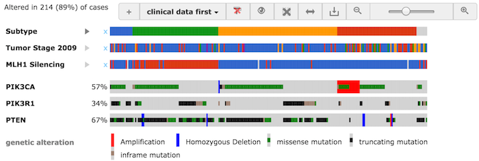
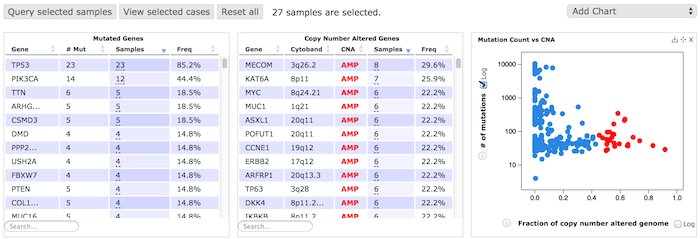
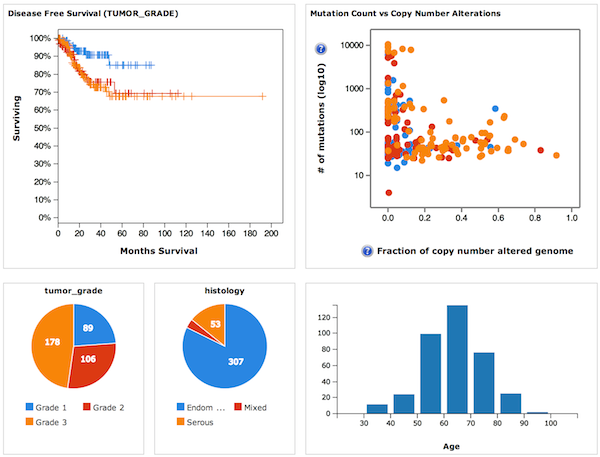
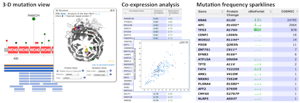
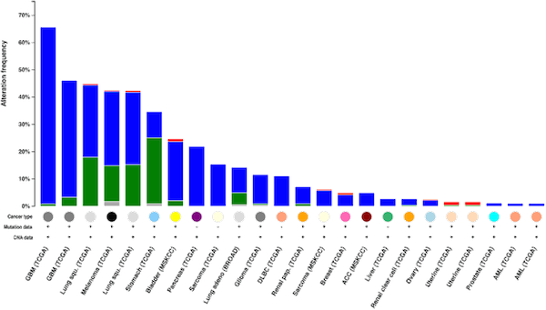
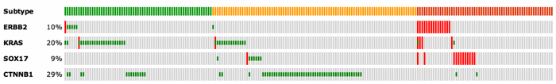
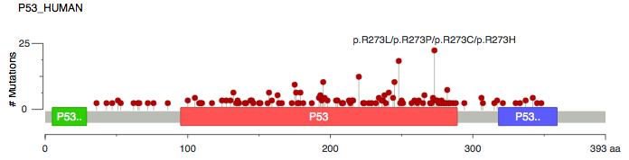
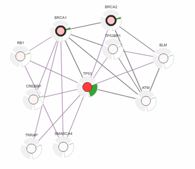
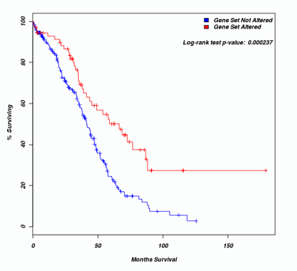

# July 24, 2016
*   **Added data** of 4,375 samples from 21 published studies:
    *   [Adenoid Cystic Carcinoma (MDA, Clin Cancer Res 2015)](http://www.cbioportal.org/beta/study?id=acyc_mda_2015) *102 samples*
    *   [Adenoid Cystic Carcinoma (FMI, Am J Surg Pathl. 2014)](http://www.cbioportal.org/beta/study?id=acyc_fmi_2014) *28 samples*
    *   [Adenoid Cystic Carcinoma (Sanger/MDA, JCI 2013)](http://www.cbioportal.org/beta/study?id=acyc_sanger_2013) *24 samples*
    *   [Adenoid Cystic Carcinoma of the Breast (MSKCC, J Pathol. 2015)](http://www.cbioportal.org/beta/study?id=acbc_mskcc_2015) *12 samples*
    *   [Bladder Cancer, Plasmacytoid Variant (MSKCC, Nat Genet 2016)](http://www.cbioportal.org/beta/study?id=blca_plasmacytoid_mskcc_2016) *34 samples*
    *   [Breast Cancer (METABRIC, Nat Commun 2016)](http://www.cbioportal.org/beta/study?id=brca_metabric) *1980 samples*
    *   [Chronic Lymphocytic Leukemia (Broad, Cell 2013)](http://www.cbioportal.org/beta/study?id=lcll_broad_2013) *160 samples*
    *   [Chronic Lymphocytic Leukemia (IUOPA, Nature 2015)](http://www.cbioportal.org/beta/study?id=cll_iuopa_2015) *506 samples*
    *   [Colorectal Adenocarcinoma (DFCI, Cell Reports 2016)](http://www.cbioportal.org/beta/study?id=coadread_dfci_2016) *619 samples*
    *   [Cutaneous T Cell Lymphoma (Columbia U, Nat Genet 2015)](http://www.cbioportal.org/beta/study?id=ctcl_columbia_2015) *42 samples*
    *   [Diffuse Large B-Cell Lymphoma (Broad, PNAS 2012)](http://www.cbioportal.org/beta/study?id=dlbc_broad_2012) *58 samples*
    *   [Hepatocellular Adenoma (Inserm, Cancer Cell 2014)](http://www.cbioportal.org/beta/study?id=liad_inserm_fr_2014) *46 samples*
    *   [Hypodiploid Acute Lymphoid Leukemia (St Jude, Nat Genet 2013)](http://www.cbioportal.org/beta/study?id=all_stjude_2013) *44 samples*
    *   [Insulinoma (Shanghai, Nat Commun 2013)](http://www.cbioportal.org/beta/study?id=panet_shanghai_2013) *10 samples*
    *   [Malignant Pleural Mesothelioma (NYU, Cancer Res 2015)](http://www.cbioportal.org/beta/study?id=plmeso_nyu_2015) *22 samples*
    *   [Mantle Cell Lymphoma (IDIBIPS, PNAS 2013)](http://www.cbioportal.org/beta/study?id=mcl_idibips_2013) *29 samples*
    *   [Myelodysplasia (Tokyo, Nature 2011)](http://www.cbioportal.org/beta/study?id=mds_tokyo_2011) *29 samples*
    *   [Neuroblastoma (Broad, Nat Genet 2013)](http://www.cbioportal.org/beta/study?id=nbl_ucologne_2015) *56 samples*
    *   [Oral Squamous Cell Carcinoma (MD Anderson, Cancer Discov 2013)](http://www.cbioportal.org/beta/study?id=hnsc_mdanderson_2013) *40 samples*
    *   [Pancreatic Adenocarcinoma (QCMG, Nature 2016)](http://www.cbioportal.org/beta/study?id=paad_qcmg_uq_2016) *383 samples*
    *   [Recurrent and Metastatic Head & Neck Cancer (JAMA Oncology, 2016)](http://www.cbioportal.org/beta/study?id=hnc_mskcc_2016) *151 samples*
*   **New TCGA study**:
    *   [Pan-Lung Cancer (TCGA, Nat Genet 2016)](http://www.cbioportal.org/beta/study?id=nsclc_tcga_broad_2016) *1144 samples*
* Updated **TCGA provisional studies**
    *   updated to the Firehose run of January 28, 2016
    *   RPPA data updated with the latest data from MD Anderson
    *   [OncoTree](http://oncotree.mskcc.org/) codes assigned per sample

# June 6, 2016
*   **New features**:
    * Annotation of mutation effect and drug sensitivity on the Mutations tab and the patient view pages (via [OncoKB](http://oncokb.org))  
    
*   **Improvements**:
    * Improved OncoPrint visualization using WebGL: faster, more zooming flexibility, visualization of recurrent variants
    * Improved Network tab with SBGN view for a single interaction
    * Performance improvement of tables in the study view page
    * Mutation type summary on the Mutations tab

# March 31, 2016
*   **New features**:
    *   Visualization of "Enrichments Analysis" results via volcano plots
    *   Improved performance of the cross cancer expression view  by switching to Plot.ly graphs
    *   Improvements to the "Clinical Data" tab on the study view page
    *   More customization options for the cross-cancer histograms
    *   Performance improvements in the study view and query result tabs
*   **Added data** of 1235 samples from 3 published studies:
    *   [Merged Cohort of LGG and GBM (TCGA, 2016)](http://www.cbioportal.org/study?id=lgggbm_tcga_pub)
    *   [Lung Adenocarcinoma (MSKCC, 2015)](http://www.cbioportal.org/study?id=luad_mskcc_2015)
    *   [Poorly-Differentiated and Anaplastic Thyroid Cancers (MSKCC, JCI 2016)](http://www.cbioportal.org/study?id=thyroid_mskcc_2016)

# January 12, 2016
*   **New features**:
    *   Visualization of multiple samples in a patient
    *   Visualization of timeline data of a patient ([example](http://www.cbioportal.org/case.do?cancer_study_id=lgg_ucsf_2014&case_id=P04)) 
        
*   All **TCGA data** updated to the latest Firehose run of August 21, 2015
*   **New TCGA studies**:
    *   [Cholangiocarcinoma (TCGA, Provisional)](http://www.cbioportal.org/study?id=chol_tcga)
    *   [Mesothelioma (TCGA, Provisional)](http://www.cbioportal.org/study?id=meso_tcga)
    *   [Testicular Germ Cell Cancer (TCGA, Provisional)](http://www.cbioportal.org/study?id=tgct_tcga)
    *   [Thymoma (TCGA, Provisional)](http://www.cbioportal.org/study?id=thym_tcga)
*   **Added data** of 650 samples from 10 published studies:
    *   [Neuroblastoma (AMC Amsterdam, Nature 2012)](http://www.cbioportal.org/study?id=nbl_amc_2012)
    *   [Clear Cell Renal Cell Carcinoma (U Tokyo, Nat Genet 2013)](http://www.cbioportal.org/study?id=ccrcc_utokyo_2013)
    *   [Multiregion Sequencing of Clear Cell Renal Cell Carcinoma (IRC, Nat Genet 2014)](http://www.cbioportal.org/study?id=ccrcc_irc_2014)
    *   [Bladder Urothelial Carcinoma (Dana Farber & MSKCC, Cancer Discovery 2014)](http://www.cbioportal.org/study?id=blca_dfarber_mskcc_2014)
    *   [Low-Grade Gliomas (UCSF, Science 2014)	](http://www.cbioportal.org/study?id=lgg_ucsf_2014)
    *   [Esophageal Squamous Cell Carcinoma (UCLA, Nat Genet 2014)](http://www.cbioportal.org/study?id=escc_ucla_2014)
    *   [Acinar Cell Carcinoma of the Pancreas (Johns Hopkins, J Pathol 2014)](http://www.cbioportal.org/study?id=paac_jhu_2014)
    *   [Gastric Adenocarcinoma (TMUCIH, PNAS 2015)](http://www.cbioportal.org/study?id=egc_tmucih_2015)
    *   [Primary Central Nervous System Lymphoma (Mayo Clinic, Clin Cancer Res 2015)](http://www.cbioportal.org/study?id=pcnsl_mayo_2015)
    *   [Desmoplastic Melanoma (Broad Institute, Nat Genet 2015)](http://www.cbioportal.org/study?id=desm_broad_2015)
*   All mutation data mapped to [UniProt canonical isoforms](http://www.uniprot.org/help/canonical_and_isoforms)

# December 23, 2015
*   **New features**:
    *   Visualization of RNA-seq expression levels across TCGA studies (cross-cancer queries) 
        
    *   Selection of genes in the study view to initiate queries 
        
*   **Improvement**:
    *   3-D structures in the "Mutations" tab are now rendered by 3Dmol.js (previously JSmol)
    *   Improved performance by code optimization and compressing large data by gzip

# December 1, 2015
*   **New feature**: Annotated statistically recurrent hotspots, via new algorithm by [Chang et al. 2015](http://www.nature.com/nbt/journal/vaop/ncurrent/full/nbt.3391.html) 
        

# November 9, 2015
*   **New features**:
    *   Links to MyCancerGenome.org for mutations 
        
    *   Improved display of selection samples on the study view page
*   **Improvements**:
    *   "Enrichments" analysis is now run across all genes
    *   The "Network" tab is now using Cytoscape.js (Adobe Flash is no longer required)

# October 6, 2015

*   **New TCGA data**:
    *   [Breast Invasive Carcinoma (TCGA, Cell 2015)](http://www.cbioportal.org/study?id=brca_tcga_pub2015)
    *   [Prostate Adenocarcinoma (TCGA, in press)](http://www.cbioportal.org/study?id=prad_tcga_pub)
    *   [Uveal Melanoma (TCGA, Provisional)](http://www.cbioportal.org/study?id=uvm_tcga)
*   **Added data** of 763 samples from 12 published studies:
    *   [Small Cell Lung Cancer (U Cologne, Nature 2015)](http://www.cbioportal.org/study?id=sclc_ucologne_2015)
    *   [Uterine Carcinosarcoma (JHU, Nat Commun 2014)](http://www.cbioportal.org/study?id=ucs_jhu_2014)
    *   [Microdissected Pancreatic Cancer Whole Exome Sequencing (UTSW, Nat Commun 2015)](http://www.cbioportal.org/study?id=paad_utsw_2015)
    *   [Pancreatic Neuroendocrine Tumors (JHU, Science 2011)](http://www.cbioportal.org/http://www.cbioportal.org/study?id=panet_jhu_2011)
    *   [Renal Non-Clear Cell Carcinoma (Genentech, Nat Genet 2014)](http://www.cbioportal.org/study?id=nccrcc_genentech_2014)
    *   [Infant MLL-Rearranged Acute Lymphoblastic Leukemia (St Jude, Nat Genet 2015)](http://www.cbioportal.org/study?id=all_stjude_2015)
    *   [Rhabdomyosarcoma (NIH, Cancer Discov 2014)](http://www.cbioportal.org/study?id=rms_nih_2014)
    *   [Thymic epithelial tumors (NCI, Nat Genet 2014)](http://www.cbioportal.org/study?id=tet_nci_2014)
    *   [Pediatric Ewing Sarcoma (DFCI, Cancer Discov 2014)](http://www.cbioportal.org/study?id=es_dfarber_broad_2014)
    *   [Ewing Sarcoma (Institut Cuire, Cancer Discov 2014)](http://www.cbioportal.org/study?id=es_iocurie_2014)
    *   [Cutaneous squamous cell carcinoma (DFCI, Clin Cancer Res 2015)](http://www.cbioportal.org/study?id=cscc_dfarber_2015)
    *   [Gallbladder Carcinoma (Shanghai, Nat Genet 2014)](http://www.cbioportal.org/study?id=gbc_shanghai_2014)

# August 21, 2015

*   All **TCGA data** updated to the Firehose run of April 16, 2015.
*   **New feature**: Enrichments Analysis finds alterations that are enriched in either altered or unaltered samples.
*   **Improvement**: improved OncoPrint with better performance.

# June 3, 2015

*   **Improvements**:
    *   Allowed downloading data in each chart/table in study summary page.
    *   Added log-rank test _p_-values to the survival plots in study summary page.
    *   Improved visualization of patient clinical data in patient-centric view.
    *   Added option to merge multiple samples for the same patient in OncoPrint.

# April 28, 2015

*   **New features**:
    *   Redesigned query interface to allow selecting multiple cancer studies
    *   Redesigned **Plots** tab

# January 20, 2015

*   All **TCGA data** updated to the Firehose run of October 17, 2014
*   **COSMIC data** updated to V71
*   **New features**:
    *   Query page: better search functions to find cancer studies
    *   OncoPrints now support color coding of different mutation types
    *   OncoPrints now support multiple clinical annotation tracks
    *   [**OncoPrinter tool**](http://www.cbioportal.org/oncoprinter.jsp) now supports mRNA expression changes  
        

# January 6, 2015

*   **New feature**: You can now view **frequencies of mutations and copy-number alterations** in the study view. These tables are updated dynamically when selecting subsets of samples.  

    

# December 9, 2014

*   **New TCGA data**:
    *   Added complete and up-to-date **clinical data** for all **TCGA** provisional studies
    *   All TCGA data updated to the Firehose run of July 15, 2014
    *   New TCGA provisional studies: Esophageal cancer, Pheochromocytoma and Paraganglioma (PCPG)
    *   New published TCGA studies: [Thyroid Cancer](http://www.cbioportal.org/study?id=thca_tcga_pub) and [Kidney Chromophobe](http://www.cbioportal.org/study?id=kich_tcga_pub)
*   **Added data** of 172 samples from 4 published studies:
    *   [Cholangiocarcinoma (National University of Singapore, Nature Genetics 2012)](http://www.cbioportal.org/study?id=chol_nus_2012)
    *   [Cholangiocarcinoma (National Cancer Centre of Singapore, Nature Genetics 2013)](http://www.cbioportal.org/study?id=chol_nccs_2013)
    *   [Intrahepatic Cholangiocarcinoma (Johns Hopkins University, Nature Genetics 2013)](http://www.cbioportal.org/study?id=chol_jhu_2013)
    *   [Bladder Cancer (MSKCC, Eur Urol 2014)](http://www.cbioportal.org/study?id=blca_mskcc_solit_2014)
*   **New features**:
    *   Redesigned **Mutual Exclusivity** tab
    *   Added **correlation scores** for scatter plots on the Plots tab
    *   Download links to [**GenomeSpace**](http://www.genomespace.org/)

# October 24, 2014

*   Added data of 885 samples from 11 published studies:
    *   [Colorectal Adenocarcinoma Triplets (MSKCC, Genome Biology 2014)](http://www.cbioportal.org/study?id=coadread_mskcc)
    *   [Esophageal Squamous Cell Carcinoma (ICGC, Nature 2014)](http://www.cbioportal.org/study?id=escc_icgc)
    *   [Malignant Peripheral Nerve Sheath Tumor (MSKCC, Nature Genetics 2014)](http://www.cbioportal.org/study?id=mpnst_mskcc)
    *   [Melanoma (Broad/Dana Farber, Nature 2012)](http://www.cbioportal.org/study?id=skcm_broad_dfarber)
    *   [Nasopharyngeal Carcinoma (National University Singapore, Nature Genetics 2014)](http://www.cbioportal.org/study?id=npc_nusingapore)
    *   [Prostate Adenocarcinoma CNA study (MSKCC, PNAS 2014)](http://www.cbioportal.org/study?id=prad_mskcc_2014)
    *   [Prostate Adenocarcinoma Organoids (MSKCC, Cell 2014)](http://www.cbioportal.org/study?id=prad_mskcc_cheny1_organoids_2014)
    *   [Stomach Adenocarcinoma (TCGA, Nature 2014)](http://www.cbioportal.org/study?id=stad_tcga_pub)
    *   [Stomach Adenocarcinoma (Pfizer and University of Hong Kong, Nature Genetics 2014)](http://www.cbioportal.org/study?id=stad_pfizer_uhongkong)
    *   [Stomach Adenocarcinoma (University of Hong Kong, Nature Genetics 2011)](http://www.cbioportal.org/study?id=stad_uhongkong)
    *   [Stomach Adenocarcinoma (University of Tokyo, Nature Genetics 2014)](http://www.cbioportal.org/study?id=stad_utokyo)

# August 8, 2014

*   Released two new tools
    *   [Oncoprinter](http://www.cbioportal.org/oncoprinter.jsp) lets you create Oncoprints from your own, custom data
    *   [MutationMapper](http://www.cbioportal.org/mutation_mapper.jsp) draws mutation diagrams (lollipop plots) from your custom data

# May 21, 2014

*   All TCGA data updated to the Firehose run of April 16, 2014

# May 12, 2014

*   Improved study summary page including survival analysis based on clinical attributes  
    e.g. [TCGA Endometrial Cancer cohort](http://www.cbioportal.org/study?id=ucec_tcga_pub)  
    

# March 27, 2014

*   New features:
    *   Visualizing of mutations mapped on 3D structures (individual or multiple mutations, directly in the browser)
    *   Gene expression correlation analysis (find all genes with expression correlation to your query genes)
    *   The Patient-Centric View now displays mutation frequencies across all cohorts in cBioPortal for each mutation
    *   The Mutation Details Tab and the Patient-Centric View now display the copy-number status of each mutation  
        

# March 18, 2014

*   All TCGA data updated to the Firehose run of January 15, 2014
*   Updated to the latest COSMIC data (v68)
*   Added two new provisional TCGA studies:
    *   Adrenocortical Carcinoma
    *   Uterine Carcinosarcoma
*   Added mutation data of 898 samples from 11 published studies:
    *   Hepatocellular Carcinoma (RIKEN, Nature Genetics 2012)
    *   Hepatocellular Carcinoma (AMC, Hepatology in press)
    *   Medulloblastoma (Broad, Nature 2012)
    *   Medulloblastoma (ICGC, Nature 2012)
    *   Medulloblastoma (PCGP, Nature 2012)
    *   Multiple Myeloma (Broad, Cancer Cell 2014)
    *   Pancreatic Adenocarcinoma (ICGC, Nature 2012)
    *   Small Cell Carcinoma of the Ovary (MSKCC, Nature Genetics in press)
    *   Small Cell Lung Cancer (CLCGP, Nature Genetics 2012)
    *   Small Cell Lung Cancer (Johns Hopkins, Nature Genetics 2012)
    *   NCI-60 Cell Lines (NCI, Cancer Res. 2012)

# December 9, 2013

*   Added mutation data of 99 bladder cancer samples (BGI, Nature Genetics 2013)

# December 6, 2013

*   Data sets matching four recently submitted or published TCGA studies are now available
    *   Glioblastoma (Cell 2013)
    *   Bladder carcinoma (Nature, in press)
    *   Head & neck squamous cell carcinoma (submitted)
    *   Lung adenocarcinoma (submitted)

# November 8, 2013

*   All TCGA data updated to the Firehose run of September 23, 2013.
*   Updated to the latest COSMIC data (v67).
*   Added mutation data of 792 samples from 9 published cancer studies:
    *   Esophageal Adenocarcinoma (Broad, Nature Genetics 2013)
    *   Head and Neck Squamous Cell Carcinoma (Broad, Science 2011)
    *   Head and Neck Squamous Cell Carcinoma (Johns Hopkins, Science 2011)
    *   Kidney Renal Clear Cell Carcinoma (BGI, Nature Genetics 2012)
    *   Prostate Adenocarcinoma, Metastatic (Michigan, Nature 2012)
    *   Prostate Adenocarcinoma (Broad/Cornell, Nature Genetics 2012)
    *   Prostate Adenocarcinoma (Broad/Cornell, Cell 2013)
    *   Skin Cutaneous Melanoma (Yale, Nature Genetics 2012)
    *   Skin Cutaneous Melanoma (Broad, Cell 2012)

# October 21, 2013

*   Improved interface for survival plots, including information on individual samples via mouse-over
*   New fusion glyph in OncoPrints    
*   Improved cross-cancer query: new alteration frequency histogram (example below - query gene: CDKN2A) and mutation diagram

    

# September 9, 2013

*   Updated COSMIC data (v66 Release)
*   Improved / interactive visualization on the "Protein changes" tab
*   Enhanced mutation diagrams: color-coding by mutation time and syncing with table filters
*   Addition of DNA cytoband information in the patient view of copy-number changes
*   OncoPrints now allow the display of an optional track with clinical annotation (Endometrial cancer example below)

    

# July 25, 2013

*   Multi-gene correlation plots.
*   Variant allele frequency distribution plots for individual tumor samples.
*   Tissue images for TCGA samples in the patient view, via [Digital Slide Archive](http://cancer.digitalslidearchive.net/). [Example](http://www.cbioportal.org/case.do?cancer_study_id=ucec_tcga&case_id=TCGA-BK-A0CC#tab_images).

# July 16, 2013

*   All TCGA data updated to the May Firehose run (May 23, 2013).
    *   TCGA Pancreatic Cancer study (provisional) added.

# July 4, 2013

*   Improved rendering of mutation diagrams, including ability to download in PDF format.
*   Improved home page: Searchable cancer study & gene set selectors, data sets selector.

# June 17, 2013

*   Improved interface for correlation plots, including information on individual samples via mouse-over.
*   Gene Details from Biogene are now available in the Network view.
*   Added mutation and copy number data from a new adenoid cystic carcinoma study: Ho et al., Nature Genetics 2013.
*   Added mutation data from 6 cancer studies.
    *   Breast Invasive Carcinoma (Shah et al., Nature 2012)
    *   Breast Invasive Carcinoma (Banerji et al., Nature 2012)
    *   Breast Invasive Carcinoma (Stephens et al., Nature 2012)
    *   Lung Adenocarcinoma (Imielinksi et al., Cell 2012)
    *   Lung Adenocarcinoma (Ding et al., Nature 2008)
    *   Colorectal Cancer (Seshagiri et al., Nature 2012)

# June 4, 2013

*   All TCGA data updated to the April Firehose run (April 21, 2012).

# May 14, 2013

*   Added a published TCGA study: Acute Myeloid Leukemia (TCGA, NEJM 2013).

# April 28, 2013

*   All TCGA data updated to the March Firehose run (March 26, 2012).
*   mRNA percentiles for altered genes shown in patient view.

# April 2, 2013

*   All TCGA data updated to the February Firehose run (February 22, 2012).

# March 28, 2013

*   All TCGA data updated to the January Firehose run (January 16, 2012).
*   Data from a new bladder cancer study from MSKCC has been added (97 samples, Iyer et al., JCO in press).

# February 16, 2013

*   The cBio Portal now contains mutation data from all provisional TCGA projects. Please adhere to [the TCGA publication guidelines](http://cancergenome.nih.gov/abouttcga/policies/publicationguidelines) when using these and any TCGA data in your publications.
*   All data updated to the October Firehose run (October 24, 2012).
*   **Sequencing read counts and frequencies** are now shown in the Mutation Details table when available.
*   Improved OncoPrints, resulting in performance improvements.

# November 21, 2012

*   Major new feature: Users can now visualize **genomic alterations and clinical data of individual tumors**, including:
    *   Summary of **mutations** and **copy-number alterations** of interest
    *   **Clinical trial** information
    *   TCGA **Pathology Reports**
*   New **cancer summary view** (Example [Endometrial Cancer](http://www.cbioportal.org/study?id=ucec_tcga))
*   **Updated drug data** from KEGG DRUG and NCI Cancer Drugs (aggregated by [PiHelper](https://bitbucket.org/armish/pihelper))

# October 22, 2012

*   All data updated to the **Broad Firehose** run from July 25, 2012.
*   **COSMIC data** added to Mutation Details (via Oncotator).
*   All predicted functional impact scores are updated to **Mutation Assessor 2.0**.
*   Users can now base queries on genes in recurrent regions of copy-number alteration (from **GISTIC** via Firehose).
*   The [Onco Query Language (OQL)](http://www.cbioportal.org/onco_query_lang_desc.jsp) now supports queries for specific mutations or mutation types.
*   Data sets added that match the data of all TCGA publications (GBM, ovarian, colorectal, and lung squamous).

# July 18, 2012

*   Mutation data for the TCGA lung squamous cell carcinoma and breast cancer projects (manuscripts in press at Nature).
*   All data updated to the **latest Broad Firehose run** (May 25, 2012).
*   **Drug information** added to the network view (via Drugbank).
*   **Improved cross-cancer** queries: Option to select data types, export of summary graphs.
*   Users can now base queries on frequently mutated genes (from **MutSig** via Firehose).

# May 16, 2012

*   All data updated to the **latest Broad Firehose run** (March 21, 2012).
*   Extended **cross-cancer** functionality, enabling users to query across all cancer studies in our database.
*   New **"build a case"** functionality, enabling users to generate custom case sets, based on one or more clinical attributes.
*   New OncoPrint features, including more **compact OncoPrints**, and support for **RPPA** visualization.

# February 27, 2012

*   All data updated to the **latest Broad Firehose run** (January 24, 2012).
*   Validated mutation data for colorectal cancer.
*   New feature: **Mutation Diagrams** that show mutations in the context of protein domains.

    

# January 30, 2012

*   Updated data for several TCGA cancer studies.
*   Some small bug-fixes.

# December 22, 2011

*   **Fourteen new [TCGA](http://cancergenome.nih.gov/) cancer studies**: This includes complete data for TCGA Colorectal Carcinoma and provisional data for thirteen other cancer types in the TCGA production pipeline. Please note that data from these thirteen new cancer types are provisional, not final and do not yet include mutation data. As per NCI guidelines, preliminary mutation data cannot be redistributed until they have been validated.

*   **Four new data types**:
    *   Reverse-phase protein array (RPPA) data.
    *   microRNA expression and copy-number (including support for multiple loci)
    *   RNA-Seq based expression data.
    *   log2 copy-number data.
*   Updated TCGA GBM copy-number, expression, and methylation data.
*   New **gene symbol validation** service. You can now use gene aliases and/or Entrez Gene IDs within your gene sets.
*   **Links to IGV** for visualization of DNA copy-number changes.
*   Background information from the [Sanger Cancer Gene Census](http://www.sanger.ac.uk/genetics/CGP/Census/).
*   Two **new [Tutorials](http://www.cbioportal.org/tutorial.jsp)** to get you quickly started in using the portal.  

# November 14, 2011

*   New and **improved mutation details**, with sorting and filtering capabilities.
*   In collaboration with Bilkent University, we have added a **new Network tab** to our results pages. The network tab enables users to visualize, analyze and filter cancer genomic data in the context of pathways and interaction networks derived from [Pathway Commons](http://www.pathwaycommons.org).

# September 3, 2011

*   You can now query across different cancer studies (feature available directly from the home page).
*   Our [MATLAB CGDS Cancer Genomics Toolbox](http://www.cbioportal.org/cgds_r.jsp) is now available. The toolbox enables you to download data from the cBio Portal, and import it directly into MATLAB.
*   The code for the cBio Portal has now been fully open sourced, and made available at [Google Code](http://code.google.com/p/cbio-cancer-genomics-portal/). If you would like to join our open source efforts and make the portal even better, drop us an email.  

# March 2, 2011

New plotting features and other improvements:

*   Correlation plots that show the relationship between different data types for individual genes.
*   Survival analysis - assess survival differences between altered and non-altered patient sets.
*   Updated [R Package](http://www.cbioportal.org/cgds_r.jsp) with support for correlation plots and general improvements for retrieving and accessing data in R data frames.
*   The [Web Interface](http://www.cbioportal.org/web_api.jsp) now supports basic clinical data, e.g. survival data.
*   [Networks](http://www.cbioportal.org/networks.jsp) for pathway analysis are now available for download.

# December 15, 2010

Several new features, including:

*   Redesigned and streamlined user interface, based on user feedback and usability testing.
*   Advanced support for gene-specific alterations. For example, users can now view mutations within TP53, and ignore copy number alterations, or only view amplifications of EGFR, and ignore deletions.
*   Improved performance.
*   [Frequently Asked Questions](FAQ) document released.
*   Updated ~~Video Tutorial~~ (update: old link no longer functional. Now see: [YouTube](https://www.youtube.com/results?search_query=cbioportal)

# November 4, 2010

*   Enhanced [Oncoprints](http://www.cbioportal.org/faq.jsp#what-are-oncoprints), enabling users to quickly visualize genomic alterations across many cases. Oncoprints now also work in all major browsers, including Firefox, Chrome, Safari, and Internet Explorer.
*   Official release of our [Web Interface](http://www.cbioportal.org/web_api.jsp), enabling programmatic access to all data.
*   Official release of our [R Package](http://www.cbioportal.org/cgds_r.jsp), enabling programmatic access to all data from the R platform for statistical computing.

