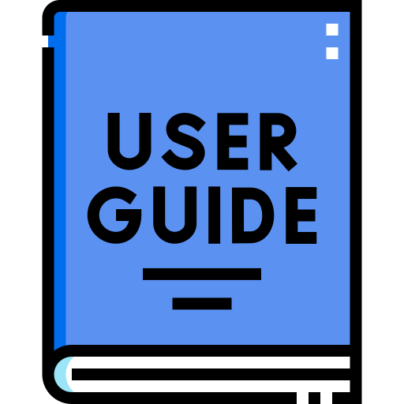
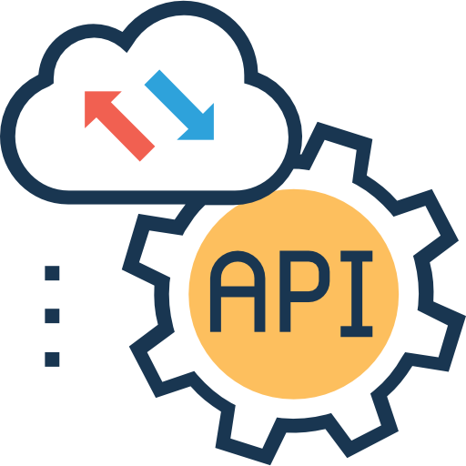

# Welcome to the documentation for cBioPortal!

We've organized this site by the different roles in the cBioPortal community.

            
            

                
                <a href="user-guide/">Portal User</a>
            

        
            

             
            <a href="web-api-and-clients/">API User</a>
            

       
            

            
            <a href="deployment/">Instance Maintainer</a>
            

        
            

            
            <a href="development/">Developer</a>
            

<h3><strong>Feedback? Questions?</strong></h3>
 

[!button cBioPortal Google Group](https://groups.google.com/g/cbioportal)

:::rfclist
We maintain an active [list of RFCs (Requests for Comments)](RFC-List.md) where we describe new features and solicit community feedback.
:::

<h3>Quick Links</h3>

- [FAQ](user-guide/faq.md)
- [Tutorials](https://www.cbioportal.org/tutorials)
- [API documentation](web-API-and-Clients.md)

