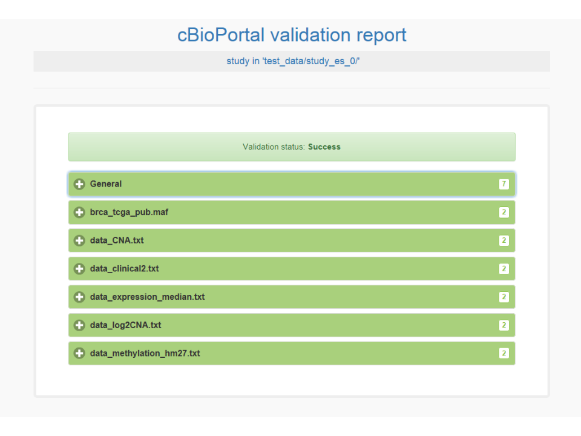
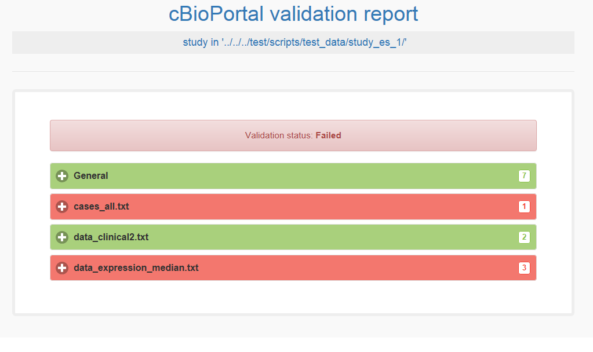

* [Introduction](#introduction)
* [Running the validator](#running-the-validator)
* [Offline Validation](#offline-validation)
* [Validation of non-human data](#validation-of-non-human-data)
* [Running the validator for multiple studies](#running-the-validator-for-multiple-studies)

## Introduction

To facilitate the loading of new studies into its database, cBioPortal [provides a set of staging files formats](File-Formats.md) for the various data types. To validate your files you can use the dataset validator script. 

## Running the validator

To run the validator first go to the importer folder
`<cbioportal_source_folder>/core/src/main/scripts/importer`
and then run the following command:
```bash
./validateData.py --help
```
This will tell you the parameters you can use: 
```console
usage: validateData.py [-h] -s STUDY_DIRECTORY
                       [-u URL_SERVER | -p PORTAL_INFO_DIR | -n]
                       [-P PORTAL_PROPERTIES] [-html HTML_TABLE]
                       [-e ERROR_FILE] [-v] [-r] [-m] [-a MAX_REPORTED_VALUES]

cBioPortal study validator

optional arguments:
  -h, --help            show this help message and exit
  -s STUDY_DIRECTORY, --study_directory STUDY_DIRECTORY
                        path to directory.
  -u URL_SERVER, --url_server URL_SERVER
                        URL to cBioPortal server. You can set this if your URL
                        is not http://localhost:8080/cbioportal
  -p PORTAL_INFO_DIR, --portal_info_dir PORTAL_INFO_DIR
                        Path to a directory of cBioPortal info files to be
                        used instead of contacting a server
  -n, --no_portal_checks
                        Skip tests requiring information from the cBioPortal
                        installation
  -P PORTAL_PROPERTIES, --portal_properties PORTAL_PROPERTIES
                        portal.properties file path (default: assumed hg19)
  -html HTML_TABLE, --html_table HTML_TABLE
                        path to html report output file
  -e ERROR_FILE, --error_file ERROR_FILE
                        File to which to write line numbers on which errors
                        were found, for scripts
  -v, --verbose         report status info messages in addition to errors and
                        warnings
  -r, --relaxed-clinical_definitions
                        Option to enable relaxed mode for validator when validating
                        clinical data without header definitions
  -m, --strict_maf_checks
                        Option to enable strict mode for validator when validating
                        mutation data
  -a MAX_REPORTED_VALUES, --max_reported_values MAX_REPORTED_VALUES
                        Cutoff in HTML report for the maximum number of line
                        numbers and values encountered to report for each
                        message. For example, set this to a high number to
                        report all genes that could not be loaded, instead of
                        reporting "GeneA, GeneB, GeneC, 213 more"
```

For more information on the `--portal_info_dir` option, see [Offline validation](#offline-validation) below. If your cBioPortal is not using `hg19`, you must use the `--portal_properties` option. For more information, see [Validation of non-human data](#validation-of-non-human-data).

When running the validator with parameter `-r` the validator will run the validation of the clinical data it will ignore all failing checks
about values in the headers of the clinical data file.

When running the validator with parameter `-m` the validator will run the validation of the specific [MAF file checks](https://wiki.nci.nih.gov/display/TCGA/Mutation+Annotation+Format+(MAF)+Specification) for the mutation file in strict maf check mode. This means that
when the validator encounters these validation checks it will report them as an error instead of a warning.

### Example 1: test study_es_0
As an example, you can try the validator with one of the test studies found in  `<cbioportal_source_folder>/core/src/test/scripts/test_data`. Example, assuming port 8080 and using -v option to also see the progress:
```bash
./validateData.py -s ../../../test/scripts/test_data/study_es_0/ -u http://localhost:8080/cbioportal -v
```
Results in:
```console
DEBUG: -: Requesting cancertypes from portal at 'http://localhost:8080/cbioportal'
DEBUG: -: Requesting clinicalattributes/patients from portal at 'http://localhost:8080/cbioportal'
DEBUG: -: Requesting clinicalattributes/samples from portal at 'http://localhost:8080/cbioportal'
DEBUG: -: Requesting genes from portal at 'http://localhost:8080/cbioportal'
DEBUG: -: Requesting genesaliases from portal at 'http://localhost:8080/cbioportal'

DEBUG: meta_CNA.txt: Starting validation of meta file
INFO: meta_CNA.txt: Validation of meta file complete

DEBUG: brca_tcga_meta_cna_hg19_seg.txt: Starting validation of meta file
INFO: brca_tcga_meta_cna_hg19_seg.txt: Validation of meta file complete

DEBUG: -: Retrieving chromosome lengths from 'http://hgdownload.cse.ucsc.edu/goldenPath/hg19/bigZips/hg19.chrom.sizes'

DEBUG: meta_patients.txt: Starting validation of meta file
INFO: meta_patients.txt: Validation of meta file complete

DEBUG: meta_samples.txt: Starting validation of meta file
INFO: meta_samples.txt: Validation of meta file complete

DEBUG: meta_fusions.txt: Starting validation of meta file
INFO: meta_fusions.txt: Validation of meta file complete

DEBUG: meta_log2CNA.txt: Starting validation of meta file
INFO: meta_log2CNA.txt: Validation of meta file complete

DEBUG: meta_study.txt: Starting validation of meta file
INFO: meta_study.txt: Validation of meta file complete

DEBUG: meta_methylation_hm27.txt: Starting validation of meta file
INFO: meta_methylation_hm27.txt: Validation of meta file complete

DEBUG: meta_expression_median.txt: Starting validation of meta file
INFO: meta_expression_median.txt: Validation of meta file complete

DEBUG: meta_gistic_genes_amp.txt: Starting validation of meta file
INFO: meta_gistic_genes_amp.txt: Validation of meta file complete

DEBUG: meta_mutations_extended.txt: Starting validation of meta file
INFO: meta_mutations_extended.txt: Validation of meta file complete

DEBUG: data_samples.txt: Starting validation of file
INFO: data_samples.txt: Validation of file complete
INFO: data_samples.txt: Read 831 lines. Lines with warning: 0. Lines with error: 0

DEBUG: brca_tcga_data_cna_hg19.seg: Starting validation of file
INFO: brca_tcga_data_cna_hg19.seg: Validation of file complete
INFO: brca_tcga_data_cna_hg19.seg: Read 10 lines. Lines with warning: 0. Lines with error: 0

DEBUG: data_methylation_hm27.txt: Starting validation of file
INFO: data_methylation_hm27.txt: Validation of file complete
INFO: data_methylation_hm27.txt: Read 9 lines. Lines with warning: 0. Lines with error: 0

DEBUG: data_fusions.txt: Starting validation of file
INFO: data_fusions.txt: Validation of file complete
INFO: data_fusions.txt: Read 4 lines. Lines with warning: 0. Lines with error: 0

DEBUG: data_expression_median.txt: Starting validation of file
INFO: data_expression_median.txt: Validation of file complete
INFO: data_expression_median.txt: Read 7 lines. Lines with warning: 0. Lines with error: 0

DEBUG: brca_tcga_pub.maf: Starting validation of file
INFO: brca_tcga_pub.maf: lines [7, 9, 14]: Validation of line skipped due to cBioPortal's filtering. Filtered types: [Silent, Intron, 3'UTR, 3'Flank, 5'UTR, 5'Flank, IGR, RNA]; value encountered: 'Silent'
INFO: brca_tcga_pub.maf: Validation of file complete
INFO: brca_tcga_pub.maf: Read 15 lines. Lines with warning: 0. Lines with error: 0

DEBUG: data_CNA.txt: Starting validation of file
INFO: data_CNA.txt: Validation of file complete
INFO: data_CNA.txt: Read 8 lines. Lines with warning: 0. Lines with error: 0

DEBUG: data_log2CNA.txt: Starting validation of file
INFO: data_log2CNA.txt: Validation of file complete
INFO: data_log2CNA.txt: Read 8 lines. Lines with warning: 0. Lines with error: 0

DEBUG: data_patients.txt: Starting validation of file
INFO: data_patients.txt: Validation of file complete
INFO: data_patients.txt: Read 830 lines. Lines with warning: 0. Lines with error: 0

DEBUG: data_gistic_genes_amp.txt: Starting validation of file
INFO: data_gistic_genes_amp.txt: Validation of file complete
INFO: data_gistic_genes_amp.txt: Read 28 lines. Lines with warning: 0. Lines with error: 0

DEBUG: -: Validating case lists

DEBUG: case_lists/cases_custom.txt: Starting validation of meta file
INFO: case_lists/cases_custom.txt: Validation of meta file complete

INFO: -: Validation of case lists complete
INFO: -: Validation complete
Validation of study succeeded.
```

When using the `-html` option, a report will be generated, which looks like this for the previous example:


### Example 2: test study_es_1
More test studies for trying the validator (`study_es_1` and `study_es_3`) are available in  `<cbioportal_source_folder>/core/src/test/scripts/test_data`. Example, assuming port 8080 and using -v option:
```bash
./validateData.py -s ../../../test/scripts/test_data/study_es_1/ -u http://localhost:8080/cbioportal -v
```
Results in:
```console
DEBUG: -: Requesting cancertypes from portal at 'http://localhost:8080/cbioportal'
DEBUG: -: Requesting clinicalattributes/patients from portal at 'http://localhost:8080/cbioportal'
DEBUG: -: Requesting clinicalattributes/samples from portal at 'http://localhost:8080/cbioportal'
DEBUG: -: Requesting genes from portal at 'http://localhost:8080/cbioportal'
DEBUG: -: Requesting genesaliases from portal at 'http://localhost:8080/cbioportal'

DEBUG: meta_samples.txt: Starting validation of meta file
WARNING: meta_samples.txt: Unrecognized field in meta file; values encountered: ['show_profile_in_analysis_tab', 'profile_name', 'profile_description']
INFO: meta_samples.txt: Validation of meta file complete

DEBUG: meta_study.txt: Starting validation of meta file
INFO: meta_study.txt: Validation of meta file complete

DEBUG: meta_expression_median.txt: Starting validation of meta file
ERROR: meta_expression_median.txt: Invalid stable id for genetic_alteration_type 'MRNA_EXPRESSION', data_type 'Z-SCORE'; expected one of [mrna_U133_Zscores, rna_seq_mrna_median_Zscores, mrna_median_Zscores, rna_seq_v2_mrna_median_Zscores, mirna_median_Zscores, mrna_merged_median_Zscores, mrna_zbynorm, rna_seq_mrna_capture_Zscores]; value encountered: 'mrna'

DEBUG: data_samples.txt: Starting validation of file
WARNING: data_samples.txt: line 3: column 4: datatype definition for attribute 'DAYS_TO_COLLECTION' does not match the portal, and will be loaded as 'NUMBER'; value encountered: 'STRING'
ERROR: data_samples.txt: line 8: column 4: According to portal, attribute should be loaded as NUMBER. Value of attribute to be loaded as NUMBER is not a real number; value encountered: 'spam'
INFO: data_samples.txt: Validation of file complete
INFO: data_samples.txt: Read 831 lines. Lines with warning: 1. Lines with error: 1

DEBUG: -: Validating case lists

DEBUG: case_lists/cases_all.txt: Starting validation of meta file
INFO: case_lists/cases_all.txt: Validation of meta file complete
ERROR: case_lists/cases_all.txt: Sample id not defined in clinical file; value encountered: 'INVALID-A2-A0T2-01'

INFO: -: Validation of case lists complete
INFO: -: Validation complete
Validation of study failed.
```

And respective HTML report:


## Offline validation ##
The validation script can be used offline, without connecting to a cBioPortal server. The tests that depend on information specific to the portal (which clinical attributes and cancer types have been previously defined, and which Entrez gene identifiers and corresponding symbols are supported), will instead be read from a folder with .json files generated from the portal.

### Example 3: validation with a portal info folder ###
To run the validator with a folder of portal information files, add the `-p/--portal_info_dir` option to the command line, followed by the path to the folder:
```bash
./validateData.py -s ../../../test/scripts/test_data/study_es_0/ -p ../../../test/scripts/test_data/api_json_system_tests/ -v
```
```console
DEBUG: -: Reading portal information from ../../../test/scripts/test_data/api_json_system_tests/cancertypes.json
DEBUG: -: Reading portal information from ../../../test/scripts/test_data/api_json_system_tests/clinicalattributes_patients.json
DEBUG: -: Reading portal information from ../../../test/scripts/test_data/api_json_system_tests/clinicalattributes_samples.json
DEBUG: -: Reading portal information from ../../../test/scripts/test_data/api_json_system_tests/genes.json
DEBUG: -: Reading portal information from ../../../test/scripts/test_data/api_json_system_tests/genesaliases.json

DEBUG: meta_CNA.txt: Starting validation of meta file
INFO: meta_CNA.txt: Validation of meta file complete

DEBUG: brca_tcga_meta_cna_hg19_seg.txt: Starting validation of meta file
INFO: brca_tcga_meta_cna_hg19_seg.txt: Validation of meta file complete

DEBUG: -: Retrieving chromosome lengths from 'http://hgdownload.cse.ucsc.edu/goldenPath/hg19/bigZips/hg19.chrom.sizes'

DEBUG: meta_patients.txt: Starting validation of meta file
INFO: meta_patients.txt: Validation of meta file complete

DEBUG: meta_samples.txt: Starting validation of meta file
INFO: meta_samples.txt: Validation of meta file complete

DEBUG: meta_fusions.txt: Starting validation of meta file
INFO: meta_fusions.txt: Validation of meta file complete

DEBUG: meta_log2CNA.txt: Starting validation of meta file
INFO: meta_log2CNA.txt: Validation of meta file complete

DEBUG: meta_study.txt: Starting validation of meta file
INFO: meta_study.txt: Validation of meta file complete

DEBUG: meta_methylation_hm27.txt: Starting validation of meta file
INFO: meta_methylation_hm27.txt: Validation of meta file complete

DEBUG: meta_expression_median.txt: Starting validation of meta file
INFO: meta_expression_median.txt: Validation of meta file complete

DEBUG: meta_gistic_genes_amp.txt: Starting validation of meta file
INFO: meta_gistic_genes_amp.txt: Validation of meta file complete

DEBUG: meta_mutations_extended.txt: Starting validation of meta file
INFO: meta_mutations_extended.txt: Validation of meta file complete

DEBUG: data_samples.txt: Starting validation of file
INFO: data_samples.txt: Validation of file complete
INFO: data_samples.txt: Read 831 lines. Lines with warning: 0. Lines with error: 0

DEBUG: brca_tcga_data_cna_hg19.seg: Starting validation of file
INFO: brca_tcga_data_cna_hg19.seg: Validation of file complete
INFO: brca_tcga_data_cna_hg19.seg: Read 10 lines. Lines with warning: 0. Lines with error: 0

DEBUG: data_methylation_hm27.txt: Starting validation of file
INFO: data_methylation_hm27.txt: Validation of file complete
INFO: data_methylation_hm27.txt: Read 9 lines. Lines with warning: 0. Lines with error: 0

DEBUG: data_fusions.txt: Starting validation of file
INFO: data_fusions.txt: Validation of file complete
INFO: data_fusions.txt: Read 4 lines. Lines with warning: 0. Lines with error: 0

DEBUG: data_expression_median.txt: Starting validation of file
INFO: data_expression_median.txt: Validation of file complete
INFO: data_expression_median.txt: Read 7 lines. Lines with warning: 0. Lines with error: 0

DEBUG: brca_tcga_pub.maf: Starting validation of file
INFO: brca_tcga_pub.maf: lines [7, 9, 14]: Validation of line skipped due to cBioPortal's filtering. Filtered types: [Silent, Intron, 3'UTR, 3'Flank, 5'UTR, 5'Flank, IGR, RNA]; value encountered: 'Silent'
INFO: brca_tcga_pub.maf: Validation of file complete
INFO: brca_tcga_pub.maf: Read 15 lines. Lines with warning: 0. Lines with error: 0

DEBUG: data_CNA.txt: Starting validation of file
INFO: data_CNA.txt: Validation of file complete
INFO: data_CNA.txt: Read 8 lines. Lines with warning: 0. Lines with error: 0

DEBUG: data_log2CNA.txt: Starting validation of file
INFO: data_log2CNA.txt: Validation of file complete
INFO: data_log2CNA.txt: Read 8 lines. Lines with warning: 0. Lines with error: 0

DEBUG: data_patients.txt: Starting validation of file
INFO: data_patients.txt: Validation of file complete
INFO: data_patients.txt: Read 830 lines. Lines with warning: 0. Lines with error: 0

DEBUG: data_gistic_genes_amp.txt: Starting validation of file
INFO: data_gistic_genes_amp.txt: Validation of file complete
INFO: data_gistic_genes_amp.txt: Read 28 lines. Lines with warning: 0. Lines with error: 0

DEBUG: -: Validating case lists

DEBUG: case_lists/cases_custom.txt: Starting validation of meta file
INFO: case_lists/cases_custom.txt: Validation of meta file complete

INFO: -: Validation of case lists complete
INFO: -: Validation complete
Validation of study succeeded.
```

### Example 4: generating the portal info folder ###
The portal information files can be generated on the server, using the dumpPortalInfo script. Go to `<cbioportal_source_folder>/core/src/main/scripts`, make sure the environment variables `$JAVA_HOME` and `$PORTAL_HOME` are set, and run dumpPortalInfo.pl with the name of the directory you want to create:
```bash
export JAVA_HOME='/usr/lib/jvm/default-java'
export PORTAL_HOME=<cbioportal_configuration_folder>
./dumpPortalInfo.pl /home/johndoe/my_portal_info_folder/
```

### Example 5: validating without portal-specific information ###
Alternatively, you can run the validation script with the `-n/--no_portal_checks` flag to entirely skip checks relating to installation-specific metadata. Be warned that files succeeding this validation may still fail to load (correctly).

```bash
./validateData.py -s ../../../test/scripts/test_data/study_es_0/ -n -v
```
```console
WARNING: -: Skipping validations relating to cancer types defined in the portal
WARNING: -: Skipping validations relating to clinical attributes defined in the portal
WARNING: -: Skipping validations relating to gene identifiers and aliases defined in the portal

DEBUG: meta_CNA.txt: Starting validation of meta file
INFO: meta_CNA.txt: Validation of meta file complete

DEBUG: brca_tcga_meta_cna_hg19_seg.txt: Starting validation of meta file
INFO: brca_tcga_meta_cna_hg19_seg.txt: Validation of meta file complete

DEBUG: -: Retrieving chromosome lengths from 'http://hgdownload.cse.ucsc.edu/goldenPath/hg19/bigZips/hg19.chrom.sizes'

DEBUG: meta_patients.txt: Starting validation of meta file
INFO: meta_patients.txt: Validation of meta file complete

DEBUG: meta_samples.txt: Starting validation of meta file
INFO: meta_samples.txt: Validation of meta file complete

DEBUG: meta_fusions.txt: Starting validation of meta file
INFO: meta_fusions.txt: Validation of meta file complete

DEBUG: meta_log2CNA.txt: Starting validation of meta file
INFO: meta_log2CNA.txt: Validation of meta file complete

DEBUG: meta_study.txt: Starting validation of meta file
INFO: meta_study.txt: Validation of meta file complete

DEBUG: meta_methylation_hm27.txt: Starting validation of meta file
INFO: meta_methylation_hm27.txt: Validation of meta file complete

DEBUG: meta_expression_median.txt: Starting validation of meta file
INFO: meta_expression_median.txt: Validation of meta file complete

DEBUG: meta_gistic_genes_amp.txt: Starting validation of meta file
INFO: meta_gistic_genes_amp.txt: Validation of meta file complete

DEBUG: meta_mutations_extended.txt: Starting validation of meta file
INFO: meta_mutations_extended.txt: Validation of meta file complete

DEBUG: data_samples.txt: Starting validation of file
INFO: data_samples.txt: Validation of file complete
INFO: data_samples.txt: Read 831 lines. Lines with warning: 0. Lines with error: 0

DEBUG: brca_tcga_data_cna_hg19.seg: Starting validation of file
INFO: brca_tcga_data_cna_hg19.seg: Validation of file complete
INFO: brca_tcga_data_cna_hg19.seg: Read 10 lines. Lines with warning: 0. Lines with error: 0

DEBUG: data_methylation_hm27.txt: Starting validation of file
INFO: data_methylation_hm27.txt: Validation of file complete
INFO: data_methylation_hm27.txt: Read 9 lines. Lines with warning: 0. Lines with error: 0

DEBUG: data_fusions.txt: Starting validation of file
INFO: data_fusions.txt: Validation of file complete
INFO: data_fusions.txt: Read 4 lines. Lines with warning: 0. Lines with error: 0

DEBUG: data_expression_median.txt: Starting validation of file
INFO: data_expression_median.txt: Validation of file complete
INFO: data_expression_median.txt: Read 7 lines. Lines with warning: 0. Lines with error: 0

DEBUG: brca_tcga_pub.maf: Starting validation of file
INFO: brca_tcga_pub.maf: lines [7, 9, 14]: Validation of line skipped due to cBioPortal's filtering. Filtered types: [Silent, Intron, 3'UTR, 3'Flank, 5'UTR, 5'Flank, IGR, RNA]; value encountered: 'Silent'
INFO: brca_tcga_pub.maf: Validation of file complete
INFO: brca_tcga_pub.maf: Read 15 lines. Lines with warning: 0. Lines with error: 0

DEBUG: data_CNA.txt: Starting validation of file
INFO: data_CNA.txt: Validation of file complete
INFO: data_CNA.txt: Read 8 lines. Lines with warning: 0. Lines with error: 0

DEBUG: data_log2CNA.txt: Starting validation of file
INFO: data_log2CNA.txt: Validation of file complete
INFO: data_log2CNA.txt: Read 8 lines. Lines with warning: 0. Lines with error: 0

DEBUG: data_patients.txt: Starting validation of file
INFO: data_patients.txt: Validation of file complete
INFO: data_patients.txt: Read 830 lines. Lines with warning: 0. Lines with error: 0

DEBUG: data_gistic_genes_amp.txt: Starting validation of file
INFO: data_gistic_genes_amp.txt: Validation of file complete
INFO: data_gistic_genes_amp.txt: Read 28 lines. Lines with warning: 0. Lines with error: 0

DEBUG: -: Validating case lists

DEBUG: case_lists/cases_custom.txt: Starting validation of meta file
INFO: case_lists/cases_custom.txt: Validation of meta file complete

INFO: -: Validation of case lists complete
INFO: -: Validation complete
Validation of study succeeded with warnings.
```

## Validation of non-human data ##
When importing a study, the validator assumes by default that the following parameters from `portal.properties` are set to:
```
species=human
ncbi.build=37
ucsc.build=hg19
```

cBioPortal is gradually introducing support for mouse. If you want to load mouse studies and you have [set up your database for mouse](Import-the-Seed-Database.md#download-the-cbioportal-database), you should set the previous parameters to:
```
species=mouse
ncbi.build=38
ucsc.build=mm10
```

If your `portal.properties` does not have the default (human) settings, you should introduce a new parameter `-P` in your command. This parameter should point to either `portal.properties` or a file which contains the new global variables. 

As an example, the command for the "Example 1" listed above incorporating the `-P` parameter is given:
```
./validateData.py -s ../../../test/scripts/test_data/study_es_0/ -P ../../../../../src/main/resources/portal.properties -u http://localhost:8080/cbioportal -v
```

## Running the validator for multiple studies
The importer folder `<cbioportal_source_folder>/core/src/main/scripts/importer` also contains a script for running the validator for multiple studies:
```bash
./validateStudies.py --help
```
The following parameters can be used:
```console
usage: validateStudies.py [-h] [-d ROOT_DIRECTORY] [-l LIST_OF_STUDIES]
                          [-html HTML_FOLDER]
                          [-u URL_SERVER | -p PORTAL_INFO_DIR | -n]
                          [-P PORTAL_PROPERTIES] [-m] [-a MAX_REPORTED_VALUES]

Wrapper where cBioPortal study validator is run for multiple studies

optional arguments:
  -h, --help            show this help message and exit
  -d ROOT_DIRECTORY, --root-directory ROOT_DIRECTORY
                        Path to directory with all studies that should be
                        validated
  -l LIST_OF_STUDIES, --list-of-studies LIST_OF_STUDIES
                        List with paths of studies which should be validated
  -html HTML_FOLDER, --html-folder HTML_FOLDER
                        Path to folder for output HTML reports
  -u URL_SERVER, --url_server URL_SERVER
                        URL to cBioPortal server. You can set this if your URL
                        is not http://localhost:8080/cbioportal
  -p PORTAL_INFO_DIR, --portal_info_dir PORTAL_INFO_DIR
                        Path to a directory of cBioPortal info files to be
                        used instead of contacting a server
  -n, --no_portal_checks
                        Skip tests requiring information from the cBioPortal
                        installation
  -P PORTAL_PROPERTIES, --portal_properties PORTAL_PROPERTIES
                        portal.properties file path (default: assumed hg19)
  -m, --strict_maf_checks
                        Option to enable strict mode for validator when
                        validating mutation data
  -a MAX_REPORTED_VALUES, --max_reported_values MAX_REPORTED_VALUES
                        Cutoff in HTML report for the maximum number of line
                        numbers and values encountered to report for each
                        message. For example, set this to a high number to
                        report all genes that could not be loaded, instead of
                        reporting "GeneA, GeneB, GeneC, 213 more"
```

Parameters `--url_server`, `--portal_info_dir`, `--no_portal_checks` and `--portal_properties` are equal to the parameters with the same name in `validateData.py`. The script will save a log file with validation output (`log-validate-studies.txt`) and output the validation status from the input studies:

```console
=== Validating study ../../../test/scripts/test_data/study_es_0
Result: VALID (WITH WARNINGS)

=== Validating study ../../../test/scripts/test_data/study_es_1
Result: INVALID

=== Validating study ../../../test/scripts/test_data/study_es_invalid
directory cannot be found: ../../../test/scripts/test_data/study_es_invalid
Result: INVALID (PROBLEMS OCCURRED)

```

### Example 1: Root directory parameter
Validation can be run for all studies in a certain directory by using the `--root-directory` parameter. The script will append each folder in the root directory to the study list to validate:
```bash
./validateStudies.py -d ../../../test/scripts/test_data/
```

### Example 2: List of studies parameter
Validation can also be run for specific studies by using the `--list-of-studies` parameter. The paths to the different studies can be defined and seperated by a comma:
```bash
./validateStudies.py -l ../../../test/scripts/test_data/study_es_0,../../../test/scripts/test_data/study_es_1
```

### Example 3: Combination root directory and list of studies parameter
Validation can also be run on specific studies in a certain directory by combining the `--root-directory` and `--list-of-studies` parameter:
```bash
./validateStudies.py -d ../../../test/scripts/test_data/ -l study_es_0,study_es_1
```

### Example 4: HTML folder parameter
When HTML validation reports are desired, an output folder for these HTML files can be specified. This folder does not have to exist, the script can create the folder. The HTML validation reports will get the following name: `<study_name>-validation.html`. To create HTML validation reports for each study the `--html-folder` parameter needs to be defined:
```bash
./validateStudies.py -d ../../../test/scripts/test_data/ -l study_es_0,study_es_1 -html ../../../test/scripts/test_data/validation-reports
```
