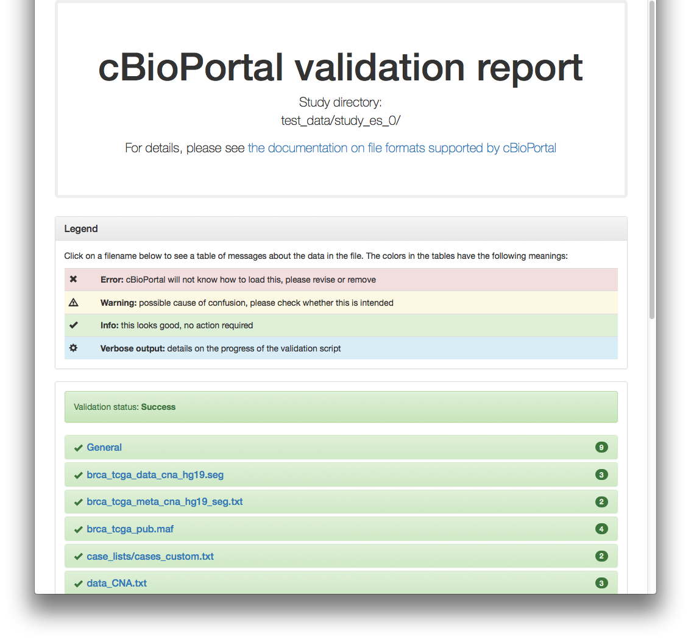
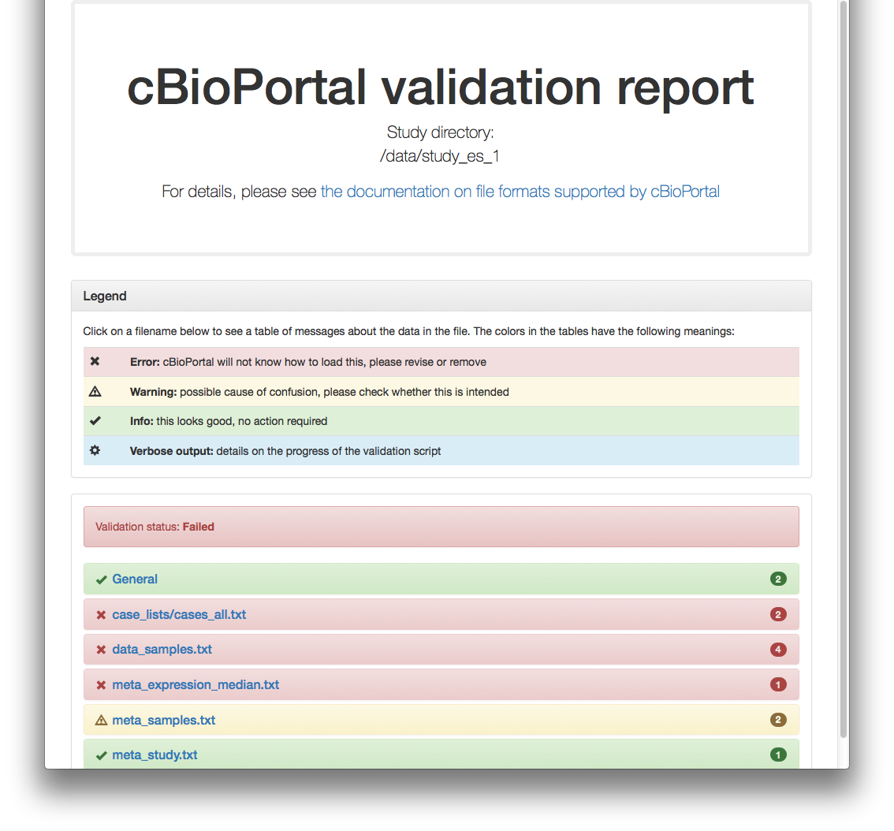

To facilitate the loading of new studies into its database, cBioPortal [provides a set of staging files formats](File-Formats.md) for the various data types. To validate your files you can use the dataset validator script. 

## Running the validator

To run the validator first go to the importer folder
`<your_cbioportal_dir>/core/src/main/scripts/importer` 
and then run the following command:
```console
./validateData.py --help
```
This will tell you the parameters you can use: 
```console
usage: validateData.py [-h] -s STUDY_DIRECTORY
                       [-u URL_SERVER | -p PORTAL_INFO_DIR | -n]
                       [-html HTML_TABLE] [-e ERROR_FILE] [-v]

cBioPortal study validator

optional arguments:
  -h, --help            show this help message and exit
  -s STUDY_DIRECTORY, --study_directory STUDY_DIRECTORY
                        path to the folder where your data files can be
                        found (required)
  -u URL_SERVER, --url_server URL_SERVER
                        URL to the cBioPortal server against which to
                        validate. When not provided, default is
                        `http://localhost/cbioportal'
  -p PORTAL_INFO_DIR, --portal_info_dir PORTAL_INFO_DIR
                        path to a directory of cBioPortal info files to be
                        used instead of contacting a server
  -n, --no_portal_checks
                        skip tests requiring information from the cBioPortal
                        installation
  -html HTML_TABLE, --html_table HTML_TABLE
                        path to html report output file
  -e ERROR_FILE, --error_file ERROR_FILE
                        File to which to write line numbers on which errors
                        were found, for scripts
  -v, --verbose         report status info messages in addition to errors and
                        warnings
```

For more information on the `--portal_info_dir` option, see [Offline validation](#offline-validation) below.

### Example 1
As an example, you can try the validator with one of the test studies found in  `<your_cbioportal_dir>/core/src/test/scripts/test_data`. Example, assuming port 8080 and using -v option to also see the progress:
```console
./validateData.py -s ../../../test/scripts/test_data/study_es_0/ -u http://localhost:8080/cbioportal -v
```
Results in:
```console
INFO: -: Requesting genes from portal at 'http://localhost:8080/cbioportal'
INFO: -: Requesting cancertypes from portal at 'http://localhost:8080/cbioportal'
INFO: -: Requesting clinicalattributes/patients from portal at 'http://localhost:8080/cbioportal'
INFO: -: Requesting clinicalattributes/samples from portal at 'http://localhost:8080/cbioportal'
INFO: data_clinical2.txt: Starting validation of file
INFO: data_clinical2.txt: Validation of file complete
INFO: data_methylation_hm27.txt: Starting validation of file
INFO: data_methylation_hm27.txt: Validation of file complete
INFO: data_expression_median.txt: Starting validation of file
INFO: data_expression_median.txt: Validation of file complete
INFO: brca_tcga_pub.maf: Starting validation of file
INFO: brca_tcga_pub.maf: Validation of file complete
INFO: data_CNA.txt: Starting validation of file
INFO: data_CNA.txt: Validation of file complete
INFO: data_log2CNA.txt: Starting validation of file
INFO: data_log2CNA.txt: Validation of file complete
INFO: -: Validating case lists
INFO: -: Validation of case lists complete
INFO: -: Validation complete
Validation of study succeeded.
```

When using the `-html` option, a report will be generated, which looks like this for the previous example:


### Example 2
More test studies for trying the validator (`study_es_1` and `study_es_3`) are available in  `<your_cbioportal_dir>/core/src/test/scripts/test_data`. Example, assuming port 8080 and using -v option:
```console
./validateData.py -s ../../../test/scripts/test_data/study_es_1/ -u http://localhost:8080/cbioportal -v
```
Results in:
```console
INFO: -: Requesting genes from portal at 'http://localhost:8080/cbioportal'
INFO: -: Requesting cancertypes from portal at 'http://localhost:8080/cbioportal'
INFO: -: Requesting clinicalattributes/patients from portal at 'http://localhost:8080/cbioportal'
INFO: -: Requesting clinicalattributes/samples from portal at 'http://localhost:8080/cbioportal'
INFO: data_clinical2.txt: Starting validation of file
INFO: data_clinical2.txt: Validation of file complete
INFO: data_expression_median.txt: Starting validation of file
ERROR: data_expression_median.txt: line 1: column 3: Sample ID not defined in clinical file; found in file: 'TEST2-A1-A0SD-01'
ERROR: data_expression_median.txt: Invalid column header, file cannot be parsed
INFO: -: Validating case lists
ERROR: cases_all.txt: Sample id not defined in clinical file; found in file: 'INVALID-A2-A0T2-01'
INFO: -: Validation of case lists complete
INFO: -: Validation complete
Validation of study failed.
```
And respective HTML report:


## Offline validation ##
The validation script can be used offline, without connecting to a cBioPortal server. The tests that depend on information specific to the portal (which clinical attributes and cancer types have been previously defined, and which Entrez gene identifiers and corresponding symbols are supported), will instead be read from a folder with .json files generated from the portal.

### Example 3: validation with a portal info folder ###
To run the validator with a folder of portal information files, add the `-p/--portal_info_dir` option to the command line, followed by the path to the folder:
```console
./validateData.py -s ../../../test/scripts/test_data/study_es_0/ -p ../../../test/scripts/test_data/api_json_system_tests/ -v
INFO: -: Reading portal information from ../../../test/scripts/test_data/api_json_system_tests/cancertypes.json
INFO: -: Reading portal information from ../../../test/scripts/test_data/api_json_system_tests/clinicalattributes_patients.json
INFO: -: Reading portal information from ../../../test/scripts/test_data/api_json_system_tests/clinicalattributes_samples.json
INFO: -: Reading portal information from ../../../test/scripts/test_data/api_json_system_tests/genes.json
INFO: -: Reading portal information from ../../../test/scripts/test_data/api_json_system_tests/genesaliases.json
INFO: data_clinical2.txt: Starting validation of file
INFO: data_clinical2.txt: Validation of file complete
INFO: brca_tcga_data_cna_hg19.seg: Starting validation of file
INFO: brca_tcga_data_cna_hg19.seg: Validation of file complete
INFO: data_methylation_hm27.txt: Starting validation of file
INFO: data_methylation_hm27.txt: Validation of file complete
INFO: data_expression_median.txt: Starting validation of file
INFO: data_expression_median.txt: Validation of file complete
INFO: brca_tcga_pub.maf: Starting validation of file
INFO: brca_tcga_pub.maf: Validation of file complete
INFO: data_CNA.txt: Starting validation of file
INFO: data_CNA.txt: Validation of file complete
INFO: data_log2CNA.txt: Starting validation of file
INFO: data_log2CNA.txt: Validation of file complete
INFO: -: Validating case lists
INFO: -: Validation of case lists complete
INFO: -: Validation complete
Validation of study succeeded.
```

### Example 4: generating the portal info folder ###
The portal information files can be generated on the server, using the dumpPortalInfo script. Go to `<your cbioportal dir>/core/src/main/scripts`, make sure the environment variables `$JAVA_HOME` and `$PORTAL_HOME` are set, and run dumpPortalInfo.pl with the name of the directory you want to create:
```console
export JAVA_HOME='/usr/lib/jvm/java-7-openjdk-amd64'
export PORTAL_HOME='../../../..'
./dumpPortalInfo.pl /home/johndoe/my_portal_info_folder/
```

### Example 5: validating without portal-specific information ###
Alternatively, you can run the validation script with the `-n/--no_portal_checks` flag to entirely skip checks relating to installation-specific metadata. Be warned that files succeeding this validation may still fail to load (correctly).

```console
./validateData.py -s ../../../test/scripts/test_data/study_es_0/ -n -v 
WARNING: -: Skipping validations relating to cancer types defined in the portal
WARNING: -: Skipping validations relating to clinical attributes defined in the portal
WARNING: -: Skipping validations relating to gene identifiers and aliases defined in the portal
INFO: data_clinical2.txt: Starting validation of file
INFO: data_clinical2.txt: Validation of file complete
INFO: brca_tcga_data_cna_hg19.seg: Starting validation of file
INFO: brca_tcga_data_cna_hg19.seg: Validation of file complete
INFO: data_methylation_hm27.txt: Starting validation of file
INFO: data_methylation_hm27.txt: Validation of file complete
INFO: data_expression_median.txt: Starting validation of file
INFO: data_expression_median.txt: Validation of file complete
INFO: brca_tcga_pub.maf: Starting validation of file
INFO: brca_tcga_pub.maf: Validation of file complete
INFO: data_CNA.txt: Starting validation of file
INFO: data_CNA.txt: Validation of file complete
INFO: data_log2CNA.txt: Starting validation of file
INFO: data_log2CNA.txt: Validation of file complete
INFO: -: Validating case lists
INFO: -: Validation of case lists complete
INFO: -: Validation complete
Validation of study succeeded with warnings.
```
