# Authenticating and Authorizing Users via Keycloak

**This documentation is for keycloak v26.2.4**

## Introduction

The cBioPortal includes support for Keycloak authentication. Keycloak can function as an Identity Provider (IDP) for cBioPortal.
This document explains why you might find Keycloak authentication useful for storing your user login information outside
the cBioPortal database. It also shows you how to configure Keycloak to communicate with your instance of cBioPortal using
SAML (Security Assertion Markup Language).

Please note that configuring your local instance to use Keycloak authentication requires a Keycloak server to be set up. For details on how to set up a Keycloak server, please read online document at <https://www.keycloak.org/guides#server>.

This document focuses mainly on the steps to configure Keycloak for **authenticating** cBioPortal users.

To skip to the authorization section see: [authorization with Keycloak](#authorization-with-keycloak). Or continue reading to learn how to integrate Keycloak with cBioPortal.

### Why Keycloak?

Keycloak is an [open source identity and access management solution](https://www.keycloak.org/docs/latest/server_admin/index.html). It has a built-in RDBM system to store login information. It can help build a security layer on top of the cBioPortal web application.

Keycloak boils down to three simple terms:
* **realm**: A realm secures and manages security metadata for a set of users, application, and registered auth clients.
* **client**: Clients are entities that can request authentication of a user within a realm.
* **role**: Roles identify a type or category of user. Keycloak often assigns access and permissions to specific roles rather than individual users for a fine-grained access control.

Keycloak offers three types of roles:
* Realm-level roles are in global namespace shared by all clients.
* Client roles have basically a namespace dedicated to a client.
* A composite role is a role that has one or more additional roles associated with it.


### How does Keycloak SAML Authentication work?

Keycloak supports both OpenID-Connect and SAML authentication. When you use SAML authentication, the Keycloak server exchanges XML documents with a web application. XML signatures and encryption are then used to verify requests from the application.

## Configure Keycloak to authenticate your cbioportal instance
1. Log in to your Keycloak Identity Provider, e.g. <http://localhost:8080/auth>, as an admin user. :warning: when setting this up on something else than localhost (e.g. production), you will need to use/enable https on your Keycloak server. For simplicity, the rest of the documentation below continues on http://localhost.
2. Click on the Navigation **Manage realms** on the left and create a new realm with the **Create realm** button.
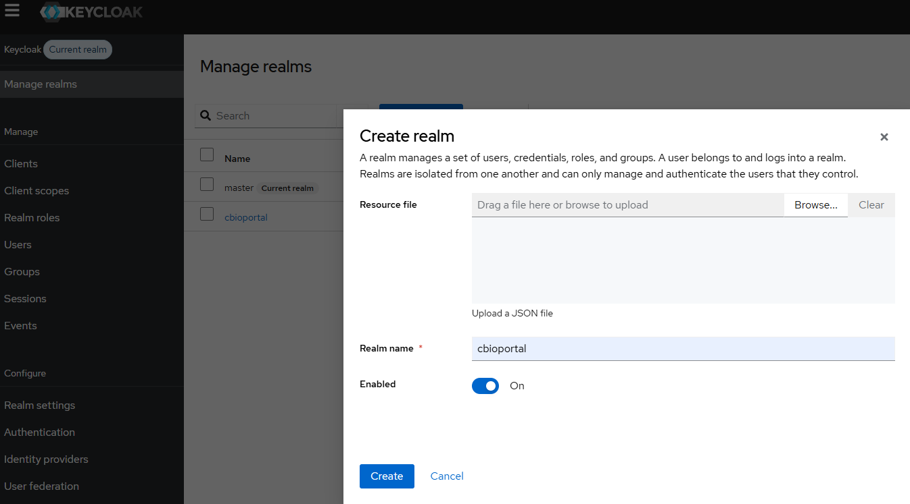
 Then type '_cbioportal_' in the name field and click the **Create** button.
4. To create a SAML client, go to the **Clients** item in the left menu. On this page, click the **Create** button. This will bring you to the **Add Client** page.
    * Select _saml_ in the **Client Protocol** drop down box.
    * Enter a **Client ID** for the client, e.g. '_cbioportal_', this will be the expected `issuer` value in SAML requests sent by the application.
    * click **next**.
    * Enter a pattern for **Valid Redirect URIs** that Keycloak can use upon a successful authentication, e.g. `http://localhost:8081/*`. :information_source: notice that you can add multiple URLs in this field. You could use this in some cases to support
the URLs with and without port (e.g. if tomcat is running on port `80` and you want to allow both `http://localhost:80/*` and `http://localhost/*` as redirect URLs).
    * Enter `http://localhost:8081/login/saml2/sso/cbio-saml-idp` in the **Master SAML Processing URL** textbox, this is the URL that the Keycloak server will send SAML requests and responses to. Then click the **Save** button; this will take you to the client page below.
    * click **Create**.

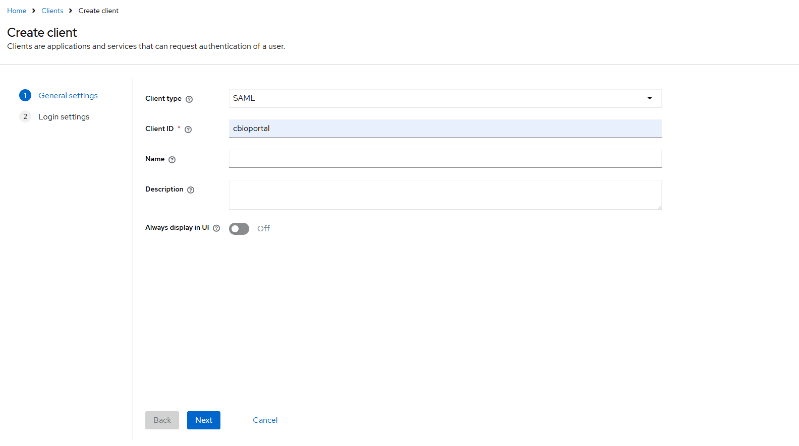

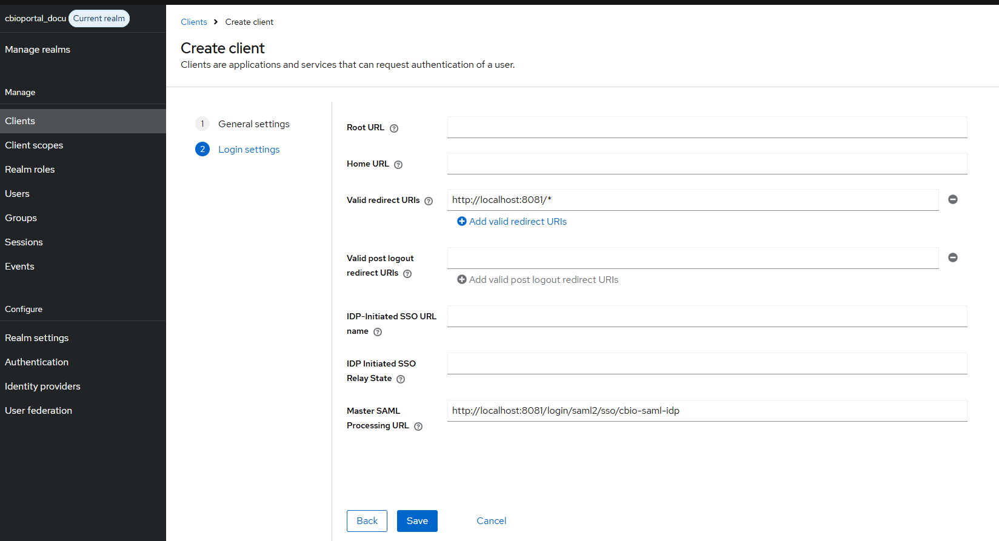

4. Scroll down to **SAML capabilities** Choose _email_ as your **Name ID Format**.

6. Set **Force Name ID Format** to _ON_ and **Force POST Binding** to _OFF_.
7. Set  **Front Channel Logout** in the Logout settings at the end of the page to _OFF_. 
8. Go to Advanced and under **Fine Grain SAML Endpoint Configuration** set **Logout Service POST Binding URL** to `http://localhost:8081/j_spring_security_logout`.
9. Leave everything else as it is and click **Save**.

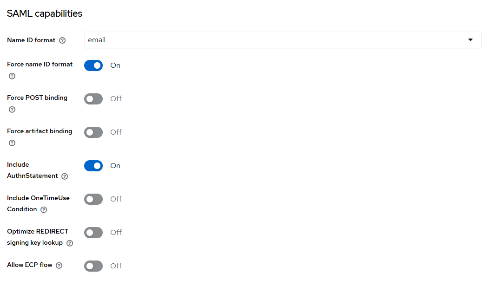

### Map SAML Assertion Attributes
To specify attributes included in the SAML assertion, click on the **client-scopes** tab, and select cbioportal-dedicated. Under the **Mappers** Tab ad mappers using the **Add mapper** Button.
Make sure you add at least:
- From the predefined Mappers:
    - the built-in User Property mapper named _X500 email_ and
    - a _Role list_-type attribute (keep the default word _Role_ as its **Role attribute name**).
- By configuration
    - a _User Property_-type attribute with the name _username_. Use _username_ for the attributes **Property**, **Name**. Use the selectable _urn:oid:1.2.840.113549.1.9.1_ as **SAML Attribute Name**.


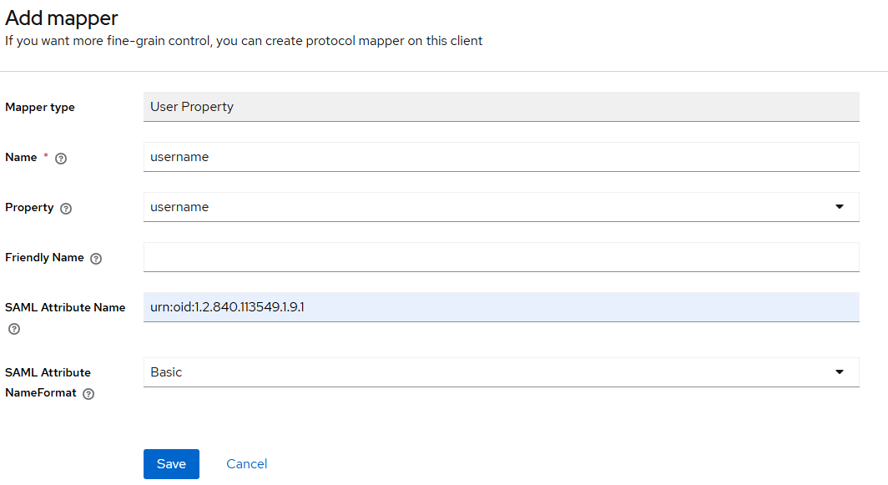

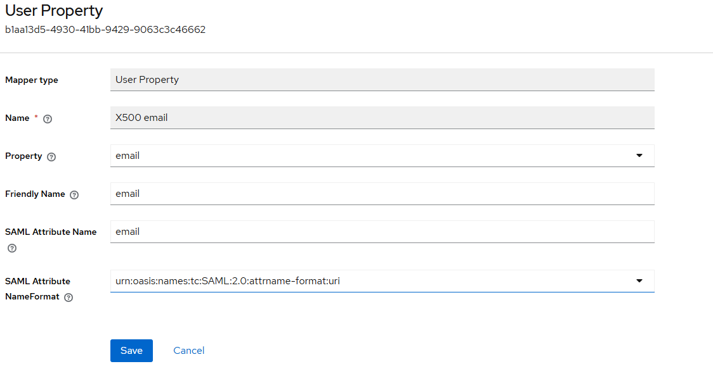

Edit the email attribute to use the word _email_ as the **SAML Attribute Name**.


Finally, head to the **Scope** tab and switch off
**Full Scope Allowed**, to ensure that only those roles relevant to a
particular cBioPortal instance are listed in assertions sent to the
instance, and not any other roles tracked in Keycloak.

### Export configuration for cBioPortal

There are two known ways to download the keycloak configuration (aka IDP SSO Descriptor) file for cBioPortal.

#### I. Download via link

The file can be fetched by the following url:

```
http(s)://{KEYCLOAK-URL}/auth/realms/{REALM-NAME}/protocol/saml/descriptor
```

For example:

```
curl -o client-tailored-saml-idp-metadata.xml "http://localhost:8081/auth/realms/cbioportal/protocol/saml/descriptor"
```

**Note:** if you use https protocol with self-signed protocol you need to add `--insecure` option to the above curl command.

#### II. Export via GUI (legacy)
1. Next, navigate to the **Realm settings** tab.
2. Select _SAML Metadata IDPSSODescriptor_ as the Format Option and click the **Download** button.
⚠️ This GUI option has been removed from the newer versions of Keycloak. But there is a link to show the content in the browser.
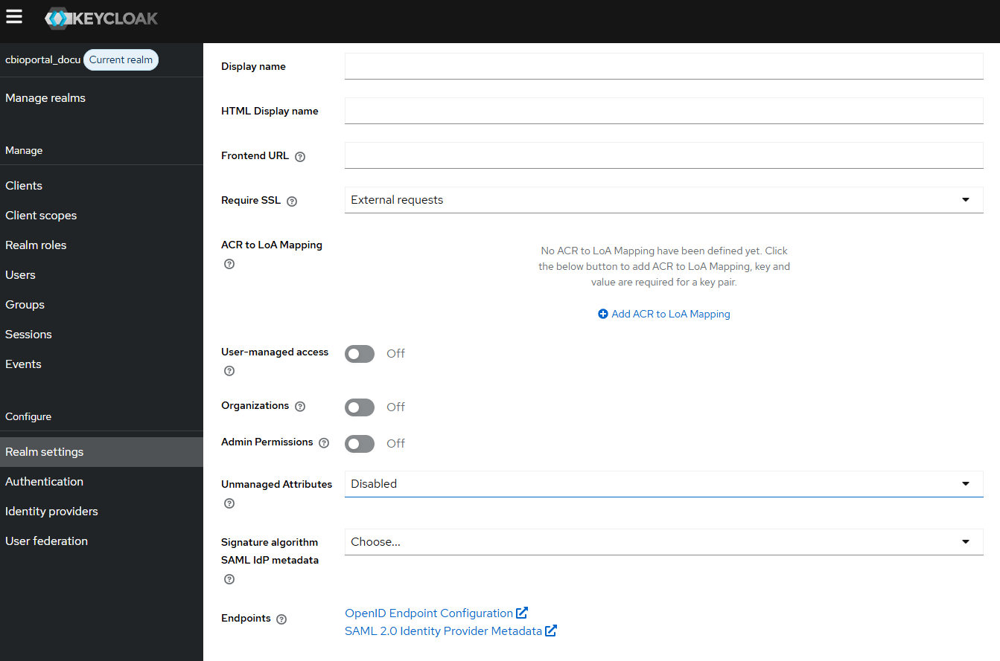

After you've downloaded the XML file with one of the above ways, move it to `portal/src/main/resources/` if you're compiling cBioPortal yourself or if you're using the Docker container, mount the file in the `/cbioportal-webapp` folder with `-v /path/to/client-tailored-saml-idp-metadata.xml:/cbioportal-webapp/WEB-INF/classes/client-tailored-saml-idp-metadata.xml`.
** Note:** It may occur that the XML-file is not properly formatted. Please use a XML-formatting tool to repair the file in this case. It's also possible to use the security property with the url from Keycloak. With that no download of the Metadata is needed, but it may happen, that the file that cbioportal gets is also not well formatted and might not work. Also cBioPortal needs a way to make a network request to Keycloak. 

## Create a signing key for cBioPortal
**Note:** This part needs further validation. At our instance the key is the generated one from keycloak and included in the metadata xml file. We have local keys and certs but they are not in keycloak but this still works. 
There are two ways to Create a signing key for cBioPortal 1. with Keystore 2. with certificate and key.

### Keystore:

**Note** this version was not verified, so it could be deprecated.

Use the Java '`keytool`' command to generate keystore, as described
[here](Authenticating-Users-via-SAML.md#creating-a-keystore)
on the page about SAML in cBioPortal:

```
keytool -genkey -alias secure-key -keyalg RSA -keystore samlKeystore.jks
```

**Important:** The validity of this keystore is **90 days**. You can change the default
value by adding the `-validity` parameter and the number of days (e.g. `-validity 200`
for 200 days). If the keystore expires, then **'invalid requester'** errors are thrown.

Install the generated JKS file to `portal/src/main/resources/` if you're compiling cBioPortal yourself or if you're using the Docker container, mount the file in the `/cbioportal-webapp` folder with `-v /path/to/samlKeystore.jks:/cbioportal-webapp/WEB-INF/classes/samlKeystore.jks`.

Import the key's certificate into Keycloak, so that Keycloak knows that it can trust the holder of this
key. To do that, head to the **SAML Keys** tab in the keycloak admin screen about the `cbioportal` client and:
1. Click the **Import** button.
2. Select the _JKS_ archive format.
3. Specify the key alias _secure-key_.
4. Type the store password _apollo1_ (not the private key password, as Keycloak only
needs to know the certificate)
5. Select the file you just installed.

**Important:** Keycloak may not give an indication of successful
completion, but when navigating to the **SAML Keys** tab again you
should now see the certificate and no private key.

### Certificate and Keyfile:
As Specified in [security properties](../customization/security.properties-reference/#saml-configuration) you can create a Signing Key and Certificate by using:

```
    openssl req -newkey rsa:2048 -nodes -keyout local.key -x509 -days 365 -out local.crt
```
Install the generated certificate and key files to `portal/src/main/resources/` if you're compiling cBioPortal yourself or if you're using the Docker container, mount the file in the `/cbioportal-webapp` folder with `-v /path/to/localsaml.crt:/cbioportal-webapp/WEB-INF/classes/localsaml.crt`.
Then add them in the security properties.
```
spring.security.saml2.relyingparty.registration.cbio-saml-idp.signing.credentials[0].certificate-location=classpath:/localsaml.crt
spring.security.saml2.relyingparty.registration.cbio-saml-idp.signing.credentials[0].private-key-location=classpath:/localsaml.key
```
In Keycloak go to the cioportal client and in the Keys menu aktivate **Client signature required** and import the created Certificat (not the key) in the window below.


## Modifying configuration

1. Within the application.properties file , make sure that these lines are present:
```
    app.name=cbioportal
    filter_groups_by_appname
```

2. Then, add the security properties for SAML authentification as described in the SAML Configuration section of the [Security Properties](../customization/security.properties-Reference.md/#saml-configuration).

## Obtain user identities

### Optional: create users in Keycloak

To create a user, click on **Users** in the left menu bar. This menu
option brings you to the user list page. On the right side of the
empty user list, you should see an **Add User** button. Click that to
start creating your new user.

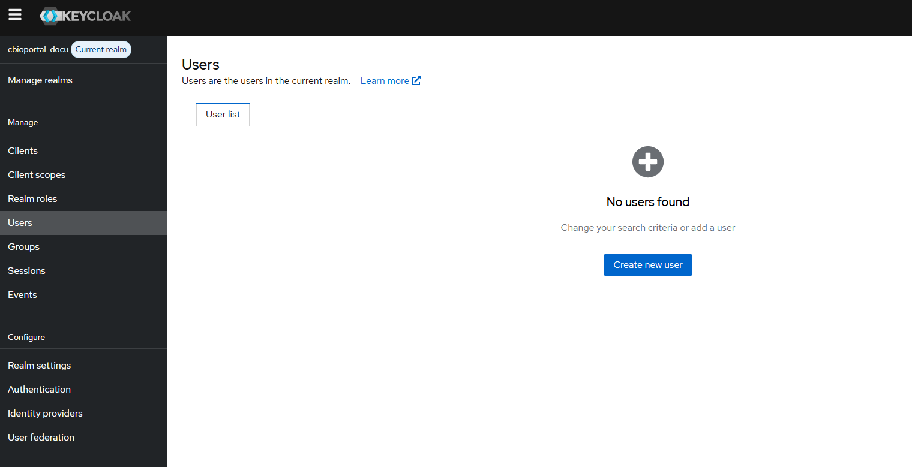

### Optional: integrate company-wide authentication services

Keycloak can read credentials from existing user databases, for
instance over LDAP. This is referred to as _user federation_. Keycloak
can also allow authentication by an external login form altogether
using a protocol such as SAML, it calls this _identity brokering_. In
either case, Keycloak acts as a proxy between your user directory and
cBioPortal, deciding which authorities to grant when telling
cBioPortal that the user has authenticated.

Please refer to the Keycloak documentation on
[user federation](https://www.keycloak.org/docs/latest/server_admin/index.html#_user-storage-federation)
and
[identity brokering](https://www.keycloak.org/docs/latest/server_admin/index.html#_identity_broker)
for more information on how to integrate Keycloak with your local LDAP
or SAML service.

#### Federate LDAP/AD user directories

Some notes on user federation using LDAP/Active Directory:

By specifying the **Vendor** of your LDAP server, Keycloak will choose
sensible defaults for the required objectClasses and attributes of
your user entries. Apart from the Dedicated Name of the tree in which
to search for users and the DN and password that Keycloak should use
to bind to the server, make sure to specify the following **Custom
User LDAP Filter** to ensure that only user entries that have an email
address are considered:

```
(mail=*)
```

When using LDAP to load users from your institute's user directory,
you will most likely want Keycloak to refrain from trying to
synchronise changes in user details back to the central directory. You
should set **Edit Mode** to `READ_ONLY`, as the alternative `UNSYNCED`
would mean that users can be changed in the Keycloak database once
imported from LDAP, and start diverging. Also disable **Sync
Registrations** unless you want Keycloak to add new users to the LDAP
store.

Do turn on **Import Users** to make Keycloak remember users after the
first login, if you want to be able to assign non-default roles. If
the LDAP tree holding your users is large and you do not want to
import all users into Keycloak, make sure to disable **Periodic Full
Sync** and **Periodic Changed Users Sync**.

## Authorization with Keycloak

### Create roles to authorize cBioPortal users

The roles you assign to users will be used to tell cBioPortal which
studies a user is allowed to see.

To create a role, head to the **Roles** tab that is displayed along
the top while configuring the `cbioportal` client – this tab is _not_
the link of the same name in the left sidebar.  Click the **Add
Role** button. Enter a name (e.g.  `brca_tcga_pub`) and description
for the role and hit the **Save** button.

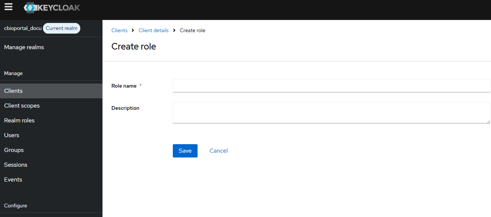

**Note:** if `filter_groups_by_appname` is set to `false` as specified above, the `Role Name` has to match with an id of the study you would give access to by assigning this role. Otherwise, if `filter_groups_by_appname` is set to `true` (**DEFAULT**), you have to add the application name (`app.name`) followed by the colon as a prefix to the study id. e.g. `cbioportal:brca_tcga_pub`

#### Groups

Keycloak allows you to create Groups for easy mapping of multiple
studies to multiple users. One can, for example, make a Keycloak group
with name `PUBLIC_STUDIES` and add all the individual Keycloak roles
corresponding to public studies to this group. It is also possible to
configure a group to be "default" in Keycloak, meaning new users are
automatically added to this group when logging in for the first time.

Alternatively, the Keycloak roles can correspond to the **groups** specified
in the [metadata files of studies](../../File-Formats.md#cancer-study) instead
of corresponding to individual **study identifiers**. Although this will
result in less roles that need to be added and maintained in Keycloak,
it does result in group configuration being spread over both Keycloak
and meta study files.

### Assign roles to users

Next, assign roles to users. Head to **Users** in the left sidebar,
find a user (users from external providers should be known to Keycloak
after they have logged in for the first time), click the ID and
open the **Role Mappings** tab for that user. Select the
_cbioportal_ client in the dropdown under **Client Roles**, and use
the **Available Roles** selection and its **Add selected** button to
assign client roles to this user.

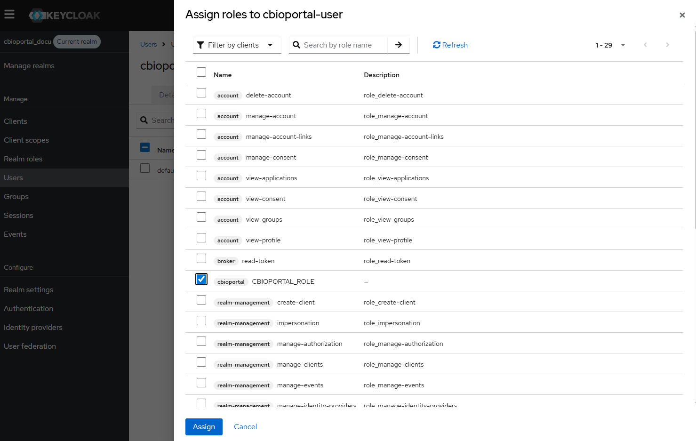

To automatically assign roles to all users when Keycloak first sees
them, the **Roles** pane accessed from the left sidebar has a
**Default Roles** tab. The interface for assigning roles here is much
the same as the one for assigning roles to individual users.

### Doing a Test Run

Rebuild the WAR file and follow the [Deployment with authentication
steps](../deploy-without-docker/Deploying.md#required-login) using `authenticate=saml`.

Then, go to:  [http://localhost:8081/](http://localhost:8081/).

If all goes well, the following should happen:

* You will be redirected to the Keycloak Login Page.
* After authenticating, you will be redirected back to your local instance of cBioPortal.

If this does not happen, see the Troubleshooting Tips  below.

### Add client for OAuth2 token-based data access

With cBioPortal instances that require user authentication the API can be queried when including a data access token in the request header (see [Authenticating Users via Tokens](./Authenticating-Users-via-Tokens.md)). KeyCloak can be configured as an OAuth2 authentication provider that distributes data access tokens to users and validates these tokens when used while querying the API. This feature is enabled by creating a `cbioportal_api` OpenID Connect client that has access to the user roles defined in the `cbioportal` SAML client.

The step below were verified to work with Keycloak version 26.4.2.

1. Create a client with name `cbioportal_api`. Set _Client Protocol_ to `openid-connect`.

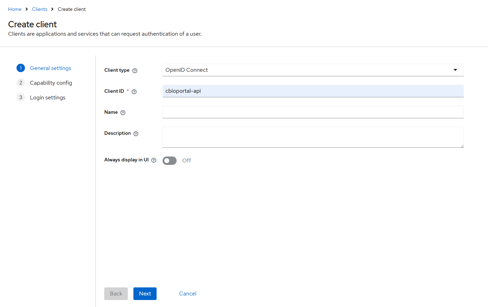

2. On the configuration page of `cbioportal_api` client apply the following settings:

#### General Settings:
| parameter        | value  | comment  |
| ------------- |:-------------:| -----:|
| Client type      | openid-connect   |   (default value) |

#### Capability Settings:
| parameter        | value  | comment  |
| ------------- |:-------------:| -----:|
| Client authentication      | on |  |
| Authorization  | OFF      |  (default value)  |
| Standard Flow      | ON      |   (default value) |
| Implicit Flow | OFF      |     (default value) |
| Standard Token Exchange | OFF | (default value)|
| OAuth 2.0 Device Authorization Grant | off | (default value)|
| OIDC CIBA Grant | OFF | (default value) |
| Direct Access Grants | OFF      |    |
| Service Accounts roles | ON     |     |

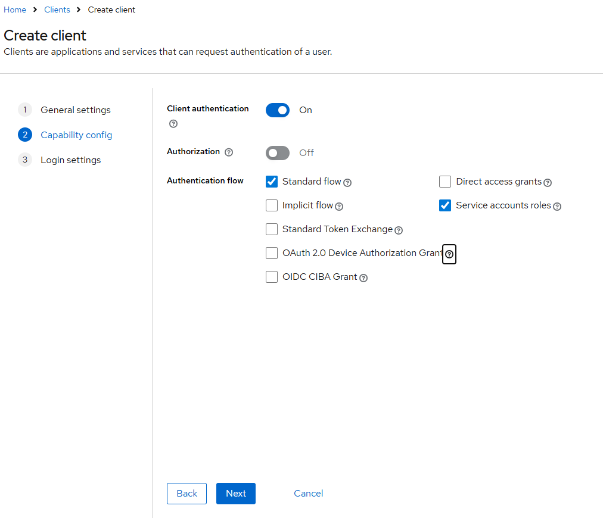

#### Login settings:
| parameter        | value  | comment  |
| ------------- |:-------------:| -----:|
| Valid Redirect URIs | _url_/api/data-access-token/oauth2  |  _url_ refers to base url of cBioPortal instance |

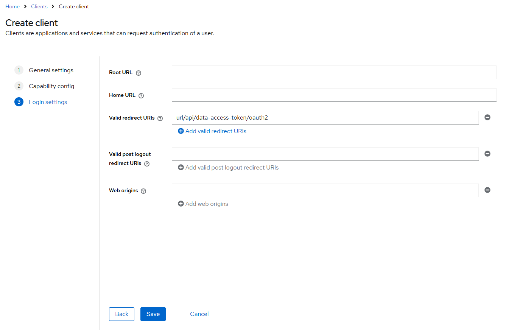

#### Credentials tab

Select `Client Id and Secret`. Take notice of the value of _Secret_ the secret field. This secret should be added to `security.properties` file of the cBioPortal backend.

| parameter        | value  | comment  |
| ------------- |:-------------:| -----:|
| Client Authenticator     | Client Id and Secret |   (default value) |

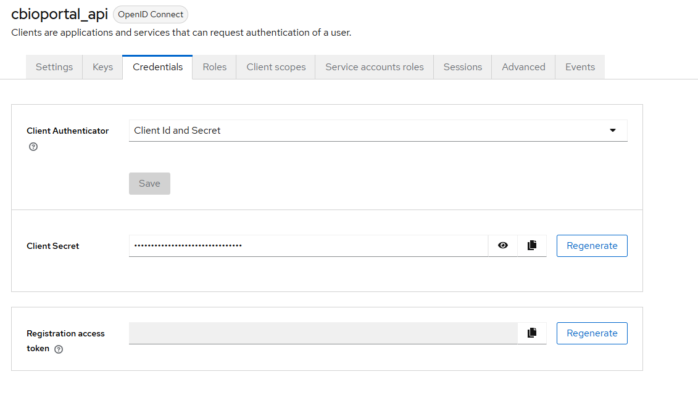

#### Client Scopes tab

Keep only scopes `roles` and `offline_access` (remove all others).

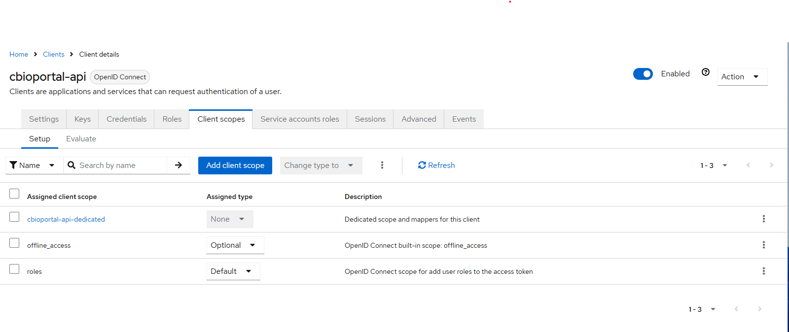

#### Mapper tab
Select cbioportal-api-dedicated and Create a new _Audience_ mapper with name `cbioportal_api_audience`. This value will be used by the cBioPortal backend during validation of access tokens.
Create the Mapper with **configure new mapper**.

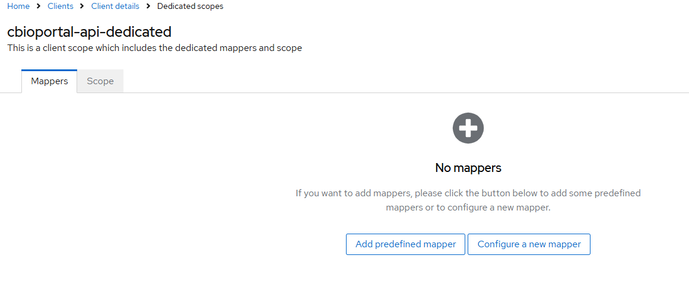

| parameter        | value  | comment  |
| ------------- |:-------------:| -----:|
| Name       | cbioportal_api_audience |  |
| Mapper Type     | Audience      |   |
| Included Client Audience      | cbioportal_api      |    |
| Add to ID token      | OFF        |  (default value)  |
| Add to access token  | ON      |   (default value)  |

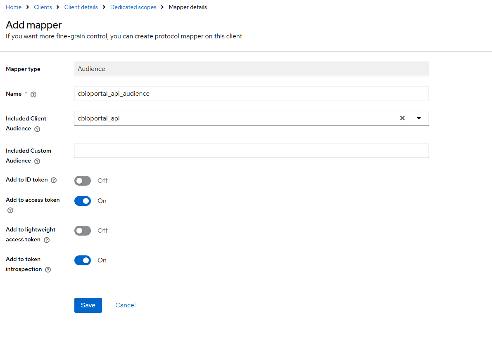
Since newer Keycloak versions dont send the subject in the Access token also add the predefined SUB Mapper to the client.


#### Scope tab

Enable _Full Scope_. This setting will include the user roles defined in the `cbioportal` SAML client in access tokens distributed by the `cbioportal_api` client.

| parameter        | value  | comment  |
| ------------- |:-------------:| -----:|
| Full Scope Allowed       | ON | (default value) |

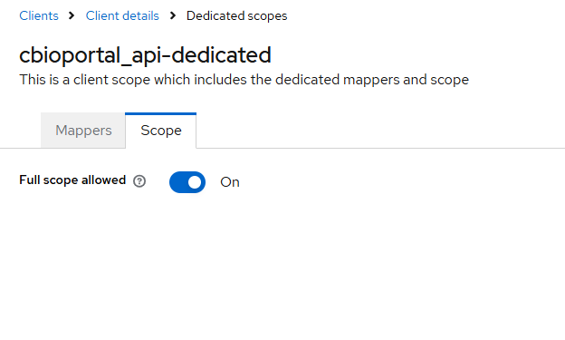

3. Add these parameters to `security.properties` of the cbioportal backend as specified in [Data Access Token Settings](../customization/security.properties-reference/#data-access-token-settings)

| parameter        | value  | comment  |
| ------------- |:-------------:| -----:|
| dat.method       | oauth2 |  |
| dat.oauth2.clientId       | cbioportal_api |  |
| dat.oauth2.clientSecret    | ?      | see _Secret_ field in the _Credentials_ tab  |
| dat.oauth2.accessTokenUri     | _keycloak_url_/auth/realms/cbioportal/protocol/openid-connect/token      |   _keycloak_url_ refers to URL of the KeyCloak server from perspective of the cBioPortal instance |
| dat.oauth2.jwkUrl  | _keycloak_url_/auth/realms/cbioportal/protocol/openid-connect/certs      |   _keycloak_url_ refers to URL of the KeyCloak server from perspective of the cBioPortal instance |
| dat.oauth2.issuer      | _keycloak_url_/auth/realms/cbioportal        |  _keycloak_url_ refers to URL of the KeyCloak server from perspective of the browser |
| dat.oauth2.userAuthorizationUri  | _keycloak_url_/auth/realms/cbioportal/protocol/openid-connect/auth      |  _keycloak_url_ refers to URL of the KeyCloak server from perspective of the browser |
| dat.oauth2.redirectUri  | _cbioportal_url_/api/data-access-token/oauth2 | _cbioportal_url_ is url up to _/api_ path |
| dat.oauth2.jwtRolesPath  | '::'-separated path to array with user roles in JWT token returned by Keycloak | example: _resource_access::cbioportal::roles_ |

More information on configuration of the cBioPortal backend can be found in [Authenticating Users via Tokens](./Authenticating-Users-via-Tokens.md).

### Troubleshooting

#### Logging

Getting this to work requires many steps, and can be a bit tricky.  If you get stuck or get an obscure error message, your best bet is to turn on all DEBUG logging.
This can be done via `src/main/resources/logback.xml`. See [logback.DEBUG.EXAMPLE.xml](./logback.DEBUG.EXAMPLE.xml) file for an example of how to configure debug levels for cbioportal.

Then, rebuild the WAR, redeploy, and try to authenticate again.  Your log file will then include hundreds of SAML-specific messages, even the full XML of each SAML message, and this should help you debug the error.

If you're using the Docker container, mount the file instead with `-v ./logback.xml:/cbioportal-webapp/WEB-INF/classes/logback.xml`.

#### Determining jwtRolesPath for OAuth2 Token
By default user-roles are extracted from path `resource_access::cbioportal::roles` in the JWT json. Changes to the configuration of roles at the realm and client level in Keycloak instance can alter this path and must be set acordingly with the `dat.oauth2.jwtRolesPath` property in the `application.properties` file. 

To check the the roles path, go into the `Client Scopes` tab inside KeyCloak. Enter the `Evaluate` section and select a test user. In the section below, select the `Generated Access Token` tab to examine the JWT structure. 

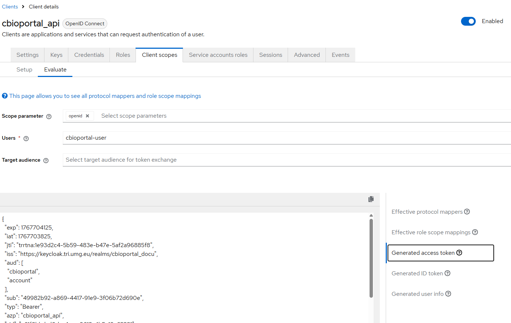

A sample JWT might look like this:
```
{
  "exp": 1234567891,
  "iat": 1234567892,
  "jti": "transient-id",
  "iss": "issuer",
  "sub": "subject",
  "typ": "Bearer",
  "session_state": "sessionstate",
  "acr": "1",
  "realm_access": {
    "roles": [
      "all"
    ]
  },
  "scope": "openid"
}
```
The `jwtRolesPath` in this case would be `realm_access::roles`. Double check this against the `jwtRolesPath` value set in `security.properties`.

