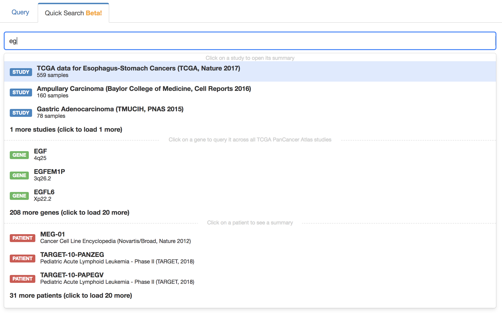

This page describes the main properties within portal.properties.

- [Database Settings](#database-settings)
- [cBioPortal Customization](#cbioportal-customization)
- [Segment File URL](#segment-file-url)
- [Bitly API Username and Key](#bitly-api-username-and-key)
- [Google Analytics](#google-analytics)
- [Password Authentication](#password-authentication)
- [CIViC integration](#civic-integration)
- [OncoPrint](#oncoprint)
- [Custom annotation of driver and passenger mutations](#custom-annotation-of-driver-and-passenger-mutations)
	- [Enabling custom annotations in the OncoPrint](#enabling-custom-annotations-in-the-oncoprint)
	- [Automatic selection of custom annotations](#automatic-selection-of-custom-annotations)
	- [Automatic selection of OncoKB annotations](#automatic-selection-of-oncokb-annotations)
	- [Automatic hiding of putative passenger mutations](#automatic-hiding-of-putative-passenger-mutations)
- [Gene sets used for gene querying](#gene-sets-used-for-gene-querying)

# Database Settings

```
db.user=
db.password=
db.host=[e.g. localhost to connect via socket, or e.g. 127.0.0.1:3307 to connect to a different port like 3307. Used by Java data import layer]
db.portal_db_name=[the database name in mysql, e.g. cbiodb]
db.driver=[this is the name of your JDBC driver, e.g., com.mysql.jdbc.Driver]
```

Include `db_connection_string` with the format specified below, and replace `localhost` by the value of `db.host`:
```
db.connection_string=jdbc:mysql://localhost/
```

db.tomcat_resource_name is required in order to work with the tomcat database connection pool and should have the default value jdbc/cbioportal in order to work correctly with the your WAR file.
```
db.tomcat_resource_name=jdbc/cbioportal
```

# cBioPortal Customization

## Hide tabs (pages)
Settings controlling which tabs (pages) to hide. Set them to `false` if you want to hide those tabs, otherwise set the properties to `true`.

```
skin.show_data_tab=
skin.show_web_api_tab=
skin.show_r_matlab_tab=
skin.show_tutorials_tab=
skin.show_faqs_tab=
skin.show_news_tab=
skin.show_tools_tab=
skin.show_about_tab=
```

**Note:** `skin.show_tools_tab` refers to the `Visualize Your Data` tab, while `skin.show_data_tab` refers to the `Data Sets` tab.

## Cross Cancer Study Query Default
The cross cancer study query default is a list of studies used when querying
one or more genes and not specifying a specific study or list of studies. There
are two ways in which the default cross cancer study list is used:

1. When using the linkout links without a study e.g. `/ln?q=TP53:MUT`. Those
   links are used mostly used to allow for easy linking to particular queries.
   One can't get those links using the cBioPortal user interface itself, they
   are only mentioned in the documentation of the Web API
   (https://www.cbioportal.org/webAPI).
2. In the quick search when querying for a gene. Quick search is
   disabled by default. It is a beta feature. See the
   [quick search documentation](#quick-search-beta).

The configuration is set with the following if you have session service
enabled:

```
default_cross_cancer_study_session_id=
```

The title will be pulled from the virtual study. Make sure to create a
`virtual_study` with studies that everybody has access to and don't use a
`main_session` id.

If session service is disabled one can use the following instead:

```
# query this comma separated list of studies
default_cross_cancer_study_list=
default_cross_cancer_study_list_name=
```

## Quick Search (BETA)


Enable or disable the quick search with the following:

```
# Enable/Disable quick search (default is false)
quick_search.enabled=true
```

The default studies queried when searching for a single gene is defined with
the `default_cross_cancer_study_session_id` or
`default_cross_cancer_study_list` properties as described in the
[cross cancer study query default section](#cross-cancer-study-query-default).


## Hide sections in the right navigation bar
Settings controlling what to show in the right navigation bar. Set them to `false` if you want to hide those sections, otherwise set the properties to `true`.

```
#Cancer Studies section:
skin.right_nav.show_data_sets=

#Example Queries section:
skin.right_nav.show_examples=

#Testimonials section:
skin.right_nav.show_testimonials=

#What's New section
skin.right_nav.show_whats_new=
```

## Control the content of specific sections
Setting controlling the blurb: you can add any HTML code here that you want to visualize. This will be shown between the cBioPortal menu and the Query selector in the main page.
```
skin.blurb=
```

Setting controlling the footer: you can add any HTML code here that you want to visualize. If the field is left empty, the default footer (from www.cbioportal.org) will be shown.
```
skin.footer=
```

Settings controlling the "What's New" blurb in the right navigation bar: you can add any HTML code here that you want to visualize. If the field is left empty, the Twitter timeline will be shown (as long as `skin.right_nav.show_whats_new` is `true`, otherwise this section will not be displayed).

```
skin.right_nav.whats_new_blurb=
```

Add a custom logo in the right side of the menu. Place here the full name of the logo file (e.g. `logo.png`). This file should be saved in `$PORTAL_HOME/portal/images/`.
```
skin.right_logo=
```

# Segment File URL

This is a root URL to where segment files can be found.  This is used when you want to provide segment file viewing via external tools such as [IGV](http://www.broadinstitute.org/igv/).

```
segfile.url=
```

# Bitly API Username and Key

The following properties are used to provide shortened bookmarks to the cBioPortal:

```
bitly.user=
bitly.api_key=
```

To obtain a bitly username and key, first register at:  https://bitly.com/

Then, go to:  https://bitly.com/a/your_api_key

**Note:**  If you are developing on a local machine, and using localhost, the bitly URL shortening service will not work.  This is because bitly will not shorten URLs for localhost.  Once you deploy to your final server, the issue should go away.

# Google Analytics

If you so desire, the following property is used to track your site's usage via google analytics.
```
google_analytics_profile_id
```

# Password Authentication

The portal supports password authentication via Google+. Before you start you need to setup a google account that will own the authentication API. Follow https://developers.google.com/identity/sign-in/web/devconsole-project to get clientID and secret. Fill it in portal.properties:
```
googleplus.consumer.key=195047654890-499gl89hj65j8d2eorqe0jvjnfaxcln0.apps.googleusercontent.com 
googleplus.consumer.secret=2jCfg4SPWdGfXF44WC588dK
```
(note: these are just examples, you need to get your own) You will also need to go to "Google+ API" and click Enable button. In case of problems make sure to enable DEBUG logging for org.springframework.social and org.springframework.security.web.authentication.

To activate password authentication,
pass the `-Dauthenticate=googleplus` argument to the web server JVM.
This can be done by adding the following line to the Tomcat config file
`$CATALINA_HOME/bin/setenv.sh`:
```sh
CATALINA_OPTS='-Dauthenticate=googleplus'
```

In addition, set this property in `portal.properties`:
```
app.name=cbioportal
```
app.name should be set to the name of the portal instance referenced in the "AUTHORITY" column of the "AUTHORITIES" table.  See the [User Authorization](User-Authorization.md) for more information.

# CIViC integration

CIViC integration can be turned on or off with the following property (default: true):
```
show.civic=true|false
```
The CIViC API url is set to https://civic.genome.wustl.edu/api/ by default. It can be overridden using the following property:
```
civic.url=
```

# OncoPrint

The default view in OncoPrint ("patient" or "sample") can be set with the following option. The default is "patient".
```
oncoprint.defaultview=sample
```

# Custom annotation of driver and passenger mutations
cBioPortal supports 2 formats to add custom annotations for driver and passenger mutations. 
1. **cbp_driver**: This will define whether a mutation is a driver or not.
2. **cbp_driver_tiers**: This can be used to define multiple classes of driver mutations. 

These data formats are described in the [cBioPortal MAF specifications](File-Formats.md#extending-the-maf-format). 

#### Enabling custom annotations in the OncoPrint
To enable functionality for one or both types of custom annotations, enter values for the following properties. These labels will appear in the OncoPrint's "Mutation color" menu.
```
oncoprint.custom_driver_annotation.binary.menu_label=Custom driver annotation
oncoprint.custom_driver_annotation.tiers.menu_label=Custom driver tiers
```

#### Automatic selection of custom annotations
OncoKB and Hotspots are by default automatically selected as annotation source. To add automatic selection of custom driver or custom driver tiers annotations, set the respective property to `true`. Default is `false`.
```
oncoprint.custom_driver_annotation.default=true|false
oncoprint.custom_driver_tiers_annotation.default=true|false
```

#### Automatic selection of OncoKB annotations
OncoKB and Hotspots are by default automatically selected as annotation source. To disable this, set the following property to `false`. To only select OncoKB and Hotspots when there are no custom driver mutation annotations, set this property to `custom`. Default is `true`.
```
oncoprint.oncokb_hotspots.default=true|false|custom
``` 

#### Automatic hiding of variants of unknown significance (VUS)
By default, the selection box to hide VUS mutations is unchecked. If you want to automatically hide VUS, set this property to `true`. Default is `false`.
```
oncoprint.hide_vus.default=true|false
```

# Gene sets used for gene querying
To change the gene sets used for gene querying, create a JSON file and add gene sets, following the format specified in the examples below. Set the path to this file (e.g. `file:/cbioportal/custom_gene_sets.json`) in the following property and restart Tomcat to apply the update. The default gene sets will be replaced by the ones in `custom_gene_sets.json`.
```
querypage.setsofgenes.location=file:/<path>
```

## Example with gene names
In this example, two gene sets will appear in the query page, under the names "Prostate Cancer: AR Signaling" and "Prostate Cancer: AR and steroid synthesis enzymes".
```
[{
	"id": "Prostate Cancer: AR Signaling",
	"genes": ["SOX9", "RAN", "TNK2", "EP300", "PXN", "NCOA2", "AR", "NRIP1", "NCOR1", "NCOR2"]
}, {
	"id": "Prostate Cancer: AR and steroid synthesis enzymes",
	"genes": ["AKR1C3", "AR", "CYB5A", "CYP11A1", "CYP11B1", "CYP11B2", "CYP17A1", "CYP19A1", "CYP21A2", "HSD17B1", "HSD17B10", "HSD17B11", "HSD17B12", "HSD17B13", "HSD17B14", "HSD17B2", "HSD17B3", "HSD17B4", "HSD17B6", "HSD17B7", "HSD17B8", "HSD3B1", "HSD3B2", "HSD3B7", "RDH5", "SHBG", "SRD5A1", "SRD5A2", "SRD5A3", "STAR"]
}]
```

## Example with specific alterations
In this example, only one gene set will appear in the query page, under the name "Genes with alterations", which will add the different genetic alterations stated below in the query box.
```
[{
	"id": "Genes with alterations",
	"genes": ["TP53: MUT=R273C;", "KRAS: HOMDEL MUT=NONSENSE MUT=NONSTART MUT=NONSTOP MUT=FRAMESHIFT MUT=SPLICE MUT=TRUNC;"]
}]
```

## Example with merged gene tracks
In this example, only one gene set will appear in the query page, under the name "BRCA genes test", containing the merged gene track called "BRCA genes".
```
[{
	"id": "BRCA genes test",
	"genes": ["[\\\"BRCA genes\\\" BRCA1: MUT=E1258D;", "BRCA2: HOMDEL MUT=NONSENSE MUT=NONSTART MUT=NONSTOP MUT=FRAMESHIFT MUT=SPLICE MUT=TRUNC;]"]
}]
```

This gene set will add the following in the query box:
```
"BRCA genes" BRCA1: MUT=E1258D; BRCA2: HOMDEL MUT=NONSENSE MUT=NONSTART MUT=NONSTOP MUT=FRAMESHIFT MUT=SPLICE MUT=TRUNC;
```

# Spark Configuration Settings

```
spark.app.name=cBioPortal
spark.master.uri=[cluster local[*]]
spark.driver.bindAddress=[driver address for local e.g. 127.0.0.1]
spark.driver.host=[driver host for local e.g. 127.0.0.1]
spark.driver.memory=[driver memory e.g. 2g]
spark.executor.memory=[executor memory e.g. 1g]
spark.shuffle.partitions=[default number of logical cores]
spark.default.parallelism=[default 200]
data.parquet.folder=[location to save parquet files e.g. cbioportal/persistence/persistence-spark/src/main/resources/parquet/]
```